# <center>libco源码阅读记录</center>

## A、主要数据结构
+ stCoRoutineEnv_t：    
  

+ stCoEpoll_t：  
  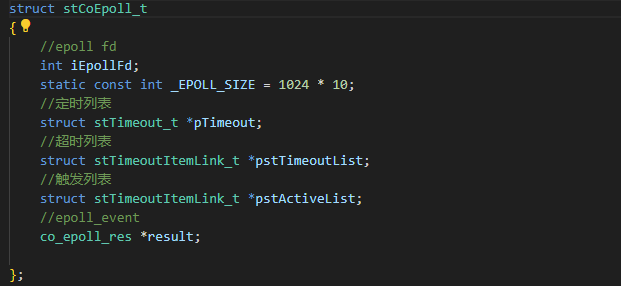

+ stTimeout_t：  
  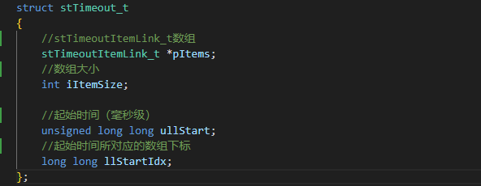

+ stCoRoutine_t：  
  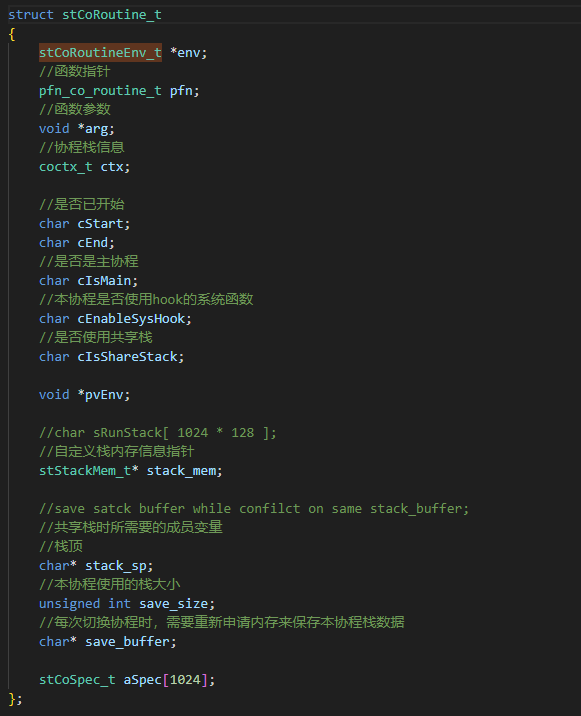  

+ coctx_t:  
  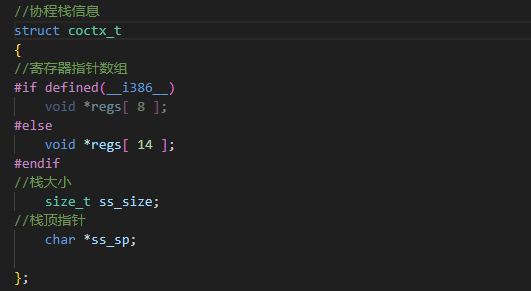  
  x86架构下32位有8个通用寄存器，64位有16个通用寄存器，rax、rbx、rcx、rdx、rsi、rdi、rbp、rsp、r8-r15。这16个寄存器除了rbp（保存栈底）、rsp（保存栈顶），其余的除了特定的作用外还可以用来保存临时数据、中间结果或用于计算。
  这16个寄存器又分为callee-saved（被调用者保存）和caller-saved（调用者保存）。如下图所示：  
  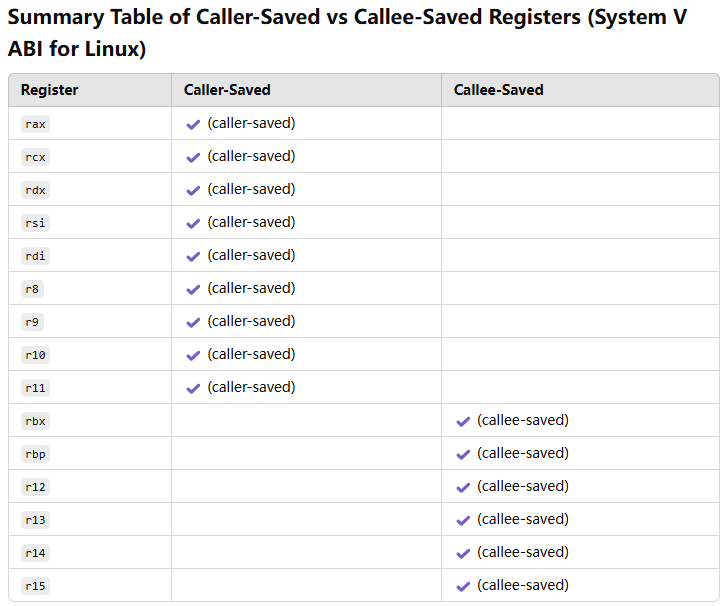  
  在属于caller-saved的寄存器中，只有r10、r11没有特定的作用，这应该就是libco不保存这两个寄存器的原因。r8、r9可能会用于参数传递。如下图所示（参数再多则通过入栈来传递）：  
  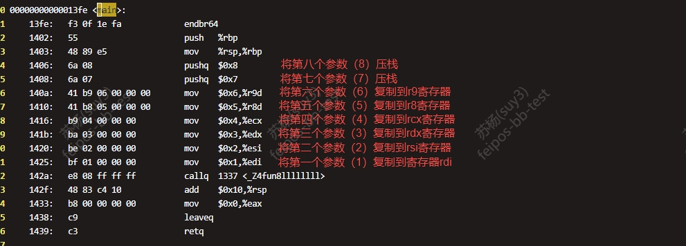  

## B、部分API，其他感觉没啥可写的，正常逻辑没啥特殊点
+ co_create:  
  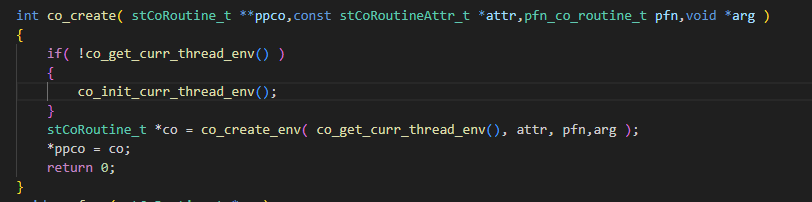  
+ co_init_curr_thread_env:  
  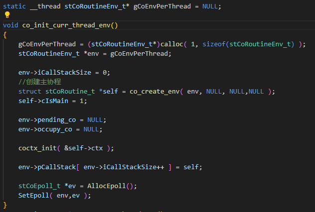  

+ co_create_env：  
  ```c
  struct stCoRoutine_t *co_create_env( stCoRoutineEnv_t * env, const stCoRoutineAttr_t* attr,
		pfn_co_routine_t pfn,void *arg )
  {

	stCoRoutineAttr_t at;
	if( attr )
	{
		memcpy( &at,attr,sizeof(at) );
	}
	if( at.stack_size <= 0 )
	{
		//默认栈大小128KB
		at.stack_size = 128 * 1024;
	}
	else if( at.stack_size > 1024 * 1024 * 8 )
	{
		//最大栈8M
		at.stack_size = 1024 * 1024 * 8;
	}

	//4K对齐，glibc默认的页大小，避免页缺失，优化内存访问
	if( at.stack_size & 0xFFF ) 
	{
		at.stack_size &= ~0xFFF;
		at.stack_size += 0x1000;
	}

	stCoRoutine_t *lp = (stCoRoutine_t*)malloc( sizeof(stCoRoutine_t) );
	
	memset( lp,0,(long)(sizeof(stCoRoutine_t))); 

	lp->env = env;
	lp->pfn = pfn;
	lp->arg = arg;

	stStackMem_t* stack_mem = NULL;
	if( at.share_stack )
	{
		//共享栈
		stack_mem = co_get_stackmem( at.share_stack);
		at.stack_size = at.share_stack->stack_size;
	}
	else
	{
		stack_mem = co_alloc_stackmem(at.stack_size);
	}
	lp->stack_mem = stack_mem;

	lp->ctx.ss_sp = stack_mem->stack_buffer;
	lp->ctx.ss_size = at.stack_size;

	lp->cStart = 0;
	lp->cEnd = 0;
	lp->cIsMain = 0;
	lp->cEnableSysHook = 0;
	lp->cIsShareStack = at.share_stack != NULL;

	lp->save_size = 0;
	lp->save_buffer = NULL;

	return lp;
  }
  ```  
  <font color= "#FF0000">默认栈大小为128K，大抵是因为glibc初始的brk\mmap阈值是128K（可能会被动态调整，调用mallopt设置阈值或者其他的一些东西的时候会把动态调整关闭，32位的最大阈值是512K，64位最大是32M，ptmalloc里再做记录），这能避免内存碎片。但如果是共享栈的时候，每次做协程切换的时候，原来协程的栈的内容每次都会申请内存来保存，这个大小又没按这个阈值来，有点奇怪。save_stack_buffer代码截图如下所示：</font>  
  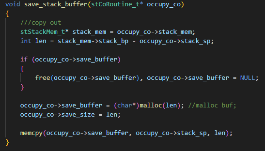

+ co_resume：  
  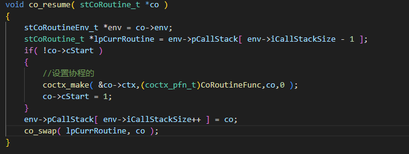  
+ coctx_make:  
  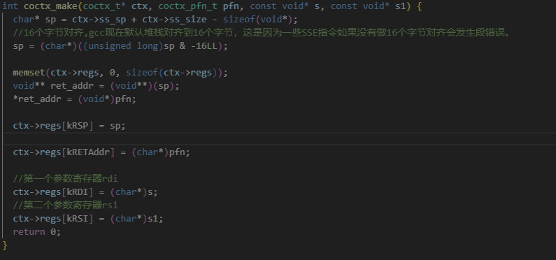  
  <font color= "#FF0000">之所以要做16个字节对齐，是因为gcc现在默认堆栈对齐到16个字节，一些SSE指令如果没有做16个字节对齐会发生段错误。</font>资料地址：https://sourceforge.net/p/fbc/bugs/659/，测试结果如下图所示：  
  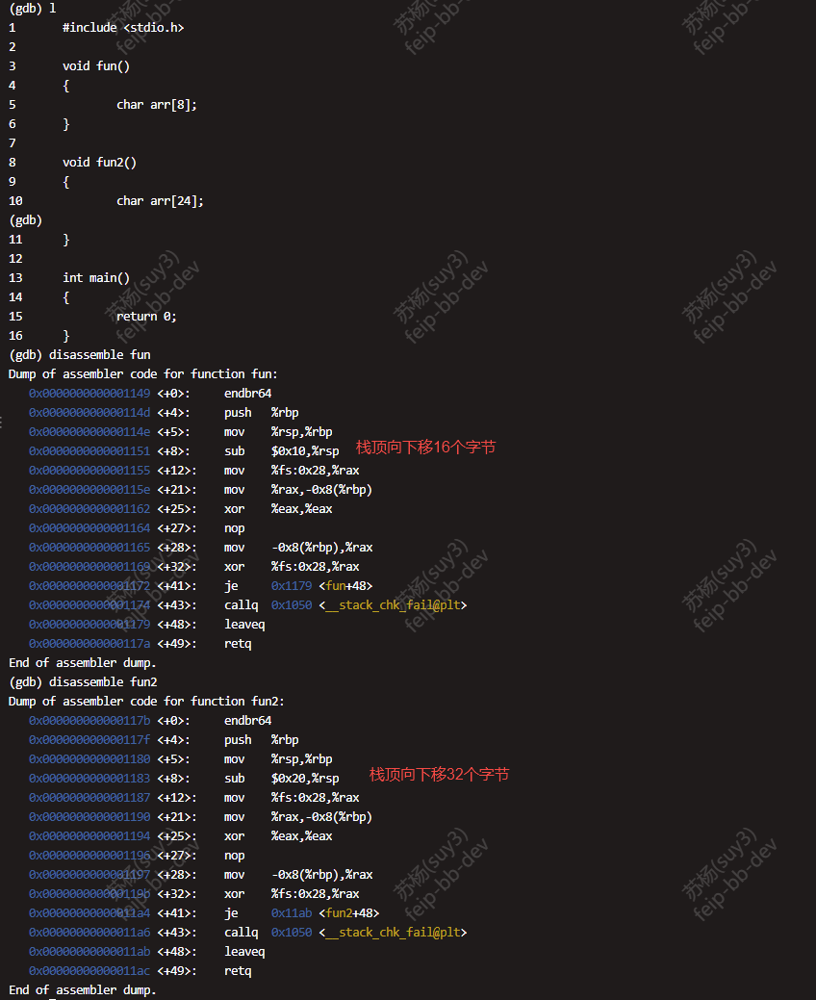
+ coctx_swap:  
  ```S  
	//将rsp寄存器指向的地址赋值到rax
	leaq (%rsp),%rax
	//将寄存器的值赋值到相对于第一个参数偏移对应字节的地方
	movq %rax, 104(%rdi)
	movq %rbx, 96(%rdi)
	movq %rcx, 88(%rdi)
	movq %rdx, 80(%rdi)
	//将rax(也就是rsp)指向地址的值赋值到rax，这个地址的此时值是coctx_swap调用者的
	//下一条指令地址，这是因为调用者在调用coctx_swap函数时会将下一条指令压栈
	movq 0(%rax), %rax
	//保存rax
	movq %rax, 72(%rdi)
	//将寄存器的值赋值到相对于第一个参数偏移对应字节的地方
	movq %rsi, 64(%rdi)
	movq %rdi, 56(%rdi)
	movq %rbp, 48(%rdi)
	movq %r8, 40(%rdi)
	movq %r9, 32(%rdi)
	movq %r12, 24(%rdi)
	movq %r13, 16(%rdi)
	movq %r14, 8(%rdi)
	movq %r15, (%rdi)
	//将rax寄存器的值清空，对自己异或
	xorq %rax, %rax

	//将保存在第二个参数的内容赋值到寄存器
	movq 48(%rsi), %rbp
	movq 104(%rsi), %rsp
	movq (%rsi), %r15
	movq 8(%rsi), %r14
	movq 16(%rsi), %r13
	movq 24(%rsi), %r12
	movq 32(%rsi), %r9
	movq 40(%rsi), %r8
	movq 56(%rsi), %rdi
	movq 80(%rsi), %rdx
	movq 88(%rsi), %rcx
	movq 96(%rsi), %rbx
	//将栈顶往上挪8个字节，为了下面将返回地址压栈
	leaq 8(%rsp), %rsp
	//将返回地址压栈
	pushq 72(%rsi)
	movq 64(%rsi), %rsi
	//弹出栈顶的值，也就是返回地址并跳转
	ret
  ```  
  对上面的注释的自测结果如下图所示：  
  调用coctx_swap函数前的寄存器信息：  
  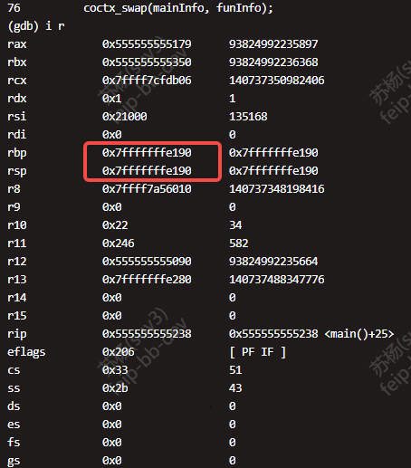  
  调用coctx_swap函数后的寄存器信息：  
  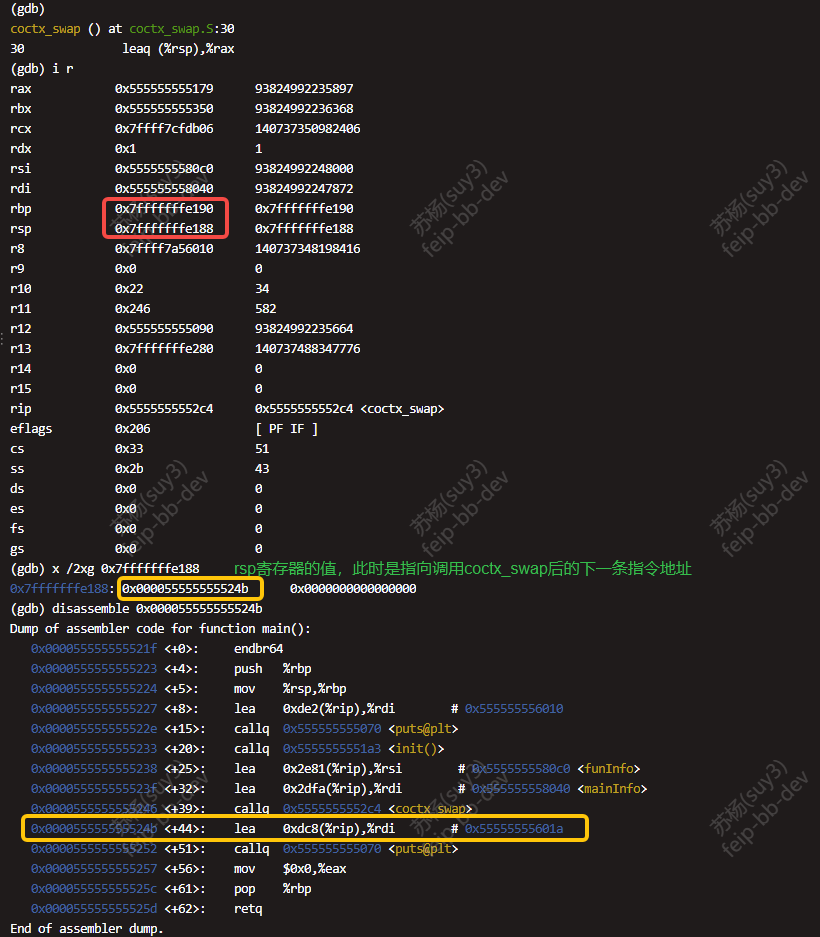  
  