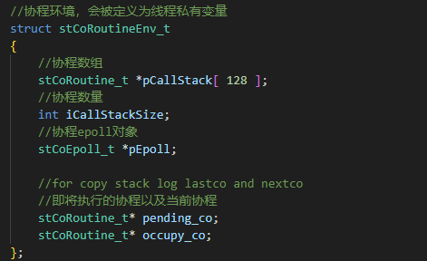

# <center>libco源码阅读记录</center>

## A、主要数据结构
+ stCoRoutineEnv_t：    
  

+ stCoEpoll_t：  
  

+ stTimeout_t：  
  

+ stCoRoutine_t：  
  

+ coctx_t:  
    
  x86架构下32位有8个通用寄存器，64位有16个通用寄存器，rax、rbx、rcx、rdx、rsi、rdi、rbp、rsp、r8-r15。这16个寄存器除了rbp（保存栈底）、rsp（保存栈顶），其余的除了特定的作用外还可以用来保存临时数据、中间结果或用于计算。
  这16个寄存器又分为callee-saved（被调用者保存）和caller-saved（调用者保存）。如下图所示：  
    
  在属于caller-saved的寄存器中，只有r10、r11没有特定的作用，这应该就是libco不保存这两个寄存器的原因。r8、r9可能会用于参数传递。如下图所示（参数再多则通过入栈来传递）：  
    

## B、主要API
+ co_create:  
    
+ co_init_curr_thread_env:  
    

+ co_create_env：  
  ```c
  struct stCoRoutine_t *co_create_env( stCoRoutineEnv_t * env, const stCoRoutineAttr_t* attr,
		pfn_co_routine_t pfn,void *arg )
  {

	stCoRoutineAttr_t at;
	if( attr )
	{
		memcpy( &at,attr,sizeof(at) );
	}
	if( at.stack_size <= 0 )
	{
		//默认栈大小128KB
		at.stack_size = 128 * 1024;
	}
	else if( at.stack_size > 1024 * 1024 * 8 )
	{
		//最大栈8M
		at.stack_size = 1024 * 1024 * 8;
	}

	//4K对齐，glibc默认的页大小，避免页缺失，优化内存访问
	if( at.stack_size & 0xFFF ) 
	{
		at.stack_size &= ~0xFFF;
		at.stack_size += 0x1000;
	}

	stCoRoutine_t *lp = (stCoRoutine_t*)malloc( sizeof(stCoRoutine_t) );
	
	memset( lp,0,(long)(sizeof(stCoRoutine_t))); 

	lp->env = env;
	lp->pfn = pfn;
	lp->arg = arg;

	stStackMem_t* stack_mem = NULL;
	if( at.share_stack )
	{
		stack_mem = co_get_stackmem( at.share_stack);
		at.stack_size = at.share_stack->stack_size;
	}
	else
	{
		stack_mem = co_alloc_stackmem(at.stack_size);
	}
	lp->stack_mem = stack_mem;

	lp->ctx.ss_sp = stack_mem->stack_buffer;
	lp->ctx.ss_size = at.stack_size;

	lp->cStart = 0;
	lp->cEnd = 0;
	lp->cIsMain = 0;
	lp->cEnableSysHook = 0;
	lp->cIsShareStack = at.share_stack != NULL;

	lp->save_size = 0;
	lp->save_buffer = NULL;

	return lp;
  }
  ```

+ coctx_make:  
    
  之所以要做16个字节对齐，是因为gcc现在默认堆栈对齐到16个字节，一些SSE指令如果没有做16个字节对齐会发生段错误。资料地址：https://sourceforge.net/p/fbc/bugs/659/，测试结果如下图所示：  
  
