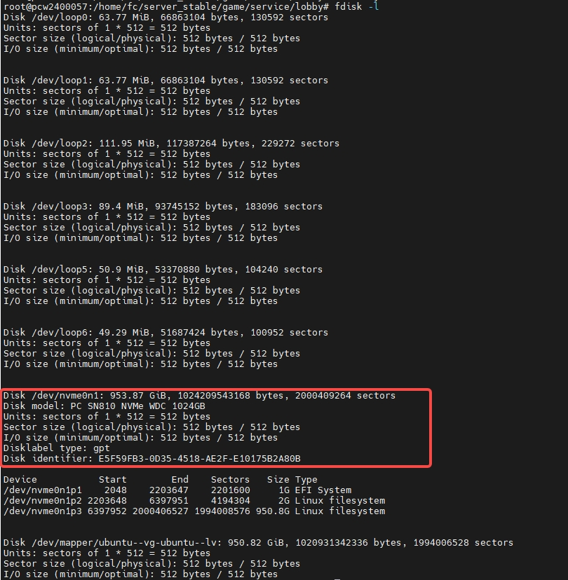
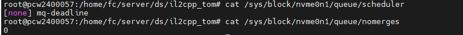
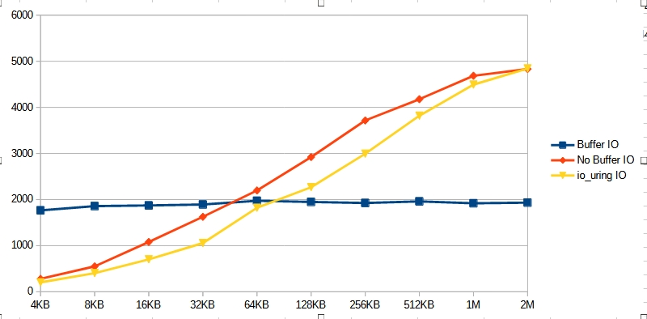

# 前言
  现在需要实现一个录像服，需求是接收ds发过来的快照信息，并保存到磁盘。当客户端请求某局战斗时，将对应的快照数据文件发送给客户端。这里不写录像服的整体架构，只是讨论单台物理机上如何能实现最大的吞吐量。  

# 块设备 I/O
  块设备，以Nvme SSD为例，该类型块设备拥有多个处理队列（之所以要支持多个处理队列是为了避免多个CPU竞争同一个处理队列造成的阻塞），系统初始化时，内核会在block layer为其处理队列创建对应的blk_mq_hw_ctx，每个blk_mq_hw_ctx会与某个CPU所绑定。内核会为该SSD创建一个专属的write back内核线程。对于block layer如何处理request会有多个因素影响，当块设备挂载了IO Scheduler（cat /sys/block/<device>/queue/scheduler）或者block layer层配置了开启合并request的配置（cat /sys/block/<device>/queue/nomerges）时，request不会立马尝试提交到blk_mq_hw_ctx。当上述两种情况都不存在时，block layer会立马尝试将request提交到blk_mq_hw_ctx，如果此时该blk_mq_hw_ctx已满，request会被保存到一个临时队列，在之后的某个时机再尝试提交到blk_mq_hw_ctx。  
  原文：“When the request arrives at the block layer, it will try the shortest path possible: send it directly to the hardware queue. However, there are two cases that it might not do that: if there’s an IO scheduler attached at the layer or if we want to try to merge requests. In both cases, requests will be sent to the software queue.”  
  block layer内核文档：https://www.kernel.org/doc/html/latest/block/blk-mq.html  
  对于写文件，大多数时候write都是将user的内存数据memcpy到page cache就返回了，不会阻塞user thread，之后触发脏页刷盘的时候，由write back内核线程调用block layer的接口创建bio->构建request。之后的步骤则是上面所述。这里可能存在多个误阻塞的场景，第一，这个脏页不一定都是该user thread造成的，因为脏页刷盘的策略面向的是块设备，而不是文件。第二，假设现在有两个线程A、B，A线程write时触发了脏页刷盘，而page cache的脏页需要DMA page cache的数据到块设备后，由块设备驱动在回调中将脏页回收。那么在这一步骤前线程B的write操作也会被阻塞。  
  对于读文件，如果缓存在page cache，则memecpy到user memory直接返回。如果cache miss，则调用block layer的接口创建request（此时还是在user thread）。之后的步骤则是上面所述。

# Network I/O
  系统初始化时，NIC驱动会通过DMA机制为NIC分配一块主内存区域，并将其映射到设备上，使NIC能够直接读写主内存中的数据。  
  当网络数据包到达时，NIC首先将数据写入其内部缓冲区。随后，NIC将数据直接DMA到之前映射好的主内存。一旦DMA传输完成，NIC驱动将通过中断或轮询机制通知内核协议栈，数据随后会被协议栈解析和处理，最终拷贝到对应 socket的接收缓冲区中，供用户空间读取。  
  当发送网络数据包时，首先从user memory memecpy到socket的send buffer，然后立马被协议栈处理（未开启纳格算法或者数据包大小超过MSS），NIC驱动将该数据包挂入TX ring buffer，配置好DMA映射后，由NIC发起DMA，从主内存读取数据并将其发送到网卡接口上。  
  NIC的RX和TX操作都依赖主内存进行DMA，NIC本身的硬件缓冲主要用于RX临时缓存，TX几乎完全绕过NIC内存，直接从主内存拉数据发送。

# 为什么要用io_uring？
  1、io_uring初始化时，内核分配并映射共享内存用于SQ Ring和CQ Ring，user构建和提交SQE时通常不需要系统调用（尤其在SQPOLL模式下）。  
  2、对于no buffer io，可以register buffer，避免反复的pin/unpin页面。  
  3、通过register files，可以减少系统调用开销，加速内核fd解析过程，较少锁竞争，从而提升性能。

# 写入性能测试
  块设备型号为：PC SN810 NVMe WDC 1024GB，该型号性能基准测试顺序写入峰值性能为5000M/S，block layer构建的request最大为512KB，接口是PCIe 4.0 ×4，并且该块设备没有挂载IO Scheduler（对于使用NVMe协议的SSD推荐不挂载IO Scheduler），并且没有开启合并bio。  
    
    
  
+ 普通buffer io代码：  
```c
void write_normal(const char *filename, int writeSize) {
  int fd = open(filename, O_CREAT | O_WRONLY | O_TRUNC, 0644);
  if (fd < 0) { perror("open"); return; }

  char *buf = (char*)malloc(writeSize);
  memset(buf, 'A', writeSize);

  struct timeval start, end;
  gettimeofday(&start, NULL);

  int block_count = (FILE_SIZE_MB * 1024 * 1024) / writeSize;
  for (int i = 0; i < block_count; i++) {
      if (write(fd, buf, writeSize) != writeSize) {
          perror("write");
          break;
      }
  }

  fsync(fd);
  gettimeofday(&end, NULL);
  struct stat sb;
  fstat(fd, &sb);
  close(fd);
  free(buf);

  double seconds = (end.tv_sec - start.tv_sec) + (end.tv_usec - start.tv_usec)/1e6;
  printf("Normal filename: %s write: %.2f MB/s\n", filename, FILE_SIZE_MB / seconds);
  printf("fstat block count: %ld\n", sb.st_blocks);
}
```

+ 普通非buffer io代码：  
```c
void write_odirect(const char *filename, int writeSize) {
  int fd = open(filename, O_CREAT | O_WRONLY | O_TRUNC | O_DIRECT, 0644);
  if (fd < 0) { perror("open"); return; }

  char *buf = aligned_alloc_buffer(writeSize);

  struct timeval start, end;
  gettimeofday(&start, NULL);

  int block_count = (FILE_SIZE_MB * 1024 * 1024) / writeSize;
  for (int i = 0; i < block_count; i++) {
      if (write(fd, buf, writeSize) != writeSize) {
          perror("write");
          break;
      }
  }

  gettimeofday(&end, NULL);
  struct stat sb;
  fstat(fd, &sb);
  close(fd);
  free(buf);

  double seconds = (end.tv_sec - start.tv_sec) + (end.tv_usec - start.tv_usec)/1e6;
  printf("O_DIRECT filename: %s write: %.2f MB/s\n", filename, FILE_SIZE_MB / seconds);
  printf("fstat block count: %ld\n", sb.st_blocks);
}
```

+ 最简单使用io_uring的io代码:
```c
void write_io_uring(const char *filename, int writeSize) {
    struct io_uring ring;
    char *buf = aligned_alloc_buffer(writeSize);
    memset(buf, 'A', writeSize);
    struct io_uring_params params;
    memset(&params, 0, sizeof(params));
    int ret = io_uring_queue_init_params(8, &ring, &params);
    if (ret) { fprintf(stderr, "io_uring init failed: %d\n", ret); return; }

    int fd = open(filename, O_CREAT | O_WRONLY | O_TRUNC | O_DIRECT, 0644);
    if (fd < 0) { perror("open"); return; }

    struct timeval start, end;
    gettimeofday(&start, NULL);

    int block_size = (FILE_SIZE_MB * 1024 * 1024) / writeSize;
    for (int i = 0; i < block_size; i++) {
        struct io_uring_sqe *sqe = io_uring_get_sqe(&ring);
        io_uring_prep_write(sqe, fd, buf, writeSize, i * writeSize);

        io_uring_submit(&ring);

        struct io_uring_cqe *cqe;
        io_uring_wait_cqe(&ring, &cqe);
        if (cqe->res < 0) {
            fprintf(stderr, "write_fixed error: %s\n", strerror(-cqe->res));
            break;
        }
        io_uring_cqe_seen(&ring, cqe);
    }

    gettimeofday(&end, NULL);
    struct stat sb;
    fstat(fd, &sb);
    close(fd);
    io_uring_queue_exit(&ring);
    free(buf);

    double seconds = (end.tv_sec - start.tv_sec) + (end.tv_usec - start.tv_usec)/1e6;
    printf("io_uring filename: %s write: %.2f MB/s\n", filename, FILE_SIZE_MB / seconds);
    printf("fstat block count: %ld\n", sb.st_blocks);
}
```

+ 测试结果：  
    
  文件总大小为512M，<font color= "#FF0000">所有测试数据都排除了一些性能特别差数据，比如说使用O_DIRECT的情况下，每次以512KB的大小写入时，有时性能会特别差，比如800MB/s。当然Buffer IO和io_uring都会有，出现这种情况对于O_DIRECT和io_uring可能是因为SSD的缓存满了，直接刷新到NAND闪存的原因（之所以这么猜测是因为出现很慢的时候立马再次执行速度又恢复了），而对于Buffer IO也有可能是write触发了脏页刷盘。官网上给出的写入性能也只是以写入SSD缓存。</font>首先对比Buffer IO和No Buffer IO，普通Buffer IO写入速率随每次写入大小变化影响不大，这是因为测试中的Buffer IO都只是写入Page Cache（排除了write时触发了脏页刷盘的测试数据），最后由fsync触发脏页刷盘，而刷盘时数据都已经在page cache，所以这几种情况最终构建的request是一样的512KB，```bpftrace -e 'tracepoint:block:block_rq_issue {printf("PID: %d COMM: %s wrote %d bytes\n", pid, comm, args->bytes);}'```。对于O_DIRECT模式，每次调用write，都会调用block layer的接口构建request，所以越少的系统调用write，性能就会越好，对于一次写入1M、2M这种情况，一次系统调用会构建多个request。而对于io_uring，理论上应该是比O_DIRECT模式性能更优的，但上述例子中只是最简单的使用，没有加任何的优化特性，而且比O_DIRECT还有更多的系统调用，所以测试数据比O_DIRECT模式性能要差。  
  
+ 结论：  
  在未挂载IO Scheduler的SSD上，理论上O_DIRECT具有更高的写入性能上限，因为它绕过了内核的page cache，避免了缓存一致性与额外拷贝的开销。但同时也要求user自己管理数据缓存和刷盘逻辑。如果user未实现缓存机制，仅以有多少数据就写多少的方式使用O_DIRECT，写入粒度较小或不连续，反而可能不如Buffer io。Buffer IO可能会合并相邻的页，使block layer能构建更少的request，从而减少IOPS消耗、提升写入效率。
  <font color= "#FF0000">使用Nvem协议的SSD，推荐是不挂载IO Schedule，因为它支持多处理队列，而且SSD对于顺序读写和随机读写性能差异不大，挂载IO Schedule反而可能会降低读写能力。</font>

# io_uring_setup() flags
+ IORING_SETUP_IOPOLL  
  将块设备以轮询方式执行该io_uring实例的I/O操作。  

+ IORING_SETUP_SQPOLL  
  创建一个内核线程来轮询SQ Array，避免每次需要使用enter/sumbit切换到内核。需要注意的是enter是会有系统调用，但是在SQPOLL模式下sumbit不会有系统调用，而非SQPOLL模式下，sumbit最终也会调用enter。

+ IORING_SETUP_SQ_AFF  
  用于配合IORING_SETUP_SQPOLL，将内核轮询线程绑定到指定CPU上运行。  

+ IORING_SETUP_ATTACH_WQ  
  允许同一进程内的多个io_uring实例共享同一个io_wq线程池，从而降低内核线程资源消耗，提升资源利用率。默认情况下每个io_uring实例有各自独立的io_wq线程池。  

+ IORING_SETUP_R_DISABLED  
  创建io_uring时，初始状态下SQ是“不可用”的，需要显式调用io_uring_register_ring_fd(IORING_REGISTER_ENABLE_RINGS)才能启用。  

+ IORING_SETUP_SUBMIT_ALL  
  如果在创建io_uring实例时设置了IORING_SETUP_SUBMIT_ALL，那么所有提交操作（io_uring_enter()）必须一次性提交所有SQ，否则失败，不提交任何一个。  

+ IORING_SETUP_COOP_TASKRUN  
  当io_uring的内核线程不够用时，用户线程在调用io_uring_enter()提交请求时，可以“主动”协助内核执行部分未完成的I/O任务。

+ IORING_SETUP_TASKRUN_FLAG  
  只在用户线程显式请求时（通过IORING_ENTER_TASKRUN）才在io_uring_enter()中协作执行请求任务，而不是像COOP_TASKRUN那样自动执行。

+ IORING_SETUP_SINGLE_ISSUER  
  所有对io_uring的提交操作（即写Submission Queue）都由同一个线程完成，内核据此省略多线程同步机制，从而加快SQE提交速度。

+ IORING_SETUP_DEFER_TASKRUN  
  尽量避免立即唤醒内核工作线程执行异步任务，而是延迟执行，直到io_uring_enter() 提交更多请求或显式需要时再运行。

+ IORING_SETUP_NO_MMAP  
  禁止内核为SQ和CQ映射内存区域自动调用mmap，从而允许用户手动完成共享内存映射。

+ IORING_SETUP_REGISTERED_FD_ONLY  
  只能对提前通过io_uring_register_files()注册的文件描述符发起IO操作，禁止使用未注册的fd。

+ IORING_SETUP_NO_SQARRAY  
  禁用SQ Array机制。io_uring初始化时，内核还是会申请CQ Ring的内存。<font color= "#FF0000">暂时想不到这个应用场景是什么，使用改参数初始化时，io_uring实例的CQ Ring都用不到，比如A进程使用IORING_SETUP_NO_SQARRAY初始化，并通过IORING_OP_MSG_RING将SQE投递给B进程的io_uring，当操作完成后，CQE被放入B进程的CQ Array，A进程是不感知的。如果为了多进程共享SQ Array，可以直接用IORING_SETUP_NO_MMAP。</font>

+ IORING_SETUP_HYBRID_IOPOLL  
  启用混合I/O轮询，默认情况下，SQE操作使用中断模式。需要使用polling模式的话，SQE提交时要使用IOSQE_IO_HARDPOLL。

# io_uring register op
+ IORING_REGISTER_BUFFERS、IORING_UNREGISTER_BUFFERS  
  预先将用户态的buffer注册到内核，以提高数据IO性能、降低内存管理开销。

+ IORING_REGISTER_FILES、IORING_UNREGISTER_FILES  
  将一组文件描述符预先注册到io_uring实例中，从而在后续提交IO操作时通过索引来引用这些文件，而不是直接使用原始的fd值。  
  + 减少系统调用开销：  
  不使用时，每次提交SQE操作如IORING_OP_READ都要传递一个fd；  
  使用后，只需传一个files_index（索引），用户态到内核态的数据更少。  
  + 加快内核fd解析过程：  
  注册后，内核在提交IO操作时可以直接通过数组索引访问文件指针；  
  避免每次都从当前进程的文件描述符表中查找、加锁、引用计数等。
  + 减少锁竞争：
  未注册时，每个IO操作都需要获取当前进程的files_struct锁；  
  注册后，直接使用预注册文件指针，规避这些锁。

+ IORING_REGISTER_FILES_UPDATE
  动态更新已注册的文件描述符fd表中的一部分，而不需要重新注册整个fd列表。

+ IORING_REGISTER_IOWQ_AFF、IORING_UNREGISTER_IOWQ_AFF  
  控制io_uring的io_wq线程绑定在哪些CPU上运行，实现CPU亲和性配置，NUMA架构下避免跨node。

+ IORING_REGISTER_IOWQ_MAX_WORKERS
  限制io_wq线程池中的最大线程数量。bounded和unbounded线程分别限制。可能会造成阻塞的操作会使用bounded worker线程，明确不会操作阻塞才会使用unbounded worker线程。如果bounded worker线程使用完了，后续的阻塞操作会等待空闲线程，而不是直接使用unbounded worker线程。

+ IORING_REGISTER_RING_FDS、IORING_UNREGISTER_RING_FDS  
  注册其他进程的io_uring fd到当前io_uring实例中，以便进行诸如IORING_OP_MSG_RING这样的跨io_uring通信。

+ IORING_REGISTER_PBUF_RING、IORING_UNREGISTER_PBUF_RING  
  注册一个共享的环形buffer池，用于某些支持自动buffer分配的操作（如recv、accept）自动从中取buffer，提高性能。

+ IORING_REGISTER_SYNC_CANCEL
+ IORING_REGISTER_FILE_ALLOC_RANGE
+ IORING_REGISTER_PBUF_STATUS
+ IORING_REGISTER_NAPI、IORING_UNREGISTER_NAPI
+ IORING_REGISTER_CLOCK
+ IORING_REGISTER_CLONE_BUFFERS
+ IORING_REGISTER_RESIZE_RINGS
+ IORING_REGISTER_MEM_REGION
+ IORING_REGISTER_USE_REGISTERED_RING

# io_uring op
+ IORING_OP_READV：从一个fd中读取数据，并填充用户提供的iovec数组（即多个缓冲区）。  
  IORING_OP_WRITEV：将多个buffer（iovecs）中数据写入目标fd。  
  IORING_OP_READ：从一个fd中读取数据。  
  IORING_OP_WRITE：将一个用户态buffer中的数据写入一个fd。  
  上述操作码，对于普通文件描述符，如果不使用O_DIRECT，

+ IORING_OP_READ_FIXED：一种使用固定缓冲区的异步读操作，它跳过pin/unpin页面，提升性能。  
  IORING_OP_WRITE_FIXED:一种使用固定缓冲区的异步写操作。 
  
  