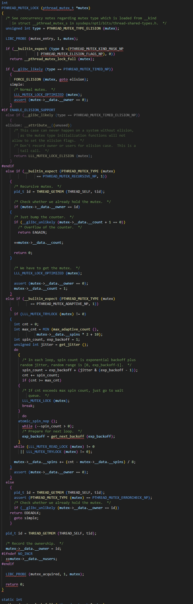
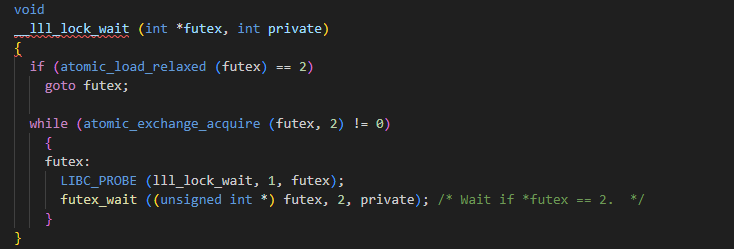
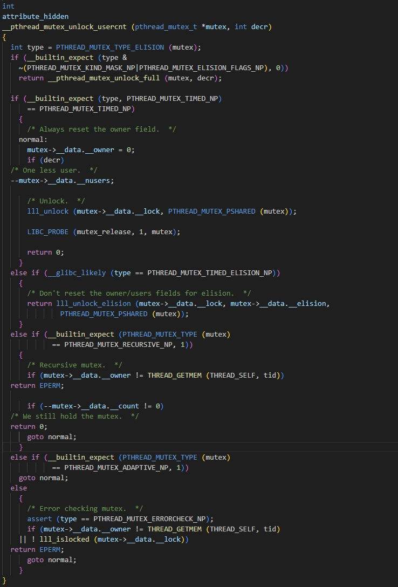
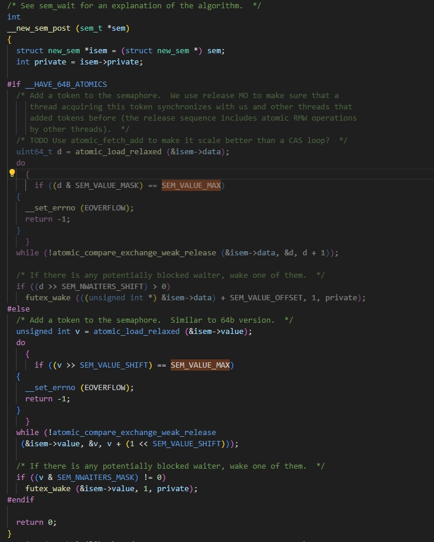
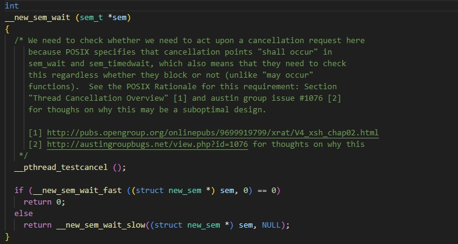
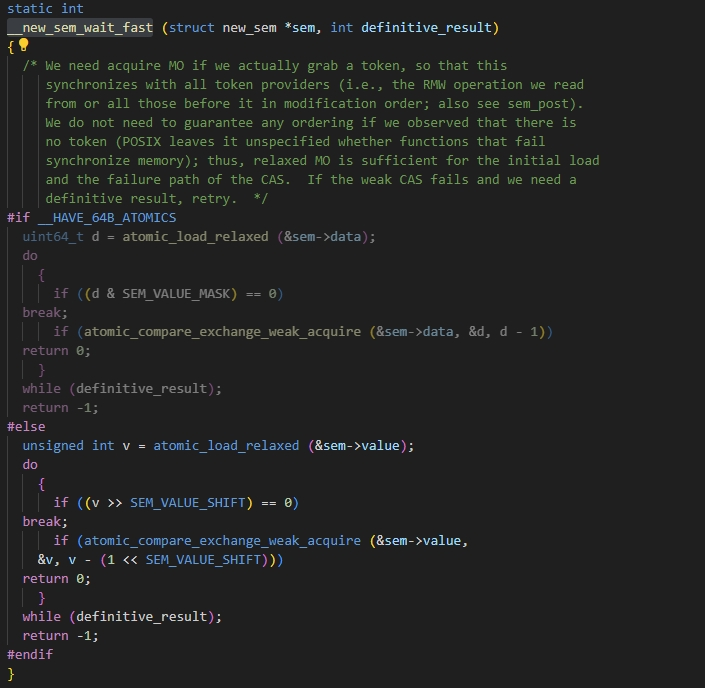
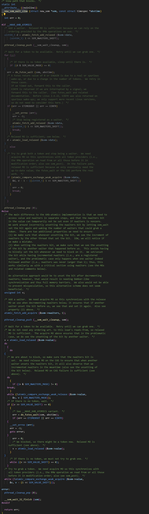

# 1、atomic<T>（原子类型）
std::atomic自定义类型的有可能不是lock-free的原因：
1、对齐问题：为了获得最佳的性能，数据需要对齐到特定的地址。不是所有的数据类型都可以保证这种对齐。当一个原子对象跨越多个缓存行时，这可能导致额外的开销，因为CPU需要检查多个缓存行来获取完整的数据。
2、大小问题：如果自定义类型的大小超过一个缓存行的大小，那么在执行原子操作时可能需要访问多个缓存行。这增加了操作的复杂性和开销。
3、实现复杂性：对于内置类型，编译器和标准库可以很容易地利用硬件指令来实现高效的原子操作。但对于复杂的自定义类型，实现高效的原子操作更为复杂。
4、硬件限制：不同的处理器和硬件平台可能有不同的原子操作支持和限制。这可能导致为某些自定义类型实现lock-free原子操作的困难。

# 2、spin lock(自旋锁)
Linux中的spin_lock其实就是一个int类型的变量，使用CPU的原子指令实现自旋锁，不会挂起线程，一直循环等待。

# 3、mutex（glibc版本为2.29）
__pthread_mutex_s:  
  ```c
struct __pthread_mutex_s
{
    int __lock __LOCK_ALIGNMENT;    //锁
    unsigned int __count;           //递归类型加锁次数
    int __owner;                    //当前持有锁的线程ID
    #if !__PTHREAD_MUTEX_NUSERS_AFTER_KIND
    unsigned int __nusers;
    #endif
    /* KIND must stay at this position in the structure to maintain
        binary compatibility with static initializers.  */
    int __kind;                     //锁的类型
    __PTHREAD_COMPAT_PADDING_MID
    #if __PTHREAD_MUTEX_NUSERS_AFTER_KIND
    unsigned int __nusers;          //当前等待和加锁的线程数
    #endif
    #if !__PTHREAD_MUTEX_USE_UNION
    __PTHREAD_SPINS_DATA;           //PTHREAD_MUTEX_ADAPTIVE_NP类型相关，用来计算最大自旋次数
    __pthread_list_t __list;        //线程列表
    # define __PTHREAD_MUTEX_HAVE_PREV      1
    #else
    __extension__ union
    {
        __PTHREAD_SPINS_DATA;
        __pthread_slist_t __list;
    };
    # define __PTHREAD_MUTEX_HAVE_PREV      0
    #endif
    __PTHREAD_COMPAT_PADDING_END
};
  ```  
  首先需要说明的是lock mutex并不是一定就会有用户态和内核态的切换（具体的实现再写），然后mutex的底层唤醒机制用的是futex。 
  PTHREAD_MUTEX_LOCK:    
  ```c 
int PTHREAD_MUTEX_LOCK(pthread_mutex_t *mutex)
{
    //获取mutex的类型
    unsigned int type = PTHREAD_MUTEX_TYPE_ELISION (mutex);

    //PTHREAD_MUTEX_ELISION_FLAGS_NP
    if (__builtin_expect (type & ~(PTHREAD_MUTEX_KIND_MASK_NP
                    | PTHREAD_MUTEX_ELISION_FLAGS_NP), 0))
        return __pthread_mutex_lock_full (mutex);

    //PTHREAD_MUTEX_TIMED_NP 默认类型
    if (__glibc_likely (type == PTHREAD_MUTEX_TIMED_NP))
    {
        //调用lll_lock加锁
        ...
    }
    //PTHREAD_MUTEX_RECURSIVE_NP 递归类型
    else if (__builtin_expect (PTHREAD_MUTEX_TYPE (mutex)
                    == PTHREAD_MUTEX_RECURSIVE_NP, 1))
    {
        //获取当前的线程ID，如果当前的线程ID等于mutex->__data.__owner，则累加mutex->__data.__count并返回
        //否则调用lll_lock加锁
        ...
    }
    //PTHREAD_MUTEX_ADAPTIVE_NP 这个类型为了避免用户态和内核态的切换，会做短暂的自旋操作
    else if (__builtin_expect (PTHREAD_MUTEX_TYPE (mutex)
                == PTHREAD_MUTEX_ADAPTIVE_NP, 1))
    {
        //尝试加锁，如果被锁则短暂的自旋
        if (...)
        {
            //短暂的自旋，超过最大次数则调用lll_lock加锁
            ...
        }
    }
    //PTHREAD_MUTEX_ERRORCHECK_NP类型,
    else
    {
        //如果mutex->__data.__owner和当前线程ID相等，则返回EDEADLK，
        //否则调用lll_lock (mutex)
        ...
    }

    //赋值mutex->__data.__owner等字段
    ...

    return 0;
}
  ```  
  详细代码截图如下所示：  
      
    
  __lll_lock_wait自旋操作，这么做的原因是futex可能会被虚假唤醒。   
  __pthread_mutex_unlock:  
  ```c 
int
attribute_hidden
__pthread_mutex_unlock_usercnt (pthread_mutex_t *mutex, int decr)
{
    int type = PTHREAD_MUTEX_TYPE_ELISION (mutex);
    if (__builtin_expect (type &
            ~(PTHREAD_MUTEX_KIND_MASK_NP|PTHREAD_MUTEX_ELISION_FLAGS_NP), 0))
        return __pthread_mutex_unlock_full (mutex, decr);

    //PTHREAD_MUTEX_TIMED_NP 默认类型
    if (__builtin_expect (type, PTHREAD_MUTEX_TIMED_NP)
        == PTHREAD_MUTEX_TIMED_NP)
    {
        //重置mutex->__data.__owner，mutex->__data.__nusers字段减1，并且调用lll_unlock解锁
        ...
    }
    else if (__glibc_likely (type == PTHREAD_MUTEX_TIMED_ELISION_NP))
        {
        /* Don't reset the owner/users fields for elision.  */
        return lll_unlock_elision (mutex->__data.__lock, mutex->__data.__elision,
                        PTHREAD_MUTEX_PSHARED (mutex));
        }
    //PTHREAD_MUTEX_RECURSIVE_NP 递归类型
    else if (__builtin_expect (PTHREAD_MUTEX_TYPE (mutex)
                    == PTHREAD_MUTEX_RECURSIVE_NP, 1))
    {
        //如果mutex->__data.__owner不是当前线程，返回EPERM
        ...

        //mutex->__data.__count做减1操作，如果结果不为0直接返回。某一线程重复加锁
        ...

        //重置mutex->__data.__owner，mutex->__data.__nusers字段减1，并且调用lll_unlock解锁
        ...
    }
    //PTHREAD_MUTEX_ADAPTIVE_NP
    else if (__builtin_expect (PTHREAD_MUTEX_TYPE (mutex)
                    == PTHREAD_MUTEX_ADAPTIVE_NP, 1))
    {
        //重置mutex->__data.__owner，mutex->__data.__nusers字段减1，并且调用lll_unlock解锁
        ...
    }
    //PTHREAD_MUTEX_ERRORCHECK_NP
    else
    {
        //检查mutex->__data.__owner和当前线程ID相等，以及当前是否被锁，失败则返回EPERM
        ...

        //重置mutex->__data.__owner，mutex->__data.__nusers字段减1，并且调用lll_unlock解锁
        ...
    }
}
  ```  
  详细代码截图如下所示：  
    
  PTHREAD_MUTEX_TIMED_NP(默认类型)、PTHREAD_MUTEX_ADAPTIVE_NP在解锁的时候没有判断锁的持有线程是否为当前线程，所以需要注意加锁解锁相对应，也可以用PTHREAD_MUTEX_ERRORCHECK_NP，会做检查，只是性能稍差。

# 4、条件变量
```c 
static __always_inline int
__pthread_cond_wait_common (pthread_cond_t *cond, pthread_mutex_t *mutex,
    const struct timespec *abstime)
{
    //释放mutex
    ...

    while(1)
    {
        if (CAS(消耗信号))
            break;
        else
            continue;

        //调用futex(FUTEX_WAIT, …)
        ...
    }
    

    //被唤醒后重新尝试获取mutex
    ...
}
```  
  <font color= "#FF0000">条件变量在futex被唤醒后，有一个自旋操作，因此条件变量不会由于futex的原因导致虚假唤醒。但消耗信号到重新获取互斥锁这两步不是原子性的，这里会导致存在虚假唤醒的情况。</font>

# 5、信号量
new_sem:  
```c 
struct new_sem
{
    #if __HAVE_64B_ATOMICS
        /* The data field holds both value (in the least-significant 32 bits) and
            nwaiters.  */
        # if __BYTE_ORDER == __LITTLE_ENDIAN
        #  define SEM_VALUE_OFFSET 0
        # elif __BYTE_ORDER == __BIG_ENDIAN
        #  define SEM_VALUE_OFFSET 1
        # else
        # error Unsupported byte order.
        # endif
        # define SEM_NWAITERS_SHIFT 32
        # define SEM_VALUE_MASK (~(unsigned int)0)
        uint64_t data;      //futex监听的地址
        int private;        //是否单个进程私有
        int pad;
    #else
        # define SEM_VALUE_SHIFT 1
        # define SEM_NWAITERS_MASK ((unsigned int)1)
        unsigned int value;
        int private;
        int pad;
        unsigned int nwaiters;
    #endif
};
```  
__new_sem_post:  
  ```c 
int __new_sem_post (sem_t *sem)
{
    struct new_sem *isem = (struct new_sem *) sem;
    int private = isem->private;

    //当前值
    uint64_t d = atomic_load_relaxed (&isem->data);
    do
    {
        //是否超过最大值SEM_VALUE_MAX（int类型的最大值）
        if ((d & SEM_VALUE_MASK) == SEM_VALUE_MAX)
        {
            __set_errno (EOVERFLOW);
            return -1;
        }
    }
    //CAS操作，data字段+1
    while (!atomic_compare_exchange_weak_release (&isem->data, &d, d + 1));

    //如果大于0，则唤醒一个线程
    if ((d >> SEM_NWAITERS_SHIFT) > 0)
        futex_wake (((unsigned int *) &isem->data) + SEM_VALUE_OFFSET, 1, private);

    return 0;
}
  ```  
  详细代码截图如下所示：  
      
  __new_sem_wait:    
  ```c 
int
__new_sem_wait (sem_t *sem)
{
    //如果data字段大于0，并且CAS data字段做减1操作成功，则直接返回0
    if (...)
        return 0;
    else
    {
        for (;;)
        {
            //如果data字段等于0，则调用futex wait，被唤醒后原子操作data字段做减1操作，成功break，失败则继续
            if (data == 0)
            {
                futex(wait);
            }
            else
            {
                if (cas(data-1))
                {
                    break;
                }
            }
        }
    }
}
  ```  
  详细代码截图如下所示：  
    
      
     
  通过源码的注释也能知道当futex被唤醒后，还会有CAS操作来避免内核的虚假唤醒。

# 6、三者比较
+ 1、关于条件变量的虚假唤醒  
  首先需要说明的是三种底层唤醒机制都是用的futex，但只有条件变量存在虚假唤醒。这是有两个方面导致的，条件变量的实现以及内核的原因，解释如下：  
  实现方面：futex唤醒和mutex加锁之间的竞态，上面代码中有介绍pthread_cond_wait内部的行为大致为：1、释放mutex。2、调用futex(FUTEX_WAIT, …)进入休眠。3、被pthread_cond_signal或pthread_cond_broadcast唤醒。4、重新尝试获取 mutex。由于步骤3和4不是原子的，多个被唤醒的线程可能会竞争mutex，导致一些线程在真正获取mutex之前再次进入等待。  
  内核方面：futex_wait()可能会被虚假唤醒（例如：信号、调度、内核 Bug 等因素）。  
  而互斥锁、条件变量、信号量都不会因为Linux内核可能出现的spurious wakeup导致虚假唤醒，这是因为互斥锁、条件变量、信号量futex被唤醒后，还会通过原子操作检查监控的值是否满足条件。但条件变量自身的实现机制还是会出现虚假唤醒。
