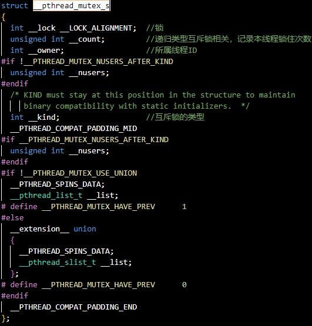
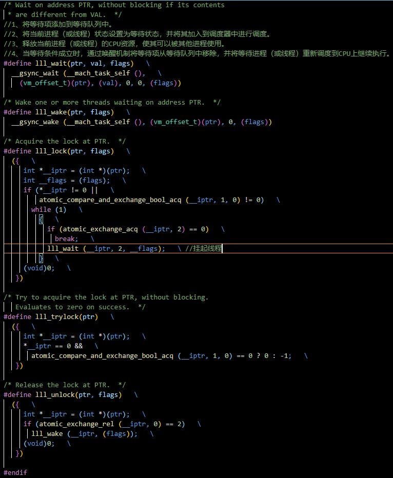
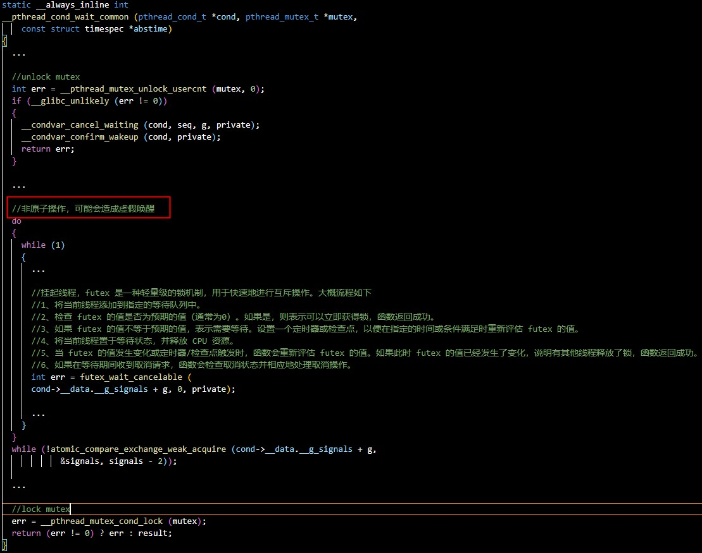
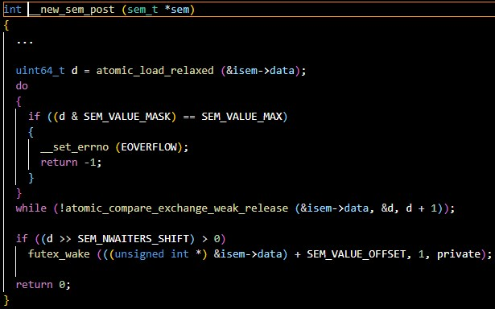
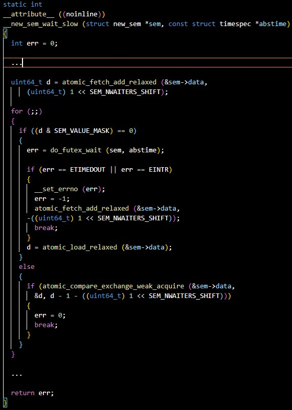

# 1、atomic<T>（原子类型）
std::atomic自定义类型的有可能不是lock-free的原因：
1、对齐问题：为了获得最佳的性能，数据需要对齐到特定的地址。不是所有的数据类型都可以保证这种对齐。当一个原子对象跨越多个缓存行时，这可能导致额外的开销，因为CPU需要检查多个缓存行来获取完整的数据。
2、大小问题：如果自定义类型的大小超过一个缓存行的大小，那么在执行原子操作时可能需要访问多个缓存行。这增加了操作的复杂性和开销。
3、实现复杂性：对于内置类型，编译器和标准库可以很容易地利用硬件指令来实现高效的原子操作。但对于复杂的自定义类型，实现高效的原子操作更为复杂。
4、硬件限制：不同的处理器和硬件平台可能有不同的原子操作支持和限制。这可能导致为某些自定义类型实现lock-free原子操作的困难。

# 2、Mutex
Linux中的互斥锁（Mutex）是一种用于保护共享资源的同步原语。其底层实现原理主要基于内核提供的原子操作和自旋锁机制。
互斥锁的实现主要包括以下几个关键部分：
1、原子操作：Linux内核提供了一组原子操作函数，这些函数可以在多线程环境中安全地执行一些基本的操作，如增加、减少、设置等。这些原子操作可以确保在多线程环境中对共享资源的操作是原子的，不会被其他线程打断。
2、自旋锁：自旋锁是一种特殊的锁，当一个线程试图获取自旋锁但该锁已经被其他线程持有时，该线程会一直循环等待（自旋），直到获得锁为止。Linux中的自旋锁与互斥锁紧密相关，互斥锁的实现通常会使用自旋锁来确保
线程安全地获取和释放锁。
3、互斥锁结构体：内核定义了一个互斥锁的数据结构，该结构体包含了与互斥锁相关的各种信息，如指向自旋锁的指针、指向等待队列的指针等。
总的来说，Linux中互斥锁的底层实现原理主要是基于原子操作和自旋锁机制，通过这些机制来确保在多线程环境中对共享资源的互斥访问。
部分源码截图如下：
mutex结构体：

mutex的lock和unlock：

# 3、Spin Lock(自旋锁)
Linux中的spin_lock其实就是一个int类型的变量，使用CPU的原子指令实现自旋锁，不会挂起线程，一直循环等待。所以单核CPU不能使用自旋锁(当然现在应该也没有单核的CPU)。

# 4、条件变量
pthread_cond_wait：

# 5、信号量
sem_post：

sem_wait：

# 6、条件变量和信号量比较
+ 1、条件变量存在虚假唤醒而信号量不会。条件变量和信号量虽然底层都使用了 futex 机制来实现，但它们在使用方式和语义上存在一些差异，这导致了它们在处理虚假唤醒方面的不同表现。 在 Linux 内核中，条件变量的实现涉及更多的调度和检查操作，因此容易出现虚假唤醒的情况；而信号量的实现更加简单和原子性，因此不会出现虚假唤醒的情况。
+ 2、条件变量和信号量在性能方面没有绝对的优劣之分，因为它们的使用场景和适用范围不同，而且在实际应用中，性能的差异也取决于具体的实现和场景。 条件变量主要用于实现线程之间的同步和通信。当线程调用条件变量的等待函数时，它会将自身放入等待队列，并释放互斥锁，然后进入睡眠状态。当其他线程修改了条件并调用通知函数时，一个或多个等待线程将被唤醒。条件变量的典型应用场景包括生产者-消费者问题、线程间的数据共享等。在某些情况下，条件变量的性能可能优于信号量，因为它们减少了不必要的阻塞和上下文切换。然而，条件变量的实现通常比信号量更复杂，因为需要处理虚假唤醒和其他同步问题。信号量是一种更通用的同步工具，用于控制对共享资源的访问。信号量的值表示可用资源的数量，当线程需要获取资源时，它会尝试减少信号量的值。如果信号量的值为零，线程将会阻塞或等待。当其他线程释放资源时，它会增加信号量的值并唤醒一个或多个等待线程。在某些情况下，信号量的性能可能优于条件变量，因为它们避免了虚假唤醒和其他同步问题。然而，信号量的实现通常比条件变量更复杂，因为需要处理资源计数和死锁等问题。

综上所述，虽然条件变量和信号量底层都使用 futex 实现，但由于它们的使用方式和语义不同，导致了在处理虚假唤醒方面的不同表现。条件变量主要用于同步和通信，而信号量主要用于资源访问控制。条件变量和信号量在性能方面没有绝对的优劣之分，选择使用哪个同步工具应该根据具体的场景和需求来决定。在某些场景下，条件变量的性能可能优于信号量，而在其他场景下，信号量的性能可能更优。
