# <center>Lua源码粗浅解析(5.4.7)</center>

## A、常见数据结构
### 1、TString  
+ TString  
  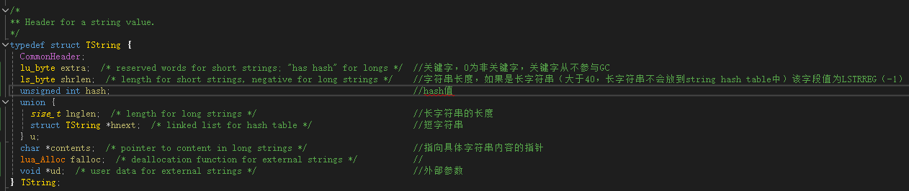  
+ luaS_newlstr  
  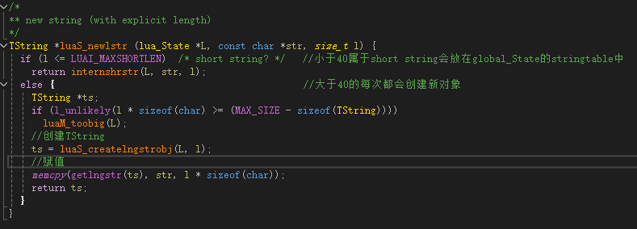  
  *PS:过长的字符串（长度大于40）每次都会创建一个新对象，大概是是为了性能考虑，如果全放在global_State中的strt中(strt的数据类型为stringtable)，长度过长时性能较差（计算hash值时会遍历整个字符串）。stringtable缩小扩容都是2倍。*
+ internshrstr  
  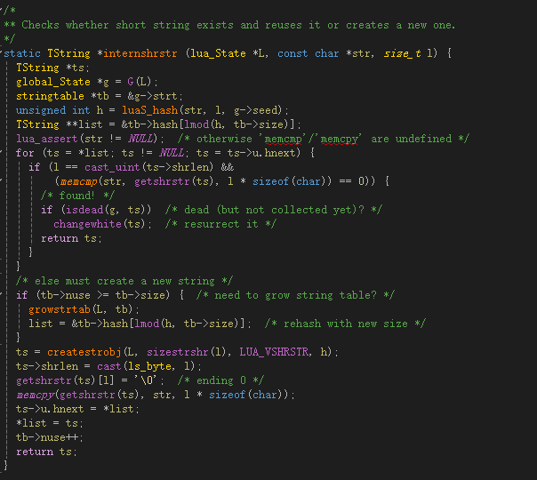
+ stringtable  
  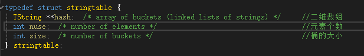

### 2、Table
+ Table  
  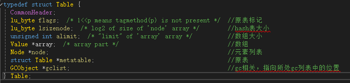
+ table相关操作指令：  
  + OP_NEWTABLE：  
  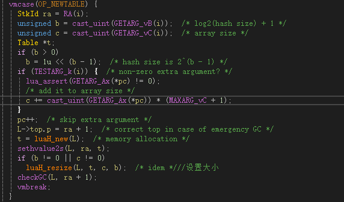  
  + OP_SETLIST：  
  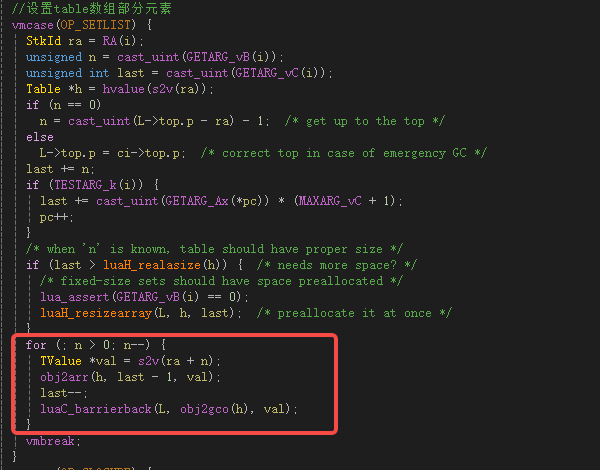
  + OP_SETI：  
  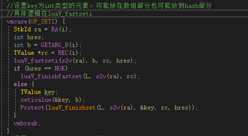  
  + OP_SETFIELD：  
  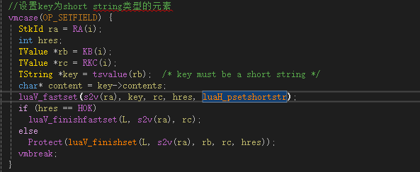  
  + OP_SETTABLE：  
  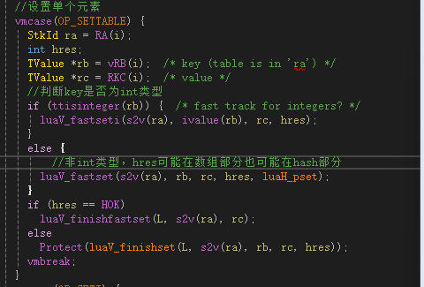
  + ```local tbl = {1,["test1"] = 4,2,["test2"] = 5,3,["test3"] = 6};```该代码的指令调用：首先调用OP_NEWTABLE，并且b(hash size)、c(array size)不为0，再调用OP_SETFIELD，一个个设置hash部分数据以及OP_SETLIST一次性设置array部分数据。  
  ```local tbl = {}; tbl[1] = 1; tbl["test1"] = 4; tbl[2] = 2;``` 该代码的指令调用：首先调用OP_NEWTABLE，并且b(hash size)、c(array size)为0，再按顺序调用OP_SETI或者OP_SETFIELD，赋值过程中会调整table的数组和hash大小。  
  <font color= "#FF0000">OP_SETTABLE在5.4.7貌似没用了。被拆分为OP_SETI和OP_SETFIELD。</font>  
  + luaV_fastseti（OP_SETI查找位置）：  
    ```c  
    #define luaV_fastseti(t,k,val,hres) \
    if (!ttistable(t)) hres = HNOTATABLE; \
    else { luaH_fastseti(hvalue(t), k, val, hres); }

    #define luaH_fastseti(t,k,val,hres) \
    { Table *h = t; lua_Unsigned u = l_castS2U(k) - 1u; \
      //未超过数组大小，此时该下标为空则直接赋值
      //否则则替换
      if ((u < h->alimit)) { \
      lu_byte *tag = getArrTag(h, u); \
      if (tagisempty(*tag)) hres = ~cast_int(u); \
        else { fval2arr(h, u, tag, val); hres = HOK; }} \
      //超过数组大小，则会放到hash表，对hash表长度取模
      else { hres = luaH_psetint(h, k, val); }}
    ```  
  + luaV_finishset，如果luaV_fastseti和luaV_fastset没有找到位置，则调用luaV_finishset：  
    ```c  
    void luaV_finishset (lua_State *L, const TValue *t, TValue *key, TValue *val, int hres) {
      int loop;  /* counter to avoid infinite loops */
      for (loop = 0; loop < MAXTAGLOOP; loop++) {
        const TValue *tm;  /* '__newindex' metamethod */
        if (hres != HNOTATABLE) {  /* is 't' a table? */
          Table *h = hvalue(t);  /* save 't' table */
          tm = fasttm(L, h->metatable, TM_NEWINDEX);  /* get metamethod */
          //没有newindex的元方法
          if (tm == NULL) {  /* no metamethod? */
            luaH_finishset(L, h, key, val, hres);  /* set new value */
            invalidateTMcache(h);
            luaC_barrierback(L, obj2gco(h), val);
            return;
          }
          /* else will try the metamethod */
        }
        else {  /* not a table; check metamethod */
          tm = luaT_gettmbyobj(L, t, TM_NEWINDEX);
          if (l_unlikely(notm(tm)))
            luaG_typeerror(L, t, "index");
        }
        /* try the metamethod */
        //元方法是个函数则调用对应的函数
        if (ttisfunction(tm)) {
          luaT_callTM(L, tm, t, key, val);
          return;
        }
        //元方法不是函数则把元方法当作一个table继续
        t = tm;  /* else repeat assignment over 'tm' */
        luaV_fastset(t, key, val, hres, luaH_pset);
        if (hres == HOK)
          return;  /* done */
        /* else 'return luaV_finishset(L, t, key, val, slot)' (loop) */
      }
      luaG_runerror(L, "'__newindex' chain too long; possible loop");
    }

    void luaH_finishset (lua_State *L, Table *t, const TValue *key, TValue *value, int hres) {
      lua_assert(hres != HOK);
      if (hres == HNOTFOUND) {
        luaH_newkey(L, t, key, value);
      }
      else if (hres > 0) {  /* regular Node? */
        setobj2t(L, gval(gnode(t, hres - HFIRSTNODE)), value);
      }
      else {  /* array entry */
        hres = ~hres;  /* real index */
        obj2arr(t, hres, value);
      }
    }
    ```
  + luaH_newkey：  
    ```c
    //如果key是int类型，且在数组大小限制内，则在这之前赋值已经完成，到这一步则是因为
    //key为非int类型或者key为int类型但超过数组限制从而被分配到hash部分。
    static void luaH_newkey (lua_State *L, Table *t, const TValue *key,TValue *value) 
    {
      Node *mp;
      TValue aux;
      if (l_unlikely(ttisnil(key)))
        luaG_runerror(L, "table index is nil");
      else if (ttisfloat(key)) 
      {
        //key为浮点数，首先尝试转成int类型
        lua_Number f = fltvalue(key);
        lua_Integer k;
        if (luaV_flttointeger(f, &k, F2Ieq)) {  /* does key fit in an integer? */
          setivalue(&aux, k);
          key = &aux;  /* insert it as an integer */
        }
        else if (l_unlikely(luai_numisnan(f)))
          luaG_runerror(L, "table index is NaN");
      }
      if (ttisnil(value))
        return;  /* do not insert nil values */
      //获取key对应的node
      mp = mainpositionTV(t, key);
      if (!isempty(gval(mp)) || isdummy(t)) {  /* main position is taken? */
        Node *othern;
        Node *f = getfreepos(t);  /* get a free place */
        if (f == NULL) {  /* cannot find a free place? */
          rehash(L, t, key);  /* grow table */
          /* whatever called 'newkey' takes care of TM cache */
          luaH_set(L, t, key, value);  /* insert key into grown table */
          return;
        }
        lua_assert(!isdummy(t));
        //获取当前位置的node的key本该所在的位置
        othern = mainpositionfromnode(t, mp);
        //如果不相等那就是其他key之前就已经发生过碰撞被分配到这里
        if (othern != mp) {  /* is colliding node out of its main position? */
          /* yes; move colliding node into free position */
          //将原来的挪到空闲位置，并将传入的key放入所对应的node里面
          while (othern + gnext(othern) != mp)  /* find previous */
            othern += gnext(othern);
          gnext(othern) = cast_int(f - othern);  /* rechain to point to 'f' */
          *f = *mp;  /* copy colliding node into free pos. (mp->next also goes) */
          if (gnext(mp) != 0) {
            gnext(f) += cast_int(mp - f);  /* correct 'next' */
            gnext(mp) = 0;  /* now 'mp' is free */
          }
          setempty(gval(mp));
        }
        else {  /* colliding node is in its own main position */
          /* new node will go into free position */
          //赋值到找到的空闲位置并且将空闲位置连接起来
          if (gnext(mp) != 0)
            gnext(f) = cast_int((mp + gnext(mp)) - f);  /* chain new position */
          else lua_assert(gnext(f) == 0);
          gnext(mp) = cast_int(f - mp);
          mp = f;
        }
      }
      //没有发生冲突且table的lsizenode不为0，则找到对应位置直接赋值
      setnodekey(L, mp, key);
      luaC_barrierback(L, obj2gco(t), key);
      lua_assert(isempty(gval(mp)));
      setobj2t(L, gval(mp), value);
    } 
    ```
  + rehash：  
    ```c
    static void rehash (lua_State *L, Table *t, const TValue *ek) 
    {
      unsigned int asize;  /* optimal size for array part */
      unsigned int na;  /* number of keys in the array part */
      //nums[i]记录的值是key的大小在2^(i - 1)到2^i的数量
      unsigned int nums[MAXABITS + 1];
      int i;
      unsigned totaluse;
      for (i = 0; i <= MAXABITS; i++) nums[i] = 0;  /* reset counts */
      setlimittosize(t);
      //计算数组部分数据分布
      na = numusearray(t, nums);  /* count keys in array part */
      totaluse = na;  /* all those keys are integer keys */
      //计算hash部分数据分布
      totaluse += numusehash(t, nums, &na);  /* count keys in hash part */
      /* count extra key */
      if (ttisinteger(ek))
        na += countint(ivalue(ek), nums);
      totaluse++;
      /* compute new size for array part */
      //计算新的数组部分大小
      asize = computesizes(nums, &na);
      /* resize the table to new computed sizes */
      //重新分配数组以及hash表的大小
      luaH_resize(L, t, asize, totaluse - na);
    }

    //计算数组部分大小，规则是找到最大且数量超过一半的
    static unsigned computesizes (unsigned nums[], unsigned *pna) 
    {
      int i;
      unsigned int twotoi;  /* 2^i (candidate for optimal size) */
      unsigned int a = 0;  /* number of elements smaller than 2^i */
      unsigned int na = 0;  /* number of elements to go to array part */
      unsigned int optimal = 0;  /* optimal size for array part */
      /* loop while keys can fill more than half of total size */
      for (i = 0, twotoi = 1;
          twotoi > 0 && *pna > twotoi / 2;
          i++, twotoi *= 2) {
        a += nums[i];
        if (a > twotoi/2) {  /* more than half elements present? */
          optimal = twotoi;  /* optimal size (till now) */
          na = a;  /* all elements up to 'optimal' will go to array part */
        }
      }
      lua_assert((optimal == 0 || optimal / 2 < na) && na <= optimal);
      *pna = na;
      return optimal;
    }
    ```
+ 因此定义一个table时最好是定义即初始化，否则一个个添加元素会导致多次rehash。或者用table.create(数组大小，hash大小)api来创建table。table.create如下所示：  
  ```c
  static int tcreate (lua_State *L) 
  {
    lua_Unsigned sizeseq = (lua_Unsigned)luaL_checkinteger(L, 1);
    lua_Unsigned sizerest = (lua_Unsigned)luaL_optinteger(L, 2, 0);
    luaL_argcheck(L, sizeseq <= UINT_MAX, 1, "out of range");
    luaL_argcheck(L, sizerest <= UINT_MAX, 2, "out of range");
    lua_createtable(L, (unsigned)sizeseq, (unsigned)sizerest);
    return 1;
  }

  LUA_API void lua_createtable (lua_State *L, unsigned narray, unsigned nrec) 
  {
    Table *t;
    lua_lock(L);
    t = luaH_new(L);
    sethvalue2s(L, L->top.p, t);
    api_incr_top(L);
    if (narray > 0 || nrec > 0)
      luaH_resize(L, t, narray, nrec);
    luaC_checkGC(L);
    lua_unlock(L);
  }
  ```
+ table其他相关API：  
  + ipairs和pairs：  
    + ipairs源码如下所示：  
      ```c
      static int luaB_ipairs (lua_State *L) 
      {
        luaL_checkany(L, 1);
        lua_pushcfunction(L, ipairsaux);  /* iteration function */
        lua_pushvalue(L, 1);  /* state */
        lua_pushinteger(L, 0);  /* initial value */
        return 3;
      }

      static int ipairsaux (lua_State *L) 
      {
        lua_Integer i = luaL_checkinteger(L, 2);
        //累加index
        i = luaL_intop(+, i, 1);
        lua_pushinteger(L, i);
        return (lua_geti(L, 1, i) == LUA_TNIL) ? 1 : 2;
      }

      LUA_API int lua_geti (lua_State *L, int idx, lua_Integer n) 
      {
        TValue *t;
        lu_byte tag;
        lua_lock(L);
        t = index2value(L, idx);
        //查找key为int类型的元素，这一步需要说明的是，该key不一定会在数组中。hash表也会找，只要key满足条件。
        luaV_fastgeti(t, n, s2v(L->top.p), tag);
        //当原表中该key为空时，会调用luaV_finishget，该函数会调用元表的index元方法，
        //如果元表的index元方法是个表则重复该操作，如果是个函数则调用该函数
        if (tagisempty(tag)) {
          TValue key;
          setivalue(&key, n);
          tag = luaV_finishget(L, t, &key, L->top.p, tag);
        }
        api_incr_top(L);
        lua_unlock(L);
        return novariant(tag);
      }
      ```  
      ipairs遍历table时是从下标1开始查找，并且原表没有会去元表中查找。当value为nil时退出。
    + pairs源码如下所示：  
      ```c
      int luaH_next (lua_State *L, Table *t, StkId key) 
      {
        unsigned int asize = luaH_realasize(t);
        unsigned int i = findindex(L, t, s2v(key), asize);  /* find original key */
        //遍历数组部分
        for (; i < asize; i++) {  /* try first array part */
          lu_byte tag = *getArrTag(t, i);
          if (!tagisempty(tag)) {  /* a non-empty entry? */
            setivalue(s2v(key), cast_int(i) + 1);
            farr2val(t, i, tag, s2v(key + 1));
            return 1;
          }
        }
        for (i -= asize; i < sizenode(t); i++) {  /* hash part */
          //#define gnode(t,i)	(&(t)->node[i])
          //遍历table的hash部分,gnode是直接将i当成下标，而不是key
          if (!isempty(gval(gnode(t, i)))) {  /* a non-empty entry? */
            Node *n = gnode(t, i);
            getnodekey(L, s2v(key), n);
            setobj2s(L, key + 1, gval(n));
            return 1;
          }
        }
        return 0;  /* no more elements */
      }
      ```
      pairs会遍历数组和hash。
+ 几个特殊的table：  
  + registry表，key为LUA_REGISTRYINDEX，返回的是global_State的l_registry字段。
  + global表，key为LUA_RIDX_GLOBALS（2），保存在l_registry表，字面意思全局变量会放在这个表里。
  + loaded表，key为LUA_LOADED_TABLE（_loaded），保存在l_registry表，调用require加载解析过的lua文件或代码会保存在这个表里。调用load加载代码不会保存在该表中。require和load都会调用lua_load来解析代码。
    ```c
    LUA_API int lua_load (lua_State *L, lua_Reader reader, void *data, const char *chunkname, const char *mode) 
    {
      ZIO z;
      int status;
      lua_lock(L);
      if (!chunkname) chunkname = "?";
      luaZ_init(L, &z, reader, data);
      status = luaD_protectedparser(L, &z, chunkname, mode);
      if (status == LUA_OK) {  /* no errors? */
        LClosure *f = clLvalue(s2v(L->top.p - 1));  /* get new function */
        //load什么样的代码upvalue size会小于1？
        //require("return 1")这样的代码，upvalue size都是1
        if (f->nupvalues >= 1) {  /* does it have an upvalue? */
          /* get global table from registry */
          TValue gt;
          getGlobalTable(L, &gt);
          /* set global table as 1st upvalue of 'f' (may be LUA_ENV) */
          setobj(L, f->upvals[0]->v.p, &gt);
          luaC_barrier(L, f->upvals[0], &gt);
        }
      }
      lua_unlock(L);
      return status;
    }
    ```
    从上面代码可以看出，会将解析生成的LClosure的第一个upvalue指向global表，而当定义非local变量的时候，会调用OP_SETTABUP，给第一个upvalue赋值，此时第一个upvalue指向的是global表。这也就是说全局变量会放在global表。
### 3、CClosure和LClosure  
  ```c
  #define ClosureHeader \
  CommonHeader; lu_byte nupvalues; GCObject *gclist

  typedef struct CClosure {
    ClosureHeader;        
    lua_CFunction f;      //函数指针
    TValue upvalue[1];  /* list of upvalues */
  } CClosure;

  typedef struct LClosure {
    ClosureHeader;    //nupvalues upvalue的数量、gclist gc相关
    struct Proto *p;
    UpVal *upvals[1];  /* list of upvalues */
  } LClosure;
  ```
  UpVal结构体的定义如下：
  ```c
  typedef struct UpVal {
    CommonHeader;
    union {
      TValue *p;  /* points to stack or to its own value */
      ptrdiff_t offset;  /* used while the stack is being reallocated */
    } v;
    union {
      struct {  /* (when open) */
        struct UpVal *next;  /* linked list */
        struct UpVal **previous;
      } open;
      TValue value;  /* the value (when closed) */
    } u;
  } UpVal;
  ```
  LClosure的upvalue分为open和close两种状态，当v.p不是指向u.value的时候就是open，当v.p指向u.value就是close的。下面通过一个实例来解释。
  ```lua
  function test()
    local a = 1
    return function()
        a = a + 1
    end
  end

  local testfunc = test()
  testfunc()
  testfunc()
  ```
  当调用函数test生成一个LClosure时（pushclosure），此时a的作用域还未结束，此时这个upvalue就是open的，v.p指向的是a在lua栈上的地址，当函数test执行结束时，a的作用域结束，lua栈回收，此时upvalue会变成close（luaF_closeupval），会将原来的值赋值给u.value，并且v.p也会指向u.value。当upvalue是open的时候，会记录在lua_State的openupval字段。当变成close的时候，会从openupvalue双向列表里删除。
## B、协程
### 1、创建协程luaB_cocreate
  ```c
  static int luaB_cocreate (lua_State *L) {
    lua_State *NL;
    //此时栈顶必须是一个函数。如果执行local co = coroutine.create(counter)，
    //首先会执行OP_CLOSURE，创建一个LClosure对象放在栈顶
    luaL_checktype(L, 1, LUA_TFUNCTION);
    //创建一个新的lua_State对象放在栈顶
    NL = lua_newthread(L);
    //将LClosure对象再次压入栈顶
    lua_pushvalue(L, 1);  /* move function to top */
    //将栈顶的1个数据（也就是LClosure对象）复制到NL的栈顶，并且L的栈顶收缩
    lua_xmove(L, NL, 1);  /* move function from L to NL */
    return 1;
  }
  ```
### 2、唤起协程luaB_coresume
  ```c
  static int luaB_coresume (lua_State *L) {
    //此时需要切换的协程处于栈顶
    lua_State *co = getco(L);
    int r;
    //lua_gettop(L) - 1的作用是获取参数个数
    r = auxresume(L, co, lua_gettop(L) - 1);
    if (l_unlikely(r < 0)) {
      lua_pushboolean(L, 0);
      lua_insert(L, -2);
      return 2;  /* return false + error message */
    }
    else {
      lua_pushboolean(L, 1);
      lua_insert(L, -(r + 1));
      return r + 1;  /* return true + 'resume' returns */
    }
  }

  static int auxresume (lua_State *L, lua_State *co, int narg) {
    int status, nres;
    if (l_unlikely(!lua_checkstack(co, narg))) {
      lua_pushliteral(L, "too many arguments to resume");
      return -1;  /* error flag */
    }
    //将参数复制到协程co
    lua_xmove(L, co, narg);
    //就不再进一步展开了，在这一步中会调用setjmp，将当前的执行环境（包括寄存器、堆栈指针等）
    //保存到协程co的errorJmp字段上，然后执行协程co的指令
    status = lua_resume(co, L, narg, &nres);
    if (l_likely(status == LUA_OK || status == LUA_YIELD)) {
      if (l_unlikely(!lua_checkstack(L, nres + 1))) {
        lua_pop(co, nres);  /* remove results anyway */
        lua_pushliteral(L, "too many results to resume");
        return -1;  /* error flag */
      }
      //将返回值复制到L的栈上
      lua_xmove(co, L, nres);  /* move yielded values */
      return nres;
    }
    else {
      lua_xmove(co, L, 1);  /* move error message */
      return -1;  /* error flag */
    }
  }
  ```
### 3、挂起协程luaB_yield
  ```c
  static int luaB_yield (lua_State *L) {
    return lua_yield(L, lua_gettop(L));
  }

  LUA_API int lua_yieldk (lua_State *L, int nresults, lua_KContext ctx, lua_KFunction k) {
    CallInfo *ci;
    luai_userstateyield(L, nresults);
    lua_lock(L);
    ci = L->ci;
    api_checkpop(L, nresults);
    if (l_unlikely(!yieldable(L))) {
      if (L != G(L)->mainthread)
        luaG_runerror(L, "attempt to yield across a C-call boundary");
      else
        luaG_runerror(L, "attempt to yield from outside a coroutine");
    }
    //此时的L是之前调用resume唤起的协程
    //将状态设为挂起，记录返回值个数
    L->status = LUA_YIELD;
    ci->u2.nyield = nresults;  /* save number of results */
    if (isLua(ci)) {  /* inside a hook? */
      lua_assert(!isLuacode(ci));
      api_check(L, nresults == 0, "hooks cannot yield values");
      api_check(L, k == NULL, "hooks cannot continue after yielding");
    }
    else {
      if ((ci->u.c.k = k) != NULL)  /* is there a continuation? */
        ci->u.c.ctx = ctx;  /* save context */
      //调用longjmp，跳转到之前resume保存的地方
      luaD_throw(L, LUA_YIELD);
    }
    lua_assert(ci->callstatus & CIST_HOOKED);  /* must be inside a hook */
    lua_unlock(L);
    return 0;  /* return to 'luaD_hook' */
  }
  ```
## C、GC
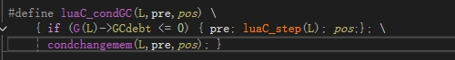  
只有当GCdebt小于等于0时，才会触发GC，这个GCdebt的单位是对象的个数而不是实际的内存大小。当申请一个新的需要GC的对象时，该变量做-1操作。totalbytes字段才是保存当前lua虚拟机申请过的内存字节数。需要注意的是并不是每次new一个GC对象都会去check gc。如下图所示：
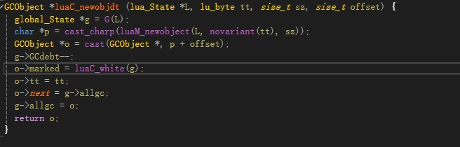  
### 1、增量式GC
  ```c
  static void incstep (lua_State *L, global_State *g) {
    //STEPSIZE默认值为250
    l_obj stepsize = applygcparam(g, STEPSIZE, 100);
    //work2do 为STEPSIZE的两倍
    l_obj work2do = applygcparam(g, STEPMUL, stepsize);
    int fast = 0;
    if (work2do == 0) {  /* special case: do a full collection */
      work2do = MAX_LOBJ;  /* do unlimited work */
      fast = 1;
    }
    do {  /* repeat until pause or enough work */
      l_obj work = singlestep(L, fast);  /* perform one single step */
      if (g->gckind == KGC_GENMINOR)  /* returned to minor collections? */
        return;  /* nothing else to be done here */
      work2do -= work;
    } while (work2do > 0 && g->gcstate != GCSpause);
    if (g->gcstate == GCSpause)
      setpause(g);  /* pause until next cycle */
    else
      luaE_setdebt(g, stepsize);
  }
  ```

#### GCSpause
  ```c
  //清理灰色链表并且标记根节点（单步）
  static void restartcollection (global_State *g) {
    cleargraylists(g);
    g->marked = NFIXED;
    markobject(g, g->mainthread);
    markvalue(g, &g->l_registry);
    markmt(g);
    markbeingfnz(g);  /* mark any finalizing object left from previous cycle */
  }
  ```

#### GCSpropagate
  ```c
  static void propagatemark (global_State *g) {
    GCObject *o = g->gray;
    //设置为黑色，这里要跟luaC_barrier对应看，假如在GCSpropagate阶段，global表已经被扫描过了，global表被标记为黑色。
    //此时又定义一个全局变量，那么在luaC_barrier里会将global表又塞回gray列表。
    nw2black(o);
    //从灰色链表里删除
    g->gray = *getgclist(o);  /* remove from 'gray' list */
    switch (o->tt) {
      case LUA_VTABLE: traversetable(g, gco2t(o)); break;
      case LUA_VUSERDATA: traverseudata(g, gco2u(o)); break;
      case LUA_VLCL: traverseLclosure(g, gco2lcl(o)); break;
      case LUA_VCCL: traverseCclosure(g, gco2ccl(o)); break;
      case LUA_VPROTO: traverseproto(g, gco2p(o)); break;
      case LUA_VTHREAD: traversethread(g, gco2th(o)); break;
      default: lua_assert(0);
    }
  }
  ```

#### GCSenteratomic
  这个阶段是也是单步的，需要在这一步明确所有对象的颜色，并且在最后将global_State的currentwhite设置为新白色。
#### GCSswpallgc、GCSswpfinobj、GCSswptobefnz
  ```c
  case GCSswpallgc: {  /* sweep "regular" objects */
    sweepstep(L, g, GCSswpfinobj, &g->finobj, fast);
    work = GCSWEEPMAX;
    break;
  }
  case GCSswpfinobj: {  /* sweep objects with finalizers */
    sweepstep(L, g, GCSswptobefnz, &g->tobefnz, fast);
    work = GCSWEEPMAX;
    break;
  }
  case GCSswptobefnz: {  /* sweep objects to be finalized */
    sweepstep(L, g, GCSswpend, NULL, fast);
    work = GCSWEEPMAX;
    break;
  }
  ```
  <font color= "#FF0000">这三个阶段做的是相同的工作，只是对应的列表不一样而已（GCSswpallgc阶段遍历的是global_State的allgc字段、GCSswpfinobj阶段遍历的是global_State的finobj字段、GCSswptobefnz遍历的是global_State的tobefnz字段），各自检查对应的列表，如果需要回收就回收，不需要则改变对象marked字段。每次最多检查GCSWEEPMAX（20）个对象。
  如果对象的类型是table或者userdata，当设置元表并且有"__gc"元方法时，会将该对象从allgc列表中移除，并放入finobj列表。
  在GCSenteratomic阶段，会调用separatetobefnz函数，这个函数会将finobj列表里白色的移动到tobefnz列表。所以在GCSswpfinobj阶段处理finobj列表时，finobj列表里的元素全是不需要回收的，所以这阶段的作用是将finobj列表里的元素的颜色做修改。</font> 

#### GCSswpend
  在非紧急状态下，如果常驻的string table太空闲，则会回收global_State的strt字段。
  如果string table的size太大或者申请内存时第一次失败后，会设为紧急状态，并做一次完整步骤的GC，并再次申请内存。
  ```c
  static void checkSizes (lua_State *L, global_State *g) {
    if (!g->gcemergency) {
      if (g->strt.nuse < g->strt.size / 4)  /* string table too big? */
        luaS_resize(L, g->strt.size / 2);
    }
  }

  //首次内存申请失败，则会执行这个函数
  static void *tryagain (lua_State *L, void *block, size_t osize, size_t nsize) {
    global_State *g = G(L);
    if (cantryagain(g)) {
      luaC_fullgc(L, 1);  /* try to free some memory... */
      return callfrealloc(g, block, osize, nsize);  /* try again */
    }
    else return NULL;  /* cannot run an emergency collection */
  }

  static void growstrtab (lua_State *L, stringtable *tb) {
    //global的strt太大
    if (l_unlikely(tb->nuse == INT_MAX)) {  /* too many strings? */
      luaC_fullgc(L, 1);  /* try to free some... */
      if (tb->nuse == INT_MAX)  /* still too many? */
        luaM_error(L);  /* cannot even create a message... */
    }
    if (tb->size <= MAXSTRTB / 2)  /* can grow string table? */
      luaS_resize(L, tb->size * 2);
  }

  void luaC_fullgc (lua_State *L, int isemergency) {
    global_State *g = G(L);
    lua_assert(!g->gcemergency);
    //设为紧急状态
    g->gcemergency = cast_byte(isemergency);  /* set flag */
    //阻塞执行一次完整步骤的GC，遍历所有的对象
    switch (g->gckind) {
      case KGC_GENMINOR: fullgen(L, g); break;
      case KGC_INC: fullinc(L, g); break;
      case KGC_GENMAJOR:
        g->gckind = KGC_INC;
        fullinc(L, g);
        g->gckind = KGC_GENMAJOR;
        break;
    }
    g->gcemergency = 0;
  }
  ```
  
#### GCScallfin
### 2、分代式GC