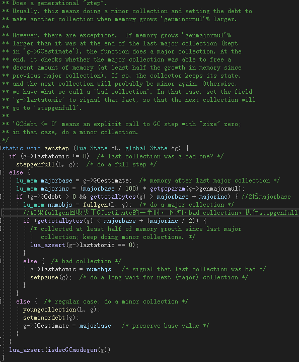
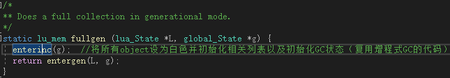
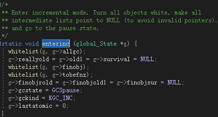
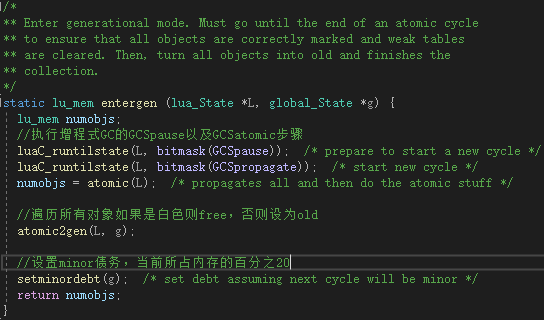
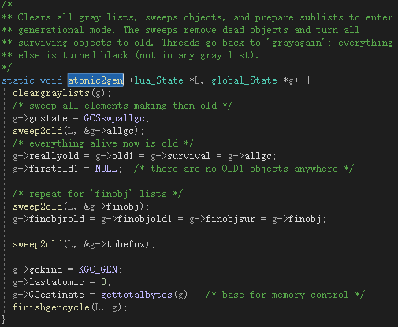
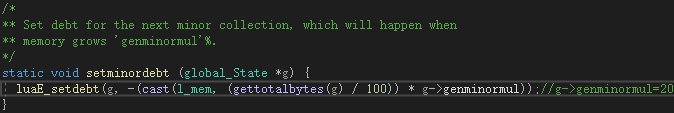
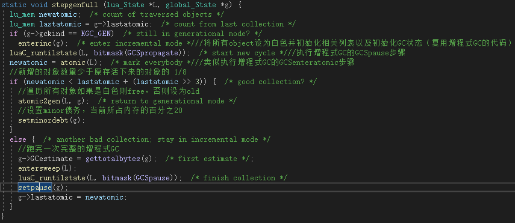

# LuaGC
+ 分代式GC

如果前一次是bad collection（即g->lastatomic（上次gc的对象个数）），则执行stepgenfull。否则去判断gcdebt是否大于0并且当前内存（gettotalbytes(g)）是否比上次major collection后的剩余内存两倍要大，满足条件则执行fullgen（返回值为当前对象的个数），否则做young collection。
fullgen源码如下所示：

stepgenfull源码如下所示：

youngcollection源码如下所示：
