# 杂项
+ lua解析器生成proto后，会创建一个LClosure(lua闭包)，然后把这个LClosure对象放到栈底（L->top），并且把_G设置为这个lua闭包的upvalue。如下图所示：
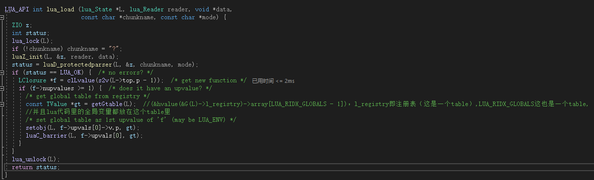
此时只是解析了lua代码，lua的全局变量或者lua函数对象（LClosure）都没有创建，需要调用lua_pcall，如下图所示：
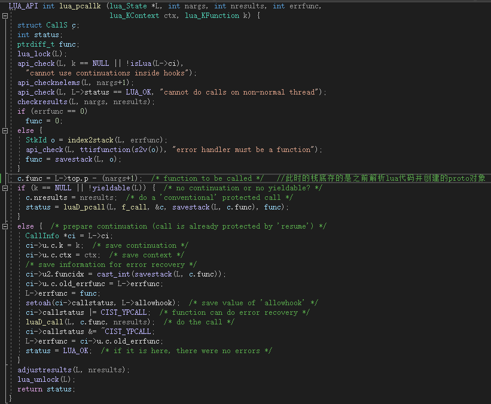
此时全局对象以及lua函数对象会被创建并且以变量名为key放到Table（_G）中，如下图所示：
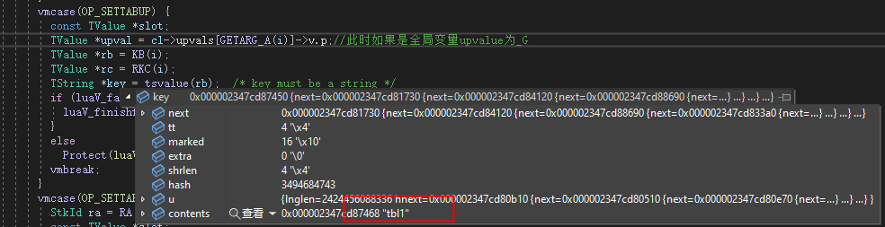
+ 一个函数的upvalue解释在网上如下图所示，但其实时有问题的，如果一个函数不访问全局变量并且从未使用lua关键字（也就是不需要访问放在global_state的string数据）时，此时创建LClosure对象的upvaluesize为0。
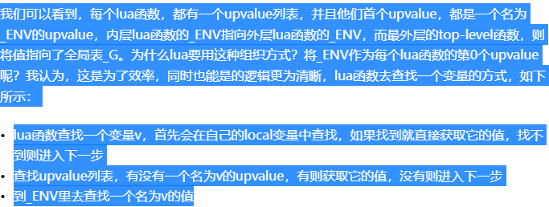
+ lua闭包upvalue最大数量为255，因为闭包结构体中用了一个字节大小的变量来保存upvalue的数量。open upvalue是指该upvalue指向栈，当栈回缩后，open upvalue会变成close upvalue。如下图所示：

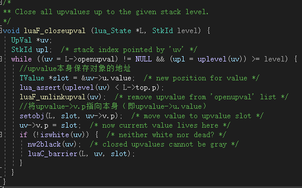

# TString
+ 小于40的单独创建对象主要是为了性能考虑，如果全放在global_State中的strt中(strt的数据类型为stringtable)，长度过长时性能较差。strt扩容时是2倍扩容，在GC的GCSswpend步会判断是否需要收缩strt大小，收缩也是缩小一倍。
+ 
+ 
+ 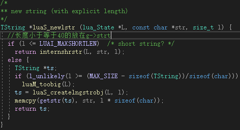
  
# ipairs和pairs差异
+ ipairs:从1开始累加，只查找本身数组以及元表（元表得有index元方法）数组部分，当value为nil的时候退出。
+ pairs:如果table的元表有pairs元方法则执行该函数做查找，否则遍历该表的数组以及hash。

# table操作
+ table新增元素：首先查找是否有元表，如果没有元表则直接往table里新增元素，如果有元表再查找是否有newindex元方法，如果没有则往元表中新增元素，如果有并且是函数则执行该函数，如果是一个表则重复执行上序步骤。
+ table查找元素：首先在表中查找，如果没有则看该表是否有元表，没有则返回nil，如果有元表但没有index元方法则返回nil，如果index元方法是函数，则实现该函数，如果是个table，则重复上序步骤。

# lua注册c函数
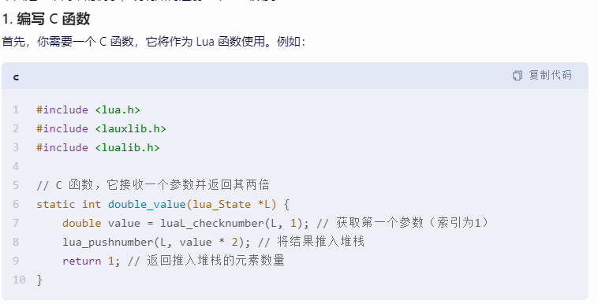
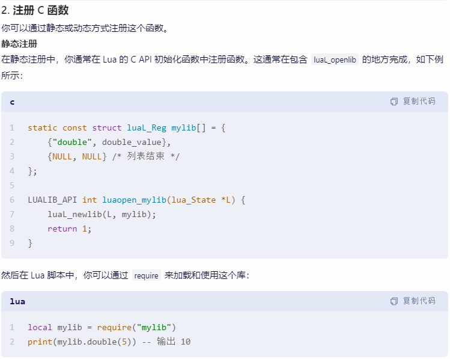
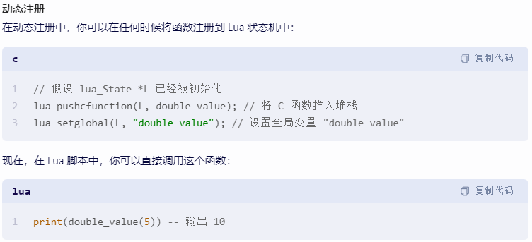

# LuaGC
+ GC相关字段，其中某些字段分属于不同的GC模式
```
typedef struct global_State{
    ...
    l_mem totalbytes;  /* number of bytes currently allocated - GCdebt */
    
    l_mem GCdebt;  /* bytes allocated not yet compensated by the collector */GC债务，申请或释放需要gc的对象时会加减该字段的值。但当每次gc完成后，会重新设置这个值。当该字段大于0才会触发GC。

    lu_mem GCestimate;  /* an estimate of the non-garbage memory in use */

    lu_byte genminormul;  /* control for minor generational collections */部分分代gc内存百分比，默认为百分之20（GCestimate）

    lu_byte genmajormul;  /* control for major generational collections */全量分代gc内存百分比，默认为百分百（GCestimate）
    
    GCObject *allgc;  /* list of all collectable objects */ 所有需要GC的对象列表（自带终结器的对象不在该列表）

    GCObject *finobj;  /* list of collectable objects with finalizers */自带终结器的对象列表，一个新对象首先会放在allgc列表，
    当这个对象是table或者userdata并且给该对象设置元表时，如果有__gc函数则会把改对象从allgc移除并放到finobj列表中。

    GCObject *tobefnz;  /* list of userdata to be GC */自带终结器且需要被回收的对象列表

    GCObject *fixedgc;  /* list of objects not to be collected */自带终结器且不需要被回收的对象列表
    ...
} global_State;
```

+ 增程式GC
```
typedef struct global_State{
    lu_byte gcstepmul;  /* GC "speed" */Step倍数，默认为100

    lu_byte gcstepsize;  /* (log2 of) GC granularity */Step大小，默认为8KB

    lu_byte gcpause;  /* size of pause between successive GCs */

    GCObject *gray;  /* list of gray objects */灰色链表

    GCObject *grayagain;  /* list of objects to be traversed atomically */

    GCObject *weak;  /* list of tables with weak values */
    
    GCObject *ephemeron;  /* list of ephemeron tables (weak keys) */
    
    GCObject *allweak;  /* list of all-weak tables */

    struct lua_State *mainthread;

    TValue l_registry;
}
```
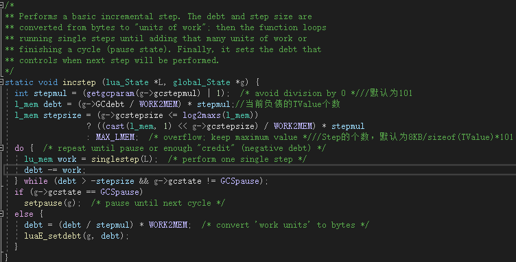

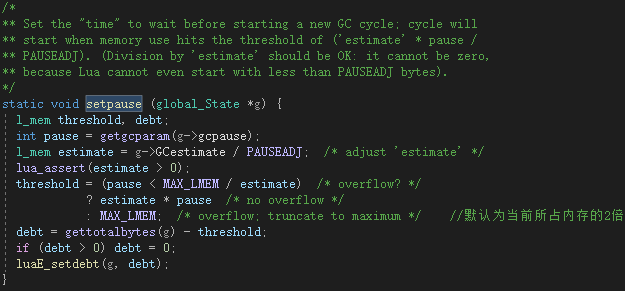

GCSpause（暂停）->GCSpropagate（扩散）->GCSenteratomic（原子步骤）->GCSswpallgc（sweep allgc列表）->GCSswpfinobj（sweep finobj列表）->GCSswptobefnz（sweep tobefnz列表）->GCSswpend（finish sweep）->GCScallfin（call finish）->GCSpause（暂停）

每次最少处理stepsize数量的TValue（不一定会回收），当执行完一次完整GC后，会调用setpause来设置下次触发GC的debt（默认为当前所占内存的2倍）。

GCSpause：清理灰色链表并且标记根节点（单步）。
GCSpropagate：从灰色链表中一个个取出处理（做标记或者放入灰色链表）（多步）。
GCSenteratomic：
    1、首先确保gray链表为空,不为空则遍历gray上所有元素
    2、置当前GC状态为GCSinsideatomic
    3、标记当前运行的线程
    4、标记注册表
    5、标记基本类型的元表
    6、标记上值:
        1:若线程不为灰色或没有上值，则从有开放上值的线程链表(twups)中移除，并标记所有触碰过的上值
    7、再次遍历gray上所有元素
    8、遍历grayagain链接上所有元素
    9、循环遍历浮游链表上弱key表(因为上面的步骤可能导致key变为黑色),直到没有需要标记的结点,最后浮游链表上的元素部分仍然是之前链表上的元素
    --------- 至此所有可被访问的强对象都被标记了 ----------------
    10、清理weak链表上弱表中可能需要被清理的值
    11、清理allweak链表上弱表中的可能需要被清理的值
    12、把finobj链表上没有被标记的对象移动到tobefnz链表上
    13、标记tobefnz链表上的元素
    14、再次遍历gray上所有元素
    15、执行第9步
    --------- 至此所有复活的对象都被标记了 ----------------
    16、清理ephemeron链表上弱表中的可能需要被清理的key
    17、清理allweak链表上弱表中的可能需要被清理的key
    18、清理weak链表上12步之后新增弱表中的可能需要被清理的value
    19、清理allweak链表上12步之后新增弱表中的可能需要被清理的value
    20、清理字符串缓存
    21、切换白色    
    22、进入清理阶段，用sweepgc记录下次该清理哪个元素
GCSswpallgc：处理sweepgc列表，每次数量GCSWEEPMAX（100）个对象，此时sweepgc指向allgc列表。
GCSswpfinobj：处理sweepgc列表，每次数量GCSWEEPMAX（100）个对象，此时sweepgc指向finobj列表，此时只是将
finobj列表的颜色改成另外一种白色。
GCSswptobefnz：处理sweepgc列表，每次数量GCSWEEPMAX（100）个对象，此时sweepgc指向tobefnz列表，此时只是将tobefnz列表的颜色改成另外一种白色。这是因为在atomic阶段中会把tobefnz列表中的userdata元素设置为黑色。
GCSswpend：调整string table。如下所示：
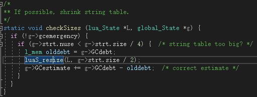
GCScallfin：处理tobefnz列表，将tobefnz中的元素加到allgc列表，然后调用对象对应的gc函数，调用完后并清理gc函数，避免多次调用。

+ 分代式GC

如果前一次是bad collection（即g->lastatomic（上次gc的对象个数）），则执行stepgenfull。否则去判断gcdebt是否大于0并且当前内存（gettotalbytes(g)）是否比上次major collection后的剩余内存两倍要大，满足条件则执行fullgen（返回值为当前对象的个数），否则做young collection。
fullgen源码如下所示：


stepgenfull源码如下所示：

youngcollection源码如下所示：
