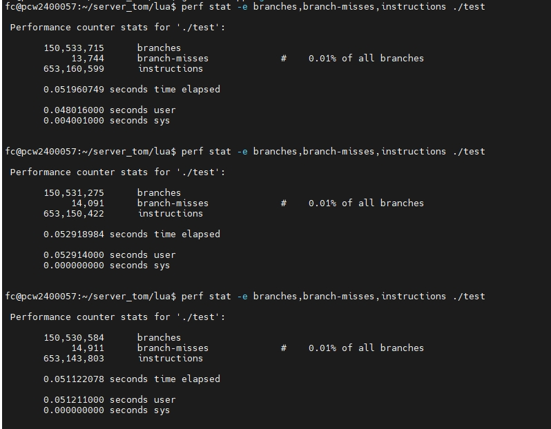
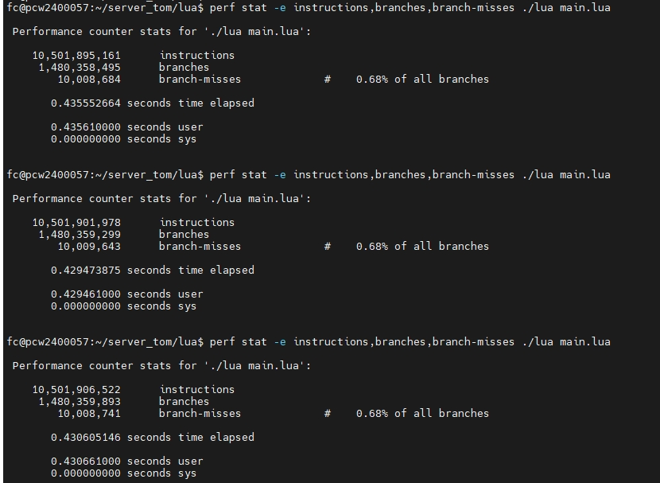
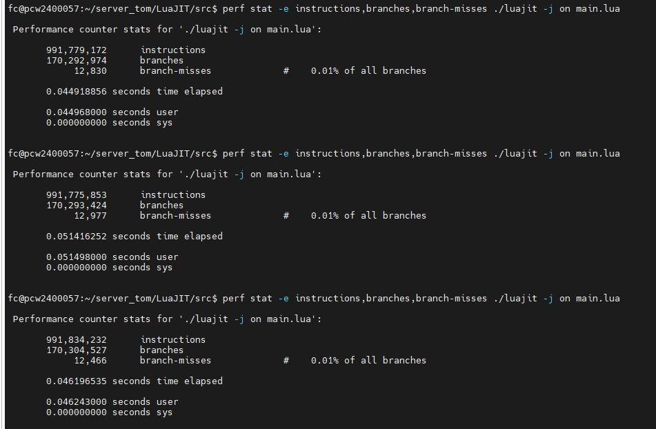
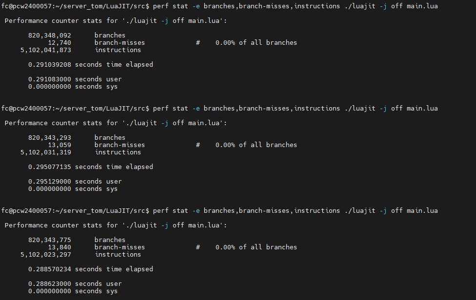
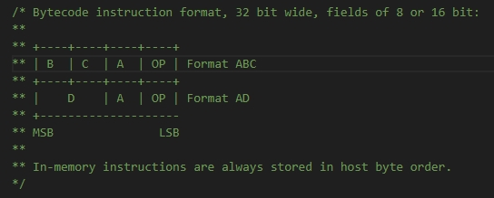
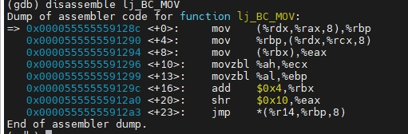
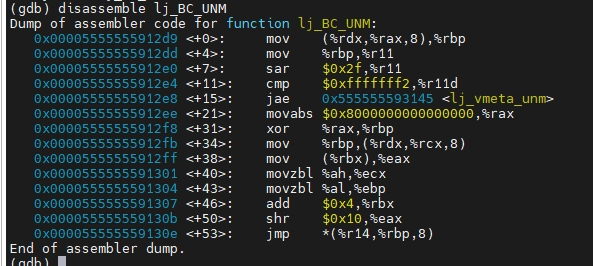

# 什么是luaJIT
+ luaJIT和lua完全是两种语言，luaJIT只是穿了身lua的衣服，其实它的内核跟lua完全不一样。也就是说luaJIT只是能支持lua的所有语法。

# 两者性能比较
+ lua代码如下所示：
    ```lua
    local function hot()
        local x = 0
        for i = 1, 10 do
            x = x + i
        end
        return x
    end

    for i = 1, 10000000 do
        hot()
    end
    ```
+ c代码实现的结果：  
    
+ 原生lua结果：  
    
+ luajit结果：
  + 开启jit:
    
  + 不开启jit:
    
+ 结果分析：
    以上结果全都未开启优化，如上所示，这个应用场景luajit开启jit时相较于lua性能提升了差不多20倍，不开启也有两三倍的提升。首先是两者的```instructions```差异，luajit不管开不开启jit，相较于原生lua都有显著的减少，这主要是两者虚拟机的实现差异，luajit是真正的基于寄存器的，而原生lua使用栈来模拟寄存器的，从汇编层面来看原生lua还是基于栈的，因此luajit会比原生lua的指令数要少。<span style="color: #CC5500;">然后是两者的```branch-misses```占比差异，luajit只占```branches```的0.1%，而原生lua占了0.68%，这里留个疑问，暂时没想到哪里会导致这个差异，原生lua的虚拟机入口在lvm.c的```luaV_execute```，虽然是switch-case，但如果条件连续且较多，在汇编层面来说实际上会生成一个跳表，而luajit的GG_State有个dispatch字段，这是个函数指针数组，luajit的虚拟机入口函数是```lj_vm_call_dispatch_f```，通过opcode偏移找到函数地址。按道理来说这两种是一样的，因此opcode分发不会导致这么大的差异。猜测可能就是底层各自对opcode的处理不同，luajit可能是比较少的cmp，导致的分支预测失败差异。</span>

# 寄存器
+ rdi：函数调用时第一个参数
+ rsi：函数调用时第二个参数
+ rdx：函数调用时第三个参数
+ rcx：函数调用时第四个参数
+ r8：函数调用时第五个参数
+ r9：函数调用时第六个参数，之后再有参数压栈，放在栈中传递
+ rax：函数返回值
+ luaJIT中有特殊作用的寄存器：
  + r14：记录GG_State中dispatch函数数组的地址
  + rbx：指向Proto中当前执行到的中间字节码地址，opcode由最后两个字节表示，IR的数据格式如下图所示：  
    
  + rbp、rsp：在luajit的寄存器规则下，rbp会用做其他用途，比如经常会用来表示opcode。而rsp是不会去改动的，这是为了在工具生成的汇编代码中，调用非工具生成的函数时，会用```call```指令，来确保此时调用的函数调用有正确的堆栈。如果是工具生成的函数则会用```jmp```指令。

# luaJIT虚拟机
+ luaJIT的虚拟机是真正基于寄存器的，而原生lua的虚拟机，网上不少资料都说它是基于寄存器的，但这也是看的角度不一样，lua实际上是用栈来模拟寄存器，因此从汇编层面来看，lua虚拟机还是基于栈的。比如c=a+b，假设a、b都在全局表中，对于原生lua会有三条命令，1、load a，从全局表加载数据到lua栈中。2、load b，从全局表加载数据到lua栈中。3、a stack pos|b stack pos|add，从lua栈中读取数据a、b到寄存器中，然后执行add操作。而对于luajit，也会有三条命令，1、load a，从全局表记载数据到寄存器。2、load b，从全局表加载数据到寄存器。3、add操作，直接操作寄存器相加。lua的操作它必须依靠lua栈，因此它的指令会比luajit多，luajit从全局表加载数据是一步到位，直接从全局表加载数据到寄存器。
+ luaJIT的代码可阅读性非常差，许多函数都是通过工具生成的汇编代码。以下通过gbd调试一步步描述luaJIT虚拟机的执行流程，包括触发热点函数后的处理。
  + luajit虚拟机执行函数调用流程：
    + 首先是入口函数```lua_pcall```，源码如下所示，当执行到```lj_vm_pcall```时，此时函数正常的函数调用，寄存器还是通用规则，因此执行到函数```lj_vm_pcall```时，此时rdi是lua_State L的地址，rsi是```api_call_base```的返回值，其实就是当前lua_state栈顶的地址。  
      ```c
      LUA_API int lua_pcall(lua_State *L, int nargs, int nresults, int errfunc)
      {
        global_State *g = G(L);
        uint8_t oldh = hook_save(g);
        ptrdiff_t ef;
        int status;
        lj_checkapi(L->status == LUA_OK || L->status == LUA_ERRERR,
              "thread called in wrong state %d", L->status);
        lj_checkapi_slot(nargs+1);
        if (errfunc == 0) {
          ef = 0;
        } else {
          cTValue *o = index2adr_stack(L, errfunc);
          ef = savestack(L, o);
        }
        status = lj_vm_pcall(L, api_call_base(L, nargs), nresults+1, ef);
        if (status) hook_restore(g, oldh);
        return status;
      }
      ```
    + ```lj_vm_pcall```：  
      ```c
      push   %rbp
      push   %rbx
      push   %r15
      push   %r14
      sub    $0x28,%rsp
      mov    $0x5,%ebx
      mov    %ecx,0xc(%rsp)
      jmp    0x555555592cf2 <lj_vm_call+15>
      ```
    + ```lj_vm_call```:  
      ```c
      push   %rbp
      push   %rbx
      push   %r15
      push   %r14
      sub    $0x28,%rsp
      mov    $0x1,%ebx
      mov    %edx,0x8(%rsp)
      mov    %rdi,%rbp            //此时rdi记录的是lua_state的地址
      mov    %rdi,0x10(%rsp)
      mov    %rsi,%rcx            //rsi寄存器赋值给rcx，此时rcx记录的是lua_state栈顶的地址,栈顶的下一个元素是GCFunc对象
      mov    0x10(%rbp),%r14      //将global_State的地址赋值给r14
      mov    0x50(%rbp),%r15
      mov    %r15,0x20(%rsp)
      mov    %rbp,0x18(%rsp)
      add    $0xfa0,%r14          //此时r14记录的是GG_State中dispatch函数指针数组的地址，在这之后r14的值不会再变
      mov    %rsp,0x50(%rbp)
      mov    %rbp,-0xe28(%r14)
      movl   $0xffffffff,-0xee8(%r14)
      mov    0x20(%rbp),%rdx
      add    %rcx,%rbx
      sub    %rdx,%rbx
      mov    0x28(%rbp),%rax
      sub    %rcx,%rax
      shr    $0x3,%eax
      add    $0x1,%eax
      ```
    + ```lj_vm_call_dispatch```：  
      ```c
      mov    -0x10(%rcx),%rbp     //rbp记录的是GCfunc对象的地址
      mov    %rbp,%r11
      shl    $0x11,%rbp
      shr    $0x11,%rbp
      sar    $0x2f,%r11
      cmp    $0xfffffff7,%r11d
      jne    0x3f1cc <lj_vmeta_call>
      ```
    + ```lj_vm_call_dispatch_f```：  
      ```c
      mov    %rcx,%rdx
      mov    %rbx,-0x8(%rdx)
      mov    0x20(%rbp),%rbx      //GCfunc其实地址向上移动32个字节，此时rbx是GCfunc的pc地址，pc指向的是Proto中间字节码的地址
      mov    (%rbx),%ecx
      movzbl %cl,%ebp             //将rbx的低8位的值赋值给rbp，此时rbp的值就是opcode
      movzbl %ch,%ecx
      add    $0x4,%rbx            //将指令地址往后移动
      jmp    *(%r14,%rbp,8)       //跳转到r14 + rbp * 8的地址
      ```  
    + <span style="color: #CC5500;">之后的指令不会再通过```lj_vm_call_dispatch_f```，而是在各个函数中用```jmp *(%r14,%rbp,8)```指令直接通过dispatch数组跳转，这跟lua是完全不一样的，lua是在```luaV_execute```中，switch opcode,处理完后pi++，然后接着执行switch。luajit这种方式就相当于一直在一个函数中，。随便找两个函数的汇编代码如下所示。</span>  
    ```lj_BC_MOV```汇编代码：  
      
    ```lj_BC_UNM```汇编代码：  
      

  + jit优化：
    所谓的jit优化就是当执行某些指令时，会根据GCfunc的pc地址记录次数，当达到阈值后，会将热点代码动态编译，编译成功后会将这些指令替换。在vm_x64.dasc中调用```hotloop```的指令就是会进行优化的指令，分别是```ITERN```、```FORL```、```ITERL```、```LOOP```。这个例子的opcode是FORL。
    + ```lj_BC_FORL```汇编指令如下所示：  
      ```c
      mov    %ebx,%ebp
      shr    %ebp
      and    $0x7e,%ebp                       //将中间字节码的地址转换成hotcount的下标，之所以要and 0x7e，只保留低两个字节的数据是因为hotcount数组的大小为128个字节
      subw   $0x2,-0x80(%r14,%rbp,1)          //dispatch数组地址向下移动0x80得到的是hotcount数组的起始地址，为什么每次减2？
      jb     0x5555555947a1 <lj_vm_hotloop>   
      ```
    + 之后的执行顺序是：```lj_vm_hotloop```-->```lj_trace_hot```-->```lj_trace_ins```-->```trace_state```，在```trace_state```函数中，在```LJ_TRACE_START```状态会初始化一些信息，并且会将dispatch函数数组中的一些opcode所对应的处理函数替换成```lj_vm_record```。也就是说在jit优化期间是不会推进业务逻辑的，记录循环中的中间字节码，知道循环结束。然后在```LJ_TRACE_ASM```状态实际生成优化代码，<span style="color: #CC5500;">并且在结束时会调用```trace_stop```，在这个函数中会针对最开始的opcode对Proto结构体里的中间字节码做处理，比如上述例子中进入循环的是```BC_FORL``` opcode会被替换成```BC_JFORI```。```trace_stop```的代码如下所示：</span>  
      ```c
      static void trace_stop(jit_State *J)
      {
        BCIns *pc = mref(J->cur.startpc, BCIns);
        BCOp op = bc_op(J->cur.startins);
        GCproto *pt = &gcref(J->cur.startpt)->pt;
        TraceNo traceno = J->cur.traceno;
        GCtrace *T = J->curfinal;

        switch (op) {
        case BC_FORL:
        setbc_op(pc+bc_j(J->cur.startins), BC_JFORI);  /* Patch FORI, too. */
        /* fallthrough */
        case BC_LOOP:
        case BC_ITERL:
        case BC_FUNCF:
        /* Patch bytecode of starting instruction in root trace. */
        setbc_op(pc, (int)op+(int)BC_JLOOP-(int)BC_LOOP);
        setbc_d(pc, traceno);
        addroot:
        /* Add to root trace chain in prototype. */
        J->cur.nextroot = pt->trace;
        pt->trace = (TraceNo1)traceno;
        break;
        case BC_ITERN:
        case BC_RET:
        case BC_RET0:
        case BC_RET1:
        *pc = BCINS_AD(BC_JLOOP, J->cur.snap[0].nslots, traceno);
        goto addroot;
        case BC_JMP:
        /* Patch exit branch in parent to side trace entry. */
        lj_assertJ(J->parent != 0 && J->cur.root != 0, "not a side trace");
        lj_asm_patchexit(J, traceref(J, J->parent), J->exitno, J->cur.mcode);
        /* Avoid compiling a side trace twice (stack resizing uses parent exit). */
        {
        SnapShot *snap = &traceref(J, J->parent)->snap[J->exitno];
        snap->count = SNAPCOUNT_DONE;
        if (J->cur.topslot > snap->topslot) snap->topslot = J->cur.topslot;
        }
        /* Add to side trace chain in root trace. */
        {
        GCtrace *root = traceref(J, J->cur.root);
        root->nchild++;
        J->cur.nextside = root->nextside;
        root->nextside = (TraceNo1)traceno;
        }
        break;
        case BC_CALLM:
        case BC_CALL:
        case BC_ITERC:
        /* Trace stitching: patch link of previous trace. */
        traceref(J, J->exitno)->link = traceno;
        break;
        default:
        lj_assertJ(0, "bad stop bytecode %d", op);
        break;
        }

        /* Commit new mcode only after all patching is done. */
        lj_mcode_commit(J, J->cur.mcode);
        J->postproc = LJ_POST_NONE;
        trace_save(J, T);

        lj_vmevent_send(J2G(J), TRACE,
        setstrV(V, V->top++, lj_str_newlit(V, "stop"));
        setintV(V->top++, traceno);
        setfuncV(V, V->top++, J->fn);
        );
        }

        /* Start a new root trace for down-recursion. */
        static int trace_downrec(jit_State *J)
        {
        /* Restart recording at the return instruction. */
        lj_assertJ(J->pt != NULL, "no active prototype");
        lj_assertJ(bc_isret(bc_op(*J->pc)), "not at a return bytecode");
        if (bc_op(*J->pc) == BC_RETM)
        return 0;  /* NYI: down-recursion with RETM. */
        J->parent = 0;
        J->exitno = 0;
        J->state = LJ_TRACE_RECORD;
        trace_start(J);
        return 1;
      }
      ```
    + 之后会在```lj_BC_JFORI```中调用函数```lj_BC_JLOOP```，在这个函数中会根据当前traceNo在trace数组中偏移找到对应的动态优化生成的函数的起始地址。    
      ```c
      mov    -0xb38(%r14),%rcx    //GG_State中dispatch数组的起始地址向下挪0xb38得到的是jit_State的GCRef数组
      mov    (%rcx,%rax,8),%rax   //rax记录的是当前的traceNo,根据traceNo在数组中偏移得到动态生成代码的起始地址
      mov    0x58(%rax),%rax
      mov    0x10(%rsp),%rbp
      mov    %rdx,-0xe20(%r14)
      mov    %rbp,-0xec0(%r14)
      sub    $0x10,%rsp
      mov    %r12,0x10(%rsp)
      mov    %r13,0x8(%rsp)
      jmp    *%rax                //跳转动态优化生成的函数起始地址
      ```