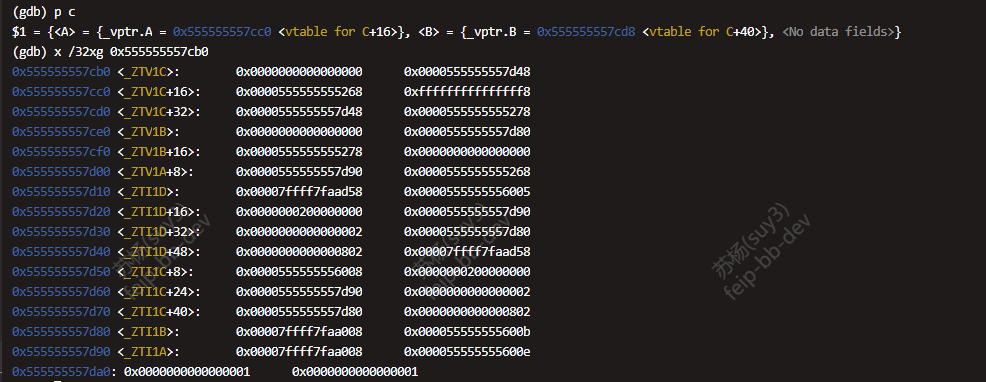
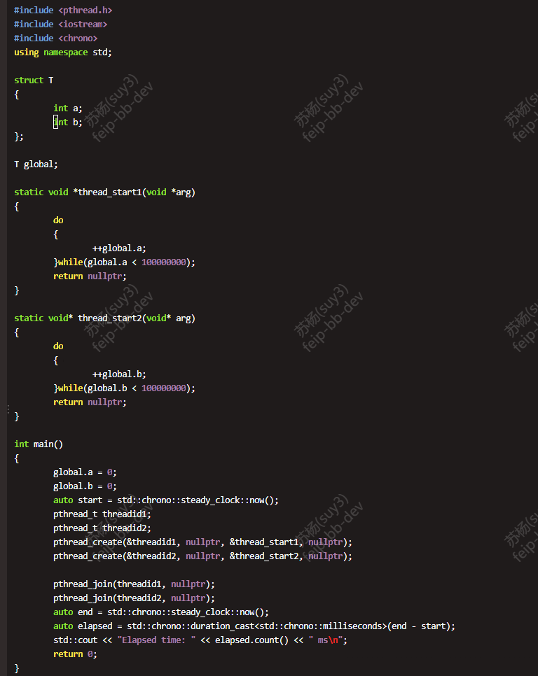
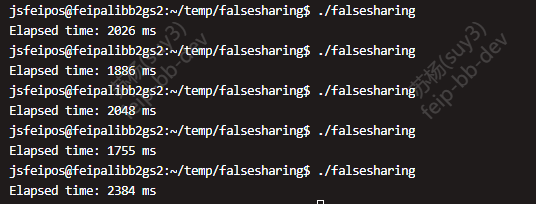
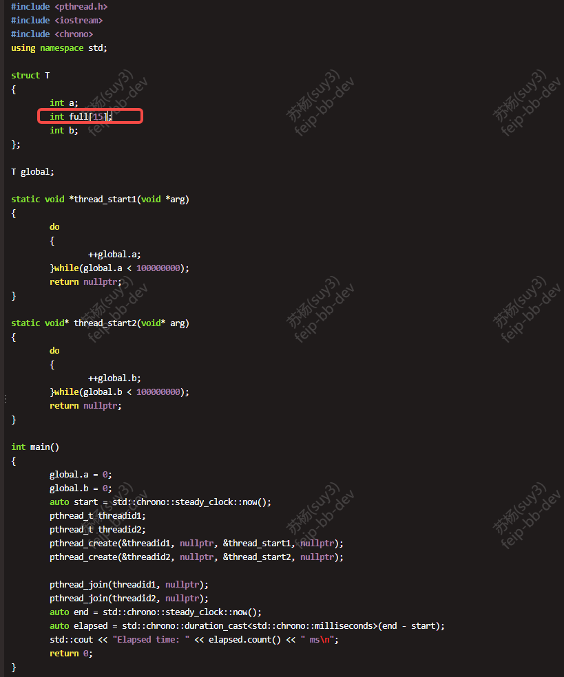
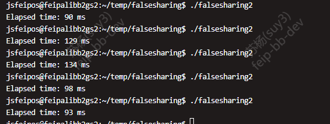
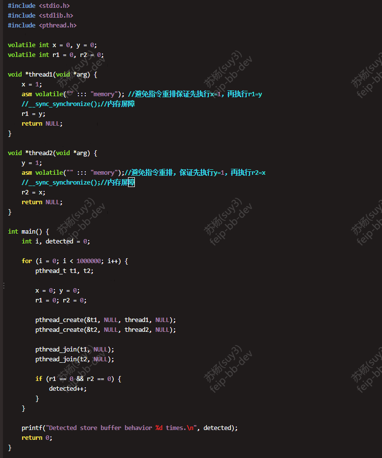
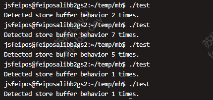
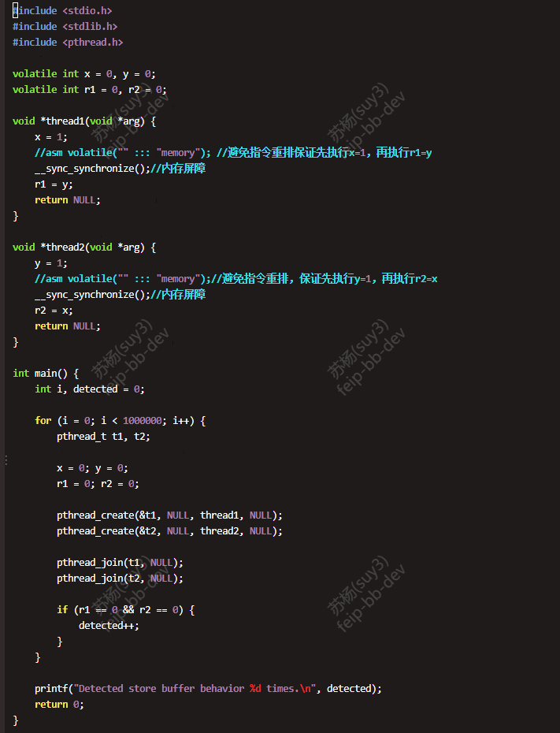
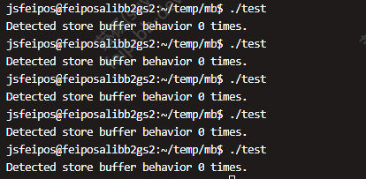

# virtual table  
  

# compare switch with ifelse  
  

# false sharing
  2024-12-04跟同事争论性能优化时对false sharing的关注度，同事觉得性能优化只需要关注业务逻辑代码实现是否合理，比如各个容器的使用是否合理等。当然我承认大部分时候业务逻辑代码的优化是大头，但false sharing同样重要，当业务逻辑优化到一定程度后，这一块会是性能瓶颈。  
  就游戏服务器来说，大部分场景我觉得做成多进程单线程才是最优解，能避免使用锁或者false sharing造成的性能浪费。当某个应用场景是CPU计算密集型的时候才适合使用多线程，一个线程处理IO操作，一个线程执行业务逻辑。现在就是刚好有这么一个应用场景才会有今天的争辩。  
  如下截图是一个简单的测试代码，在64位机器上测试false sharing带来的消耗。  
  未做填充时的代码以及输出截图：  
    
    
  做填充时的代码以及输出截图：  
    
    

# 内存序
  本想对C++11几种内存序做些记录，但实际准备写的时候又觉得没必要，首先是不管开发还是实际线上运营都是在X86_64架构下，而且一般都是加锁。其次这块感觉也没什么难点需要特别记录的。之所以明确表明X86_64架构，是因为X86_64是TSO（强一致性内存模型），这种CPU只有Store Buffer，没有Invalid Queue。也就是说这种内存模型只有store load这种情况会出现乱序，也就在这种情况下如果需要保证一致性才需要加内存屏障。测试案例如下所示：  
  volatile关键字，表明变量是易变的，CPU每次都从主存上拿数据。  
  没有内存屏障代码截图以及测试结果如下图所示：  
    
    
  有内存屏障代码截图以及测试结果如下图所示：  
    
    