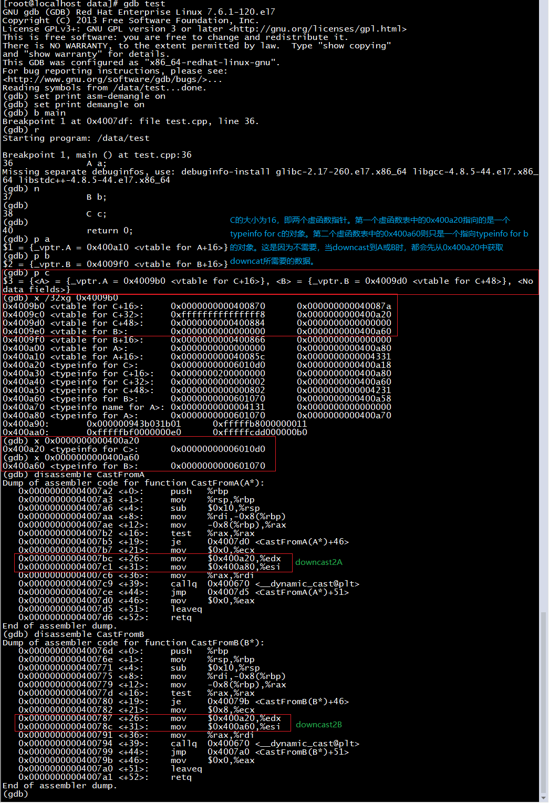
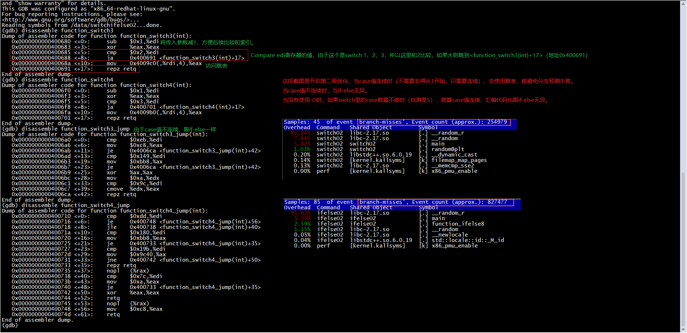
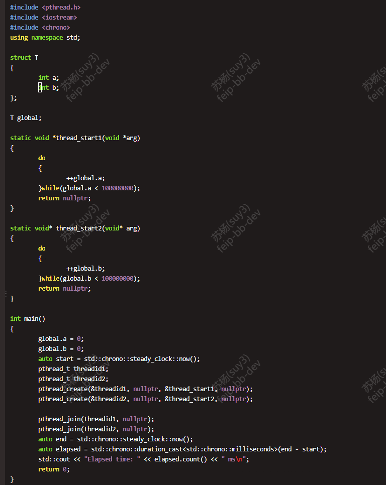
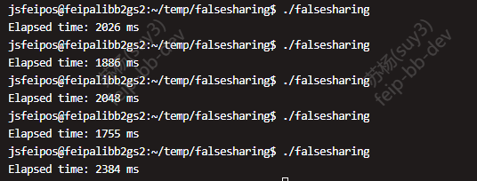
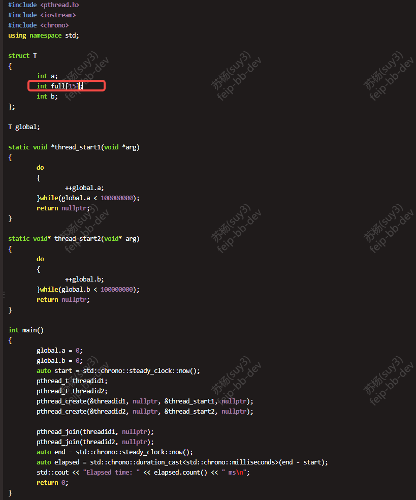
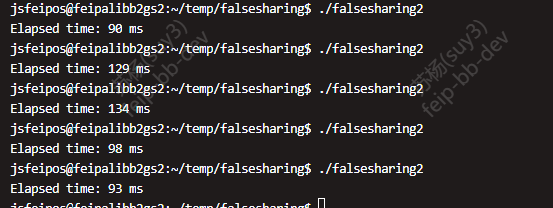

# virtual table  
  

# compare switch with ifelse  
  

# false sharing
  2024-12-04跟同事争论性能优化时对false sharing的关注度，同事觉得性能优化只需要关注业务逻辑代码实现是否合理，比如各个容器的使用是否合理等。当然我承认大部分时候业务逻辑代码的优化是大头，但false sharing同样重要，当业务逻辑优化到一定程度后，这一块会是性能瓶颈。  
  就游戏服务器来说，大部分场景我觉得做成多进程单线程才是最优解，能避免使用锁或者false sharing造成的性能浪费。当某个应用场景是CPU计算密集型的时候才适合使用多线程，一个线程处理IO操作，一个线程执行业务逻辑。现在就是刚好有这么一个应用场景才会有今天的争辩。  
  如下截图是一个简单的测试代码，在64位机器上测试false sharing带来的消耗。  
  未做填充时的代码以及输出截图：  
    
    
  做填充时的代码以及输出截图：  
    
    
