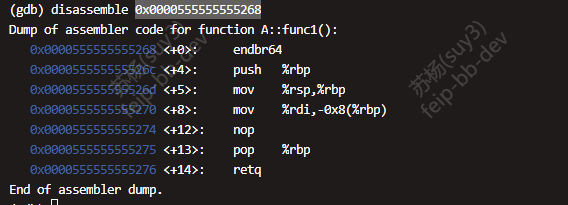
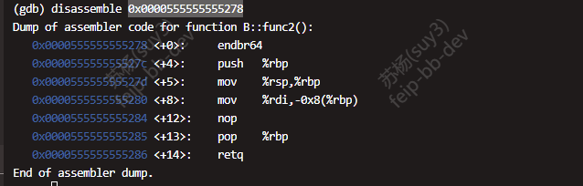
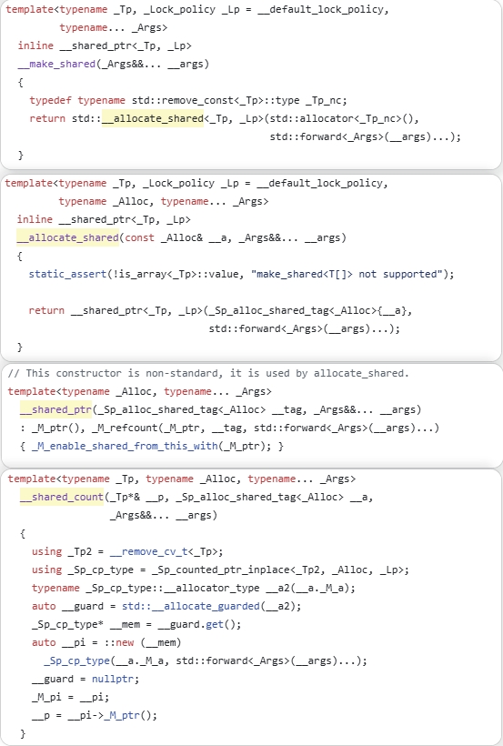

# compare switch with ifelse  
  

# false sharing
  大部分时候业务逻辑代码的优化是大头，但false sharing同样重要，当业务逻辑优化到一定程度后，这一块会是性能瓶颈。  
  就游戏服务器来说，大部分场景我觉得做成多进程单线程才是最优解，能避免使用锁或者false sharing造成的性能浪费。  
  如下截图是一个简单的测试代码，在64位机器上测试false sharing带来的消耗。  
  未做填充时的代码以及输出截图：  
    
    
  做填充时的代码以及输出截图：  
    
    

# 内存序
  + X86_64是TSO（强一致性内存模型），这种内存模型只有store-load这种情况会出现乱序。也就在这种情况下如果需要保证一致性才需要加内存屏障。测试案例如下所示：  
  volatile关键字，表明变量是易变的，CPU每次都从主存上拿数据。  
  没有内存屏障代码截图以及测试结果如下图所示：  
    
    
  有内存屏障代码截图以及测试结果如下图所示：  
    
  
  + <font color= "#CC5500">TSO内存模型也有invalid queue（这里之前有误解），load-load、store-store、load-store、store-load这四种情况，指令都不会乱序。load-store不会乱序的意思是，cpu的invalid queue中已经有cache line失效通知，只是还未处理，此时，cpu的缓存中的值还是旧值，但对于cpu来说只是还未处理失效通知，因此不算乱序，只是load到了旧值。而store-load会出现乱序是因为修改值后cache line失效通知保存在store buffer中，还未通过总线通知给其他cpu，load完成的时间可能早于store“被其他核看到”的时间，因此会乱序。</font>
  + compare_exchange_weak、compare_exchange_strong
    在强一致性内存模型下，这两者没有差别，因为强一致性内存模型下，CAS可以用单条指令，只有在非TSO内存模型的平台上表现才会有差异，在这种平台上，compare_exchange_weak可能会出现值一样，但是失败的情况，也就是“伪失败”，这是因为这种平台的CAS这个操作不是单一指令，compare_exchange_strong是通过重试的方式来保证不出现伪失败的情况。因此在非TSO内存模型下，这种方式性能会差点。伪代码如下：  
    ```c++  
    bool compare_exchange_strong(atomic<T>* obj, T& expected, T desired) {
        T current = load_linked(obj);  // LL指令
        
        if (current != expected) {
            expected = current;
            return false;  // 真实失败
        }
        
        // 关键：强版本在条件存储失败时会重试
        while (!store_conditional(obj, desired)) {
            // 重试前重新检查值是否仍然匹配
            current = load_linked(obj);
            if (current != expected) {
                expected = current;
                return false;  // 值在重试期间被修改了
            }
            // 否则是伪失败，继续重试
        }
        return true;
    }

    bool compare_exchange_weak(atomic<T>* obj, T& expected, T desired) {
        T current = load_linked(obj);
        
        if (current != expected) {
            expected = current;
            return false;
        }
        
        // 弱版本：条件存储失败就直接返回，不重试
        return store_conditional(obj, desired);
        // 可能因为伪失败而返回false，即使值匹配
    }
    ```  

# virtual table  
  ```c++  
  class A
  {
    public:
      virtual void func1(){}
  };
  class B
  {
    public:
      virtual void func2(){}
  };
  class C : public A, public B
  {
  };
  ```  
  在64位linux平台上，C的大小毋庸置疑是16个字节。两个虚函数指针，但这两个虚函数指针指向的是哪呢？网上有不少讲这块的博客，基本上都说是指向两个虚函数表。那问题来了，是哪两个虚函数表？类A和类B的虚函数表？那类C的虚函数表呢？测试结果如下所示：  
    
  先说结论，C的两个函数指针都是指向的vtable for C，只是指向的位置不一样。A的虚函数表起始地址是0x555555557cf0，B的虚函数表起始地址是0x555555557ce0，C的虚函数表起始地址是0x555555557cb0。可以看到C的虚函数表中具体存了哪些数据，首先在0x555555557cb8的值是0x0000555555557d48，0x0000555555557d48也可以从表中得出结论是C的typeinfo信息。然后是0x0000555555555268，该地址的反汇编代码如下所示：  
    
  然后又是0x0000555555557d48，最后是0x0000555555555278，反汇编代码如下所示：  
    
  由于C没有重写func1()和func2()，所以C里的函数地址和A、B的是一样的。综上所述，从逻辑上看是指向两个不同的虚函数表。从物理视角看是指向同一个虚函数表区域的不同部分。

# make_shared
