# 1、主要数据结构
+ 1、arena（分配区）     
  每个进程只有一个主分配区(main arena)，但可能存在多个非主分配区(non main arena)。分配区数量限制如下图所示：  
  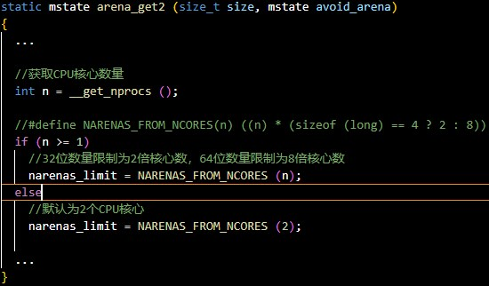

+ 2、chunk结构体  
  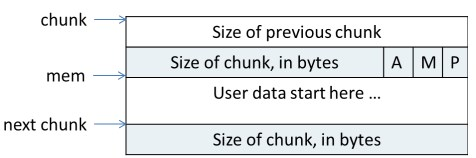  
  在图中，chunk 指针指向一个 chunk 的开始，一个 chunk 中包含了用户请求的内存区域和相关的控制信息。图中的 mem 指针才是真正返回给用户的内存指针。
  + a、Chunk 的第二个域的最低一位为 P，它表示前一个块是否在使用中，P 为 0 则表示前一个 chunk 为空闲，这时chunk 的第一个域 prev_size 才有效，prev_size 表示前一个 chunk 的 size，程序可以使用这个值来找到前一个 chunk 的开始地址。当 P 为 1 时，表示前一个 chunk 正在使用中，prev_size无效，程序也就不可以得到前一个chunk的大小。不能对前一个chunk进行任何操作。ptmalloc分配的第一个块总是将 P 设为 1，以防止程序引用到不存在的区域。
  + b、Chunk 的第二个域的倒数第二个位为 M，他表示当前 chunk 是从哪个内存区域获得的虚拟内存。M 为 1 表示该 chunk 是从 mmap 映射区域分配的，否则是从 heap 区域分配的。
  + c、Chunk 的第二个域倒数第三个位为 A，表示该 chunk 属于主分配区或者非主分配区，如果属于非主分配区，将该位置为 1，否则置为 0。

# 2、malloc
+ 2.1、malloc步骤文字介绍：  
  + 2.1.1、获取分配区的锁，为了防止多个线程同时访问同一个分配区，在进行分配之前需要取得分配区域的锁。线程先查看线程私有实例中是否已经存在一个分配区，如果存在尝试对该分配区加锁，如果加锁成功，使用该分配区分配内存，否则，该线程搜索分配区循环链表试图获得一个空闲（没有加锁）的分配区。如果所有的分配区都已经加锁，那么 ptmalloc 会开辟一个新的分配区，把该分配区加入到全局分配区循环链表和线程的私有实例中并加锁，然后使用该分配区进行分配操作。开辟出来的新分配区一定为非主分配区，因为主分配区是从父进程那里继承来的。开辟非主分配区时会调用 mmap()创建一个sub-heap，并设置好 top chunk。  
  + 2.1.2、将用户的请求大小转换为实际需要分配的 chunk 空间大小。  
  + 2.1.3、判断所需分配chunk的大小是否满足chunk_size <= max_fast (max_fast 64位为128B，32位为64B)，如果是的话，则转下一步，否则跳到第 2.1.5 步。  
  + 2.1.4、首先尝试在 fast bins 中取一个所需大小的 chunk 分配给用户。如果可以找到，则分配结束。否则转到下一步。  
  + 2.1.5、判断所需大小是否处在 small bins 中，即判断 chunk_size < (64位为1024B，32位为512B) 是否成立。如果chunk 大小处在 small bins 中，则转下一步，否则转到第 2.1.6 步。  
  + 2.1.6、根据所需分配的 chunk 的大小，找到具体所在的某个 small bin，从该 bin 的尾部摘取一个恰好满足大小的 chunk。若成功，则分配结束，否则，转到下一步。  
  + 2.1.7、到了这一步，说明需要分配的是一块大的内存，或者 small bins 中找不到合适的chunk。于是，ptmalloc 首先会遍历 fast bins 中的 chunk，将相邻的 chunk 进行合并，并链接到 unsorted bin 中，然后遍历 unsorted bin 中的 chunk，如果 unsorted bin 只有一个 chunk，并且这个 chunk 在上次分配时被使用过，并且所需分配的 chunk 大小属于 small bins，并且 chunk 的大小大于等于需要分配的大小，这种情况下就直接将该 chunk 进行切割，分配结束，否则将根据 chunk 的空间大小将其放入 small bins 或是 large bins 中，遍历完成后，转入下一步。  
  + 2.1.8、到了这一步，说明需要分配的是一块大的内存，或者 small bins 和 unsorted bin 中都找不到合适的 chunk，并且 fast bins 和 unsorted bin 中所有的 chunk 都清除干净了。从 large bins 中按照“smallest-first，best-fit”原则，找一个合适的 chunk，从中划分一块所需大小的 chunk，并将剩下的部分链接回到 bins 中。若操作成功，则分配结束，否则转到下一步。  
  + 2.1.9、如果搜索 fast bins 和 bins 都没有找到合适的 chunk，那么就需要操作 top chunk 来进行分配了。判断 top chunk 大小是否满足所需 chunk 的大小，如果是，则从 top chunk 中分出一块来。否则转到下一步。  
  + 2.1.10、到了这一步，说明 top chunk 也不能满足分配要求，所以，于是就有了两个选择: 如果是主分配区，调用 sbrk()，增加 top chunk 大小；如果是非主分配区，调用 mmap来分配一个新的 sub-heap，增加 top chunk 大小；或者使用 mmap()来直接分配。在这里，需要依靠 chunk 的大小来决定到底使用哪种方法。判断所需分配的 chunk大小是否大于等于 mmap 分配阈值，如果是的话，则转下一步，调用 mmap 分配，否则跳到第 2.1.12 步，增加 top chunk 的大小。  
  + 2.1.11、使用 mmap 系统调用为程序的内存空间映射一块 chunk_size align 4kB 大小的空间。然后将内存指针返回给用户。  
  + 2.1.12、判断是否为第一次调用 malloc，若是主分配区，则需要进行一次初始化工作，分配一块大小为(chunk_size + 128KB) align 4KB 大小的空间作为初始的 heap。若已经初始化过了，主分配区则调用 sbrk()增加 heap 空间，分主分配区则在 top chunk 中切割出一个 chunk，使之满足分配需求，并将内存指针返回给用户。

+ 2.2、malloc源码截图如下列图所示：  
  2.2.1、malloc入口函数：  
  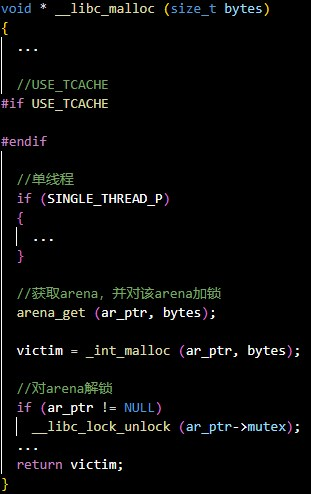  
  2.2.2、int_malloc源码如下图所示：  
  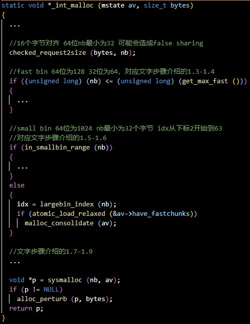  
  2.2.3、sysmalloc大概步骤如下图所示：  
  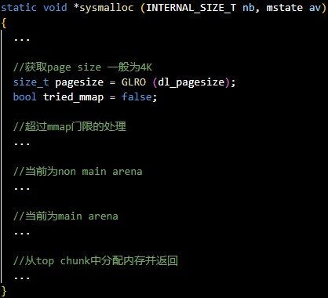  
  2.2.4、超过mmap门限处理如下图所示：  
  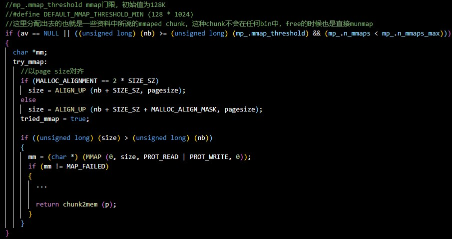  
  2.2.5、没超过mmap门限且当前为non main arena时的处理步骤如下图所示：  
  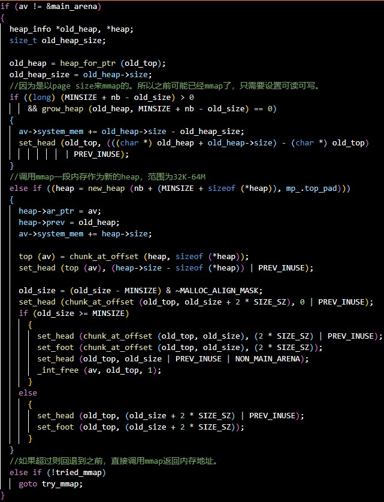  
  2.2.6、未超过mmap门限且当前为main arena时的处理步骤如下图所示：  
  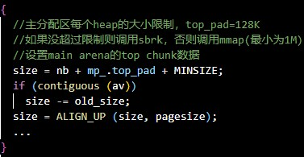

# 3、free
+ 3.1、free步骤文字介绍：  
  + 3.1.1、判断传入的指针是否为 0，如果为 0，则什么都不做，直接 return。否则转下一步。  
  + 3.1.2、判断所需释放的 chunk 是否为 mmaped chunk，如果是，则调用 munmap()释放mmaped chunk，解除内存空间映射，该该空间不再有效。如果开启了 mmap 分配阈值的动态调整机制，并且当前回收的 chunk 大小大于 mmap 分配阈值，将 mmap分配阈值设置为该 chunk 的大小，将 mmap 收缩阈值设定为 mmap 分配阈值的2倍，释放完成，否则跳到下一步。  
  + 3.1.3、判断 chunk 的大小和所处的位置，若 chunk_size <= max_fast，如果开启了TRIM_FASTBINS，则会检查 chunk 是否不位于heap 的顶部，也就是说并不与 top chunk 相邻，则转到下一步，否则跳到第 3.1.5 步。（因为与 top chunk 相邻的小 chunk 也和 top chunk 进行合并，所以这里不仅需要判断大小，还需要判断相邻情况）  
  + 3.1.4、将 chunk 放到 fast bins 中，chunk 放入到 fast bins 中时，并不修改该 chunk 使用状态位 P。也不与相邻的 chunk 进行合并。只是放进去，如此而已。这一步做完之后释放便结束了，程序从 free()函数中返回。  
  + 3.1.5、判断前一个 chunk 是否处在使用中，如果前一个块也是空闲块，则合并。并转下一步。  
  + 3.1.6、判断当前释放 chunk 的下一个块是否为 top chunk，如果是，则转第 3.1.8 步，否则转下一步。  
  + 3.1.7、判断下一个 chunk 是否处在使用中，如果下一个 chunk 也是空闲的，则合并，并将合并后的 chunk 放到 unsorted bin 中。注意，这里在合并的过程中，要更新 chunk的大小，以反映合并后的 chunk 的大小。并转到第 3.1.9 步。  
  + 3.1.8、如果执行到这一步，说明释放了一个与 top chunk 相邻的 chunk。则无论它有多大，都将它与 top chunk 合并，并更新 top chunk 的大小等信息。转下一步。  
  + 3.1.9、判断合并后的 chunk 的大小是否大于 FASTBIN_CONSOLIDATION_THRESHOLD（默认64KB），如果是的话，则会触发进行 fast bins 的合并操作，fast bins 中的 chunk 将被遍历，并与相邻的空闲 chunk 进行合并，合并后的 chunk 会被放到 unsorted bin 中。fast bins 将变为空，操作完成之后转下一步。  
  + 3.1.10、判断 top chunk 的大小是否大于 mmap 收缩阈值（初始值为 128KB），如果是的话，对于主分配区，则会试图归还 top chunk 中的一部分给操作系统。但是最先分配的128KB 空间是不会归还的，ptmalloc 会一直管理这部分内存，用于响应用户的分配请求；如果为非主分配区，会进行 sub-heap 收缩，将 top chunk 的一部分返回给操作系统，如果 top chunk 为整个 sub-heap，会把整个 sub-heap 还回给操作系统。做完这一步之后，释放结束，从 free() 函数退出。可以看出，收缩堆的条件是当前free 的 chunk 大小加上前后能合并 chunk 的大小大于 64k，并且要 top chunk 的大小要达到 mmap 收缩阈值，才有可能收缩堆。

+ 3.2、free源码截图如下列图所示：  
  + 3.2.1、free入口函数以及释放mmap chunk：  
  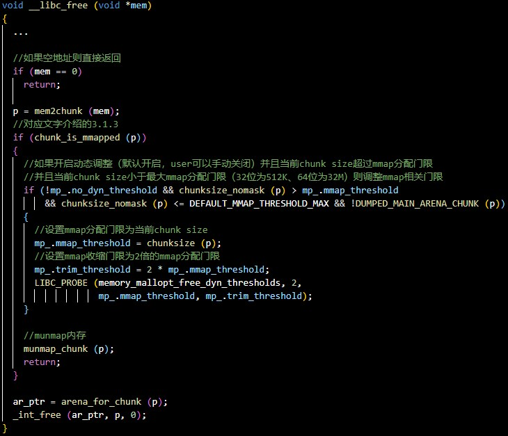  
  + 3.2.2、释放非mmap chunk，并且size小于max_fast  
  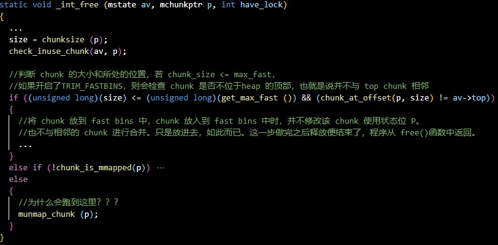  
  + 3.2.2、释放非mmap chunk，并且size大于max_fast。  
  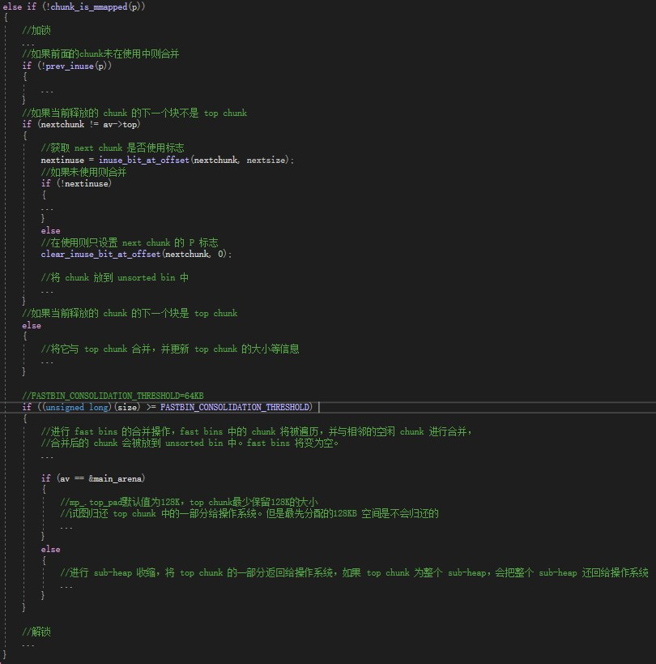  
  + 3.2.3、在缩小非主分配区（non-main arena）时，并不会实际缩小内存映射的区域大小。相反，它会采取一些措施来标记这部分内存为只读，以防止进一步的访问或修改。这种策略的目的是为了安全和效率。如果每次缩小非主分配区时都实际缩小内存映射，那么将会涉及系统调用的开销，这会对性能产生不利影响。而且，频繁地调整内存映射的大小也会增加管理的复杂性。

# 4、USE_TCACHE
+ tcache结构体如下图所示：  
  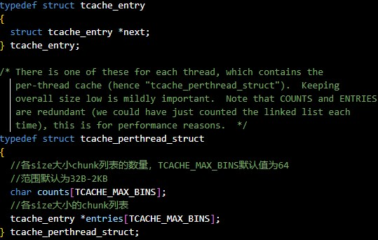

+ 线程私有变量，默认在32B-2KB的内存申请与释放首先都会放入tcache中，所以能加快分配性能，但也可能增加内存碎片和 "false sharing" 的风险。

# 5、SINGLE_THREAD_P
+ 单线程只有main arean，申请或释放内存时不会加锁。如下图所示：  
  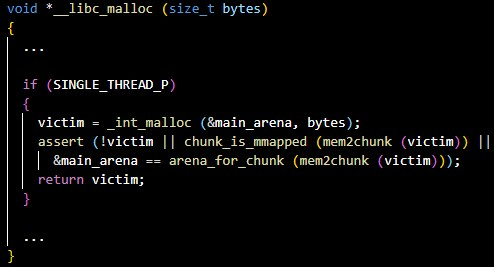