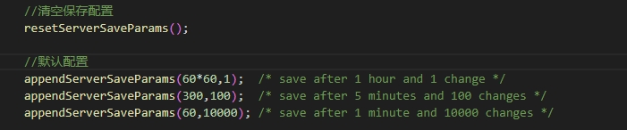
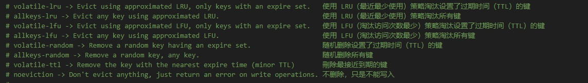
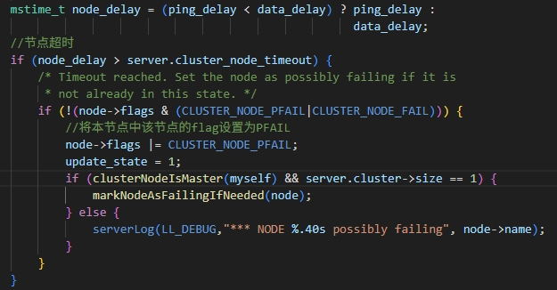
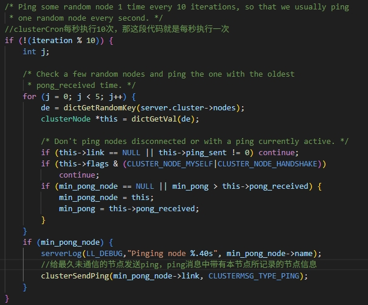
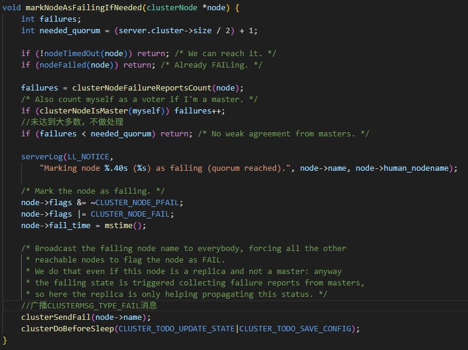
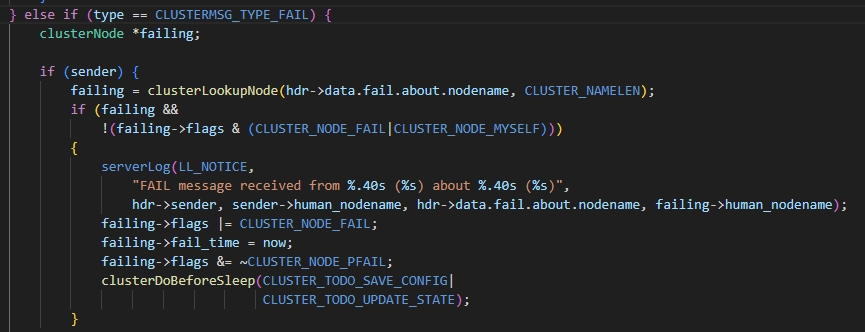
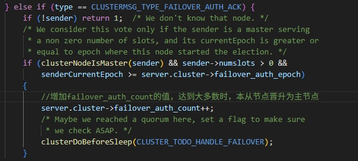

# <center>Redis源码粗浅解析(7.4.2)</center>
# jemalloc
  内存分配机制用的jemalloc，具体机制之后如果看源码再做记录。redis用这个主要是为了减少内存碎片。glibc默认的ptmalloc已经做过记录。

# redis底层数据类型

## sds
+ 结构定义：  
```c
typedef char *sds;

//SDS头结构
//sdshdr5没有用到
struct __attribute__ ((__packed__)) sdshdr5 {
    unsigned char flags; 
    char buf[];
};

//size小于 (1<<8)
struct __attribute__ ((__packed__)) sdshdr8 {
    uint8_t len;            //实际字符串长度
    uint8_t alloc;          //实际的buf内存大小
    unsigned char flags;    //SDS_TYPE_8
    char buf[];
};

//size小于 (1<<16)
struct __attribute__ ((__packed__)) sdshdr16 {
    uint16_t len;
    uint16_t alloc;
    unsigned char flags;    //SDS_TYPE_16
    char buf[];
};

//size小于 (1<<32)
struct __attribute__ ((__packed__)) sdshdr32 {
    uint32_t len;
    uint32_t alloc;
    unsigned char flags;    //SDS_TYPE_32
    char buf[];
};

struct __attribute__ ((__packed__)) sdshdr64 {
    uint64_t len;
    uint64_t alloc;
    unsigned char flags;    //SDS_TYPE_64
    char buf[];
};
```
+ 扩容规则：  
  新的大小小于1M时，则扩容为原本大小的2倍。如果大于1M则扩容1M。

## intset
+ 结构定义：  
```c
typedef struct intset {
    uint32_t encoding;  //字节数，表示contents多少个字节表示一个元素
    uint32_t length;    //长度
    int8_t contents[];  //
} intset;
```
+ intsetAdd：  
```c
//新增元素
intset *intsetAdd(intset *is, int64_t value, uint8_t *success) {
    //判断value所归属的编码
    uint8_t valenc = _intsetValueEncoding(value);
    uint32_t pos;
    if (success) *success = 1;

    //判断是否超过现在所能保存的最大值
    if (valenc > intrev32ifbe(is->encoding)) {
        //升级编码个数并添加新元素
        return intsetUpgradeAndAdd(is,value);
    } else {
        //查找是否已经存在
        if (intsetSearch(is,value,&pos)) {
            if (success) *success = 0;
            return is;
        }
        //扩容
        is = intsetResize(is,intrev32ifbe(is->length)+1);
        //将原本从pos开始的元素往后挪
        if (pos < intrev32ifbe(is->length)) intsetMoveTail(is,pos,pos+1);
    }

    //在pos位置设置value
    _intsetSet(is,pos,value);
    is->length = intrev32ifbe(intrev32ifbe(is->length)+1);
    return is;
}

static intset *intsetUpgradeAndAdd(intset *is, int64_t value) {
    uint8_t curenc = intrev32ifbe(is->encoding);
    uint8_t newenc = _intsetValueEncoding(value);
    int length = intrev32ifbe(is->length);
    int prepend = value < 0 ? 1 : 0;

    is->encoding = intrev32ifbe(newenc);
    is = intsetResize(is,intrev32ifbe(is->length)+1);

    while(length--)
        _intsetSet(is,length+prepend,_intsetGetEncoded(is,length,curenc));

    if (prepend)
        _intsetSet(is,0,value);
    else
        _intsetSet(is,intrev32ifbe(is->length),value);
    is->length = intrev32ifbe(intrev32ifbe(is->length)+1);
    return is;
}
```
+ intsetSearch:
```c
//查找元素
static uint8_t intsetSearch(intset *is, int64_t value, uint32_t *pos) {
    int min = 0, max = intrev32ifbe(is->length)-1, mid = -1;
    int64_t cur = -1;

    //intset是否为空
    if (intrev32ifbe(is->length) == 0) {
        if (pos) *pos = 0;
        return 0;
    } else {
        //是否超过最大最小值
        if (value > _intsetGet(is,max)) {
            if (pos) *pos = intrev32ifbe(is->length);
            return 0;
        } else if (value < _intsetGet(is,0)) {
            if (pos) *pos = 0;
            return 0;
        }
    }

    //二分法查找
    while(max >= min) {
        mid = ((unsigned int)min + (unsigned int)max) >> 1;
        cur = _intsetGet(is,mid);
        if (value > cur) {
            min = mid+1;
        } else if (value < cur) {
            max = mid-1;
        } else {
            break;
        }
    }

    if (value == cur) {
        if (pos) *pos = mid;
        return 1;
    } else {
        if (pos) *pos = min;
        return 0;
    }
}
```
+ intsetRemove:
```c
//删除元素
intset *intsetRemove(intset *is, int64_t value, int *success) {
    uint8_t valenc = _intsetValueEncoding(value);
    uint32_t pos;
    if (success) *success = 0;

    //
    if (valenc <= intrev32ifbe(is->encoding) && intsetSearch(is,value,&pos)) {
        uint32_t len = intrev32ifbe(is->length);

        if (success) *success = 1;

        //从pos+1开始往前挪
        if (pos < (len-1)) intsetMoveTail(is,pos+1,pos);
        is = intsetResize(is,len-1);
        is->length = intrev32ifbe(len-1);
    }
    return is;
}
```

+<font color= "#CC5500">从上面可以看出intset每次在增加或者删除元素时，都会去调整内存，调用zrealloc。如果redis用glibc的ptmalloc的话，虽然有时候realloc很高效，不会有系统调用。但它还是有可能出现调用mmap或者brk的情况。但redis用的是jemalloc，对于这块之后看过jemalloc的源码再来记录。</font>

## listpack
+ lpNew:  
```c
unsigned char *lpNew(size_t capacity) {
    //LP_HDR_SIZE = 6
    //listpack头结构为7个字节
    unsigned char *lp = lp_malloc(capacity > LP_HDR_SIZE+1 ? capacity : LP_HDR_SIZE+1);
    if (lp == NULL) return NULL;
    //前4个字节表示所占内存大小
    lpSetTotalBytes(lp,LP_HDR_SIZE+1);
    //第5、6个字节表示元素个数
    lpSetNumElements(lp,0);
    //最后一位结束符
    lp[LP_HDR_SIZE] = LP_EOF;
    return lp;
}
```
+ 增、删、查等代码比较简单就不做记录了，每个元素的数据结构是：编码+数据+长度（该元素的总长度）。编码包含了该元素的数据类型、数据长度等信息。

## quicklist
+ quicklist相关结构体如下所示：  
```c
typedef struct quicklistNode {
    struct quicklistNode *prev;
    struct quicklistNode *next;
    unsigned char *entry;               //数据指针
    size_t sz;                          //该节点的大小
    unsigned int count : 16;            //该节点的元素个数
    unsigned int encoding : 2;          //该节点是否压缩
    unsigned int container : 2;         //该节点编码格式
    unsigned int recompress : 1;
    unsigned int attempted_compress : 1;
    unsigned int dont_compress : 1; 
    unsigned int extra : 9;
} quicklistNode;

typedef struct quicklist {
    quicklistNode *head;                    //头节点指针
    quicklistNode *tail;                    //尾节点指针
    unsigned long count;                    //元素总个数
    unsigned long len;                      //列表的长度
    signed int fill : QL_FILL_BITS;         //16位大小，每个quicklistNode的容量限制。
    unsigned int compress : QL_COMP_BITS;   //16位大小，表示头尾各有多少个节点不压缩。
    unsigned int bookmark_count: QL_BM_BITS;//
    quicklistBookmark bookmarks[];
} quicklist;
```
+ quicklist的fill字段限制每个节点的最大容量，默认值为-2，可以通过`list_max_listpack_size`配置参数设置。  
  当fill小于0时，该字段表示每个listpack节点的最大字节数。各个节点大小对应static const size_t optimization_level[] = {4096, 8192, 16384, 32768, 65536}。
  当fill大于等于0时，该字段表示每个listpack节点的元素个数，而且每个节点的最大字节数等于SIZE_SAFETY_LIMIT=8KB。

+ quicklist的compress字段表示头尾各有多少个节点不压缩。可以通过`list_compress_depth`配置参数设置。默认值为0，表示所有节点都不压缩。

+ quicklistPushTail:
```c
int quicklistPushTail(quicklist *quicklist, void *value, size_t sz) {
    quicklistNode *orig_tail = quicklist->tail;
    //首先判断塞入的数据大小是否超过限制，超过则直接新建个原始数据的尾节点。
    if (unlikely(isLargeElement(sz, quicklist->fill))) {
        __quicklistInsertPlainNode(quicklist, quicklist->tail, value, sz, 1);
        return 1;
    }

    //判断尾节点是否超过容量限制。
    if (likely(
            _quicklistNodeAllowInsert(quicklist->tail, quicklist->fill, sz))) {
        //listpack节点加元素
        quicklist->tail->entry = lpAppend(quicklist->tail->entry, value, sz);
        quicklistNodeUpdateSz(quicklist->tail);
    } else {
        //新建个节点
        quicklistNode *node = quicklistCreateNode();
        node->entry = lpAppend(lpNew(0), value, sz);

        quicklistNodeUpdateSz(node);
        _quicklistInsertNodeAfter(quicklist, quicklist->tail, node);
    }
    //更新对应个数
    quicklist->count++;
    quicklist->tail->count++;
    return (orig_tail != quicklist->tail);
}

//fill是quicklist的fill字段
static int isLargeElement(size_t sz, int fill) {
    //packed_threshold默认值是0且没有配置参数控制
    if (unlikely(packed_threshold != 0)) return sz >= packed_threshold;
    //如果fill字段大于等于0则是固定值SIZE_SAFETY_LIMIT（8KB）
    if (fill >= 0)
        return !sizeMeetsSafetyLimit(sz);
    else
    //否则（(-fill)-1）对应static const size_t optimization_level[] = {4096, 8192, 16384, 32768, 65536};
    //fill默认值为-2，即每个节点最大为8KB。
    //可以通过list_max_listpack_size配置参数设置。
        return sz > quicklistNodeNegFillLimit(fill);
}
```

## dict
+ dict相关结构体如下所示：  
```c
struct dict {
    //字典key的类型，提供不同的hash算法、key的比较函数等
    dictType *type;
    //两个桶的元素，第二个桶用来做rehash
    dictEntry **ht_table[2];
    //两个桶的元素数量
    unsigned long ht_used[2];
    //分步rehash到的下标
    long rehashidx;
    //暂停rehash
    unsigned pauserehash : 15;
    unsigned useStoredKeyApi : 1; 
    //两个桶的大小
    signed char ht_size_exp[2];
    //关闭自动扩容
    int16_t pauseAutoResize;
    void *metadata[];
};

struct dictEntry {
    void *key;
    union {
        void *val;
        uint64_t u64;
        int64_t s64;
        double d;
    } v;
    struct dictEntry *next;
};
```
+ updateDictResizePolicy:  
```c
//初始值为DICT_RESIZE_ENABLE
//如果是在父进程，但此时有子进程，值为DICT_RESIZE_AVOID
//如果是子进程，值为DICT_RESIZE_FORBID，子进程不允许扩容
void updateDictResizePolicy(void) {
    if (server.in_fork_child != CHILD_TYPE_NONE)
        dictSetResizeEnabled(DICT_RESIZE_FORBID);
    else if (hasActiveChildProcess())
        dictSetResizeEnabled(DICT_RESIZE_AVOID);
    else
        dictSetResizeEnabled(DICT_RESIZE_ENABLE);
}
```
+ dictExpandIfNeeded，每次新增元素时检查是否需要扩容，如果不是空dict导致的扩容就会导致rehash。  
```c
int dictExpandIfNeeded(dict *d) {
    //已经在rehash，直接返回
    if (dictIsRehashing(d)) return DICT_OK;

    //此时还是个空的dict，直接扩容到初始大小，DICT_HT_INITIAL_SIZE=4
    if (DICTHT_SIZE(d->ht_size_exp[0]) == 0) {
        dictExpand(d, DICT_HT_INITIAL_SIZE);
        return DICT_OK;
    }

    //当DICT_RESIZE_ENABLE并且桶里的元素个数大于等于桶的大小
    //当DICT_RESIZE_AVOID并且桶里的元素个数大于等于4倍桶的大小（dict_force_resize_ratio=4）
    if ((dict_can_resize == DICT_RESIZE_ENABLE &&
         d->ht_used[0] >= DICTHT_SIZE(d->ht_size_exp[0])) ||
        (dict_can_resize != DICT_RESIZE_FORBID &&
         d->ht_used[0] >= dict_force_resize_ratio * DICTHT_SIZE(d->ht_size_exp[0])))
    {
        if (dictTypeResizeAllowed(d, d->ht_used[0] + 1))
            dictExpand(d, d->ht_used[0] + 1);
        return DICT_OK;
    }
    return DICT_ERR;
}
```  
+ dictShrinkIfNeeded，每次删除元素时检查是否需要缩小
```c
int dictShrinkIfNeeded(dict *d) {
    //正在rehash，直接返回
    if (dictIsRehashing(d)) return DICT_OK;
    
    //本身已经够小，直接返回
    if (DICTHT_SIZE(d->ht_size_exp[0]) <= DICT_HT_INITIAL_SIZE) return DICT_OK;

    //HASHTABLE_MIN_FILL=8
    //当DICT_RESIZE_ENABLE并且桶里的元素个数*8还是小于等于桶的大小时
    //当DICT_RESIZE_AVOID并且桶里的元素个数*8*4还是小于等于桶的大小时
    if ((dict_can_resize == DICT_RESIZE_ENABLE &&
         d->ht_used[0] * HASHTABLE_MIN_FILL <= DICTHT_SIZE(d->ht_size_exp[0])) ||
        (dict_can_resize != DICT_RESIZE_FORBID &&
         d->ht_used[0] * HASHTABLE_MIN_FILL * dict_force_resize_ratio <= DICTHT_SIZE(d->ht_size_exp[0])))
    {
        if (dictTypeResizeAllowed(d, d->ht_used[0]))
            dictShrink(d, d->ht_used[0]);
        return DICT_OK;
    }
    return DICT_ERR;
}
``` 
+ rehash的推进规则：
  + 1、每次操作（增删改查）正在rehash的dict时，会主动推进hash。推进规则：如果新元素的hash idx大于rehashidx，并且该hash idx的原桶中有元素，那么直接将原桶中该hash idx中的所有元素rehash到新桶中，但此时rehashidx值不变。如果新元素的hash idx小于rehashidx或者原桶中没有元素，那么从rehashidx开始往前推进一次，rehashidx加1。正在rehash的dict，增加元素时只会往新桶中加。
  + 2、 在定时任务`databasesCron`中，如果开启了主动推进rehash，会推进需要rehash的dict，每次最少100步。但每次推进rehash的时间不能超过1毫秒。伪代码如下所示：  
  ```c
  ...
  
  //INCREMENTAL_REHASHING_THRESHOLD_US=1000微秒
  if (server.activerehashing) 
  {
    uint64_t elapsed_us = 0;
    for (j = 0; j < dbs_per_call; j++) {
        redisDb *db = &server.db[rehash_db % server.dbnum];
        elapsed_us += kvstoreIncrementallyRehash(db->keys, INCREMENTAL_REHASHING_THRESHOLD_US - elapsed_us);
        if (elapsed_us >= INCREMENTAL_REHASHING_THRESHOLD_US)
            break;
        elapsed_us += kvstoreIncrementallyRehash(db->expires, INCREMENTAL_REHASHING_THRESHOLD_US - elapsed_us);
        if (elapsed_us >= INCREMENTAL_REHASHING_THRESHOLD_US)
            break;
        rehash_db++;
    }
  }
  ...
  ```  

+ 相关参数：
  + `activerehashing`：默认开启，是否主动推进rehash。

## zskiplist
+ zskiplist相关结构体如下所示： 
```c
typedef struct zskiplistNode {
    sds ele;
    double score;
    struct zskiplistNode *backward;
    struct zskiplistLevel {
        struct zskiplistNode *forward;
        unsigned long span;
    } level[];
} zskiplistNode;

typedef struct zskiplist {
    //头节点和尾节点
    struct zskiplistNode *header, *tail;
    //元素个数
    unsigned long length;
    //
    int level;
} zskiplist;
```

## zset
```c
typedef struct zset {
    dict *dict;
    zskiplist *zsl;
} zset;
```

## redisObject

+ redis所有底层数据类型最终都被统一成redisObject。
```c
struct redisObject {
    unsigned type:4;            //ptr指向的数据类型，这个数据类型指的是提供给用户的，比如String、List等。
    unsigned encoding:4;        //底层数据类型
    unsigned lru:LRU_BITS;      //
    int refcount;               //引用次数
    void *ptr;                  //指向实际上的数据
};
```

+ type字段的值：  
  #define OBJ_STRING 0    /* String object. */  
  #define OBJ_LIST 1      /* List object. */  
  #define OBJ_SET 2       /* Set object. */  
  #define OBJ_ZSET 3      /* Sorted set object. */  
  #define OBJ_HASH 4      /* Hash object. */  

+ encoding字段的值：  
  #define OBJ_ENCODING_RAW 0            /* Raw representation */  
  #define OBJ_ENCODING_INT 1            /* Encoded as integer */  
  #define OBJ_ENCODING_HT 2             /* Encoded as hash table */  
  #define OBJ_ENCODING_ZIPMAP 3         /* No longer used: old hash encoding. */  
  #define OBJ_ENCODING_LINKEDLIST 4     /* No longer used: old list encoding. */  
  #define OBJ_ENCODING_ZIPLIST 5        /* No longer used: old list/hash/zset encoding. */  
  #define OBJ_ENCODING_INTSET 6         /* Encoded as intset */  
  #define OBJ_ENCODING_SKIPLIST 7       /* Encoded as skiplist */  
  #define OBJ_ENCODING_EMBSTR 8         /* Embedded sds string encoding */  
  #define OBJ_ENCODING_QUICKLIST 9      /* Encoded as linked list of listpacks */  
  #define OBJ_ENCODING_STREAM 10        /* Encoded as a radix tree of listpacks */  
  #define OBJ_ENCODING_LISTPACK 11      /* Encoded as a listpack */  
  #define OBJ_ENCODING_LISTPACK_EX 12   /* Encoded as listpack, extended with metadata */  

# redis数据类型

## String
+ String类型的对象type=`OBJ_STRING`，而encoding字段可能是`OBJ_ENCODING_INT`、`OBJ_ENCODING_EMBSTR`或者`OBJ_ENCODING_RAW`。  
  tryObjectEncodingEx源码如下所示：  
```c
robj *tryObjectEncodingEx(robj *o, int try_trim) {
    long value;
    sds s = o->ptr;
    size_t len;

    serverAssertWithInfo(NULL,o,o->type == OBJ_STRING);

    if (!sdsEncodedObject(o)) return o;

    if (o->refcount > 1) return o;

    len = sdslen(s);
    //当长度小于等于20且可以转换成整型时
    if (len <= 20 && string2l(s,len,&value)) {
        //OBJ_SHARED_INTEGERS=10000
        //redis启动时，会预先创建一组整数对象，并存储在shared.integers[]数组中。当redis需要存储一个小整数时，如果该整数落在这个范围内，就会直接使用shared.integers[]中的对象，而不是重新创建新的redisObject。
        if ((server.maxmemory == 0 ||
            !(server.maxmemory_policy & MAXMEMORY_FLAG_NO_SHARED_INTEGERS)) &&
            value >= 0 &&
            value < OBJ_SHARED_INTEGERS)
        {
            decrRefCount(o);
            return shared.integers[value];
        } else {
            //encoding=OBJ_ENCODING_INT
            if (o->encoding == OBJ_ENCODING_RAW) {
                sdsfree(o->ptr);
                o->encoding = OBJ_ENCODING_INT;
                o->ptr = (void*) value;
                return o;
            } else if (o->encoding == OBJ_ENCODING_EMBSTR) {
                decrRefCount(o);
                return createStringObjectFromLongLongForValue(value);
            }
        }
    }

    //OBJ_ENCODING_EMBSTR_SIZE_LIMIT=44
    //当长度小于等于OBJ_ENCODING_EMBSTR_SIZE_LIMIT时，且encoding=OBJ_ENCODING_RAW，
    //会重新创建一个redisObject，type=OBJ_STRING，encoding=OBJ_ENCODING_EMBSTR。
    //OBJ_ENCODING_RAW和OBJ_ENCODING_EMBSTR的区别在于：OBJ_ENCODING_RAW的redisObject和实际的数据也就是ptr指向的地址，内存不是连续的。
    //而OBJ_ENCODING_EMBSTR的redisObject和实际的数据内存上是连续的。提高内存访问效率。
    if (len <= OBJ_ENCODING_EMBSTR_SIZE_LIMIT) {
        robj *emb;

        if (o->encoding == OBJ_ENCODING_EMBSTR) return o;
        emb = createEmbeddedStringObject(s,sdslen(s));
        decrRefCount(o);
        return emb;
    }

    //如果都失败了，最后再尝试将SDS缩短从而节省内存。
    if (try_trim)
        trimStringObjectIfNeeded(o, 0);

    return o;
}
```

## List
+ List类型的对象type=`OBJ_LIST`，而encoding字段可能是`OBJ_ENCODING_QUICKLIST`或者`OBJ_ENCODING_LISTPACK`。  
  当新创建一个List类型的对象时，encoding字段初始值是`OBJ_ENCODING_LISTPACK`。  

+  listTypeTryConvertListpack源码如下所示：  
```c
static void listTypeTryConvertListpack(robj *o, robj **argv, int start, int end,
                                       beforeConvertCB fn, void *data)
{
    serverAssert(o->encoding == OBJ_ENCODING_LISTPACK);

    size_t add_bytes = 0;
    size_t add_length = 0;

    if (argv) {
        for (int i = start; i <= end; i++) {
            if (!sdsEncodedObject(argv[i]))
                continue;
            add_bytes += sdslen(argv[i]->ptr);
        }
        add_length = end - start + 1;
    }

    //当新的数据长度或者数据个数超过list_max_listpack_size限制，则切换成quicklist
    if (quicklistNodeExceedsLimit(server.list_max_listpack_size,
            lpBytes(o->ptr) + add_bytes, lpLength(o->ptr) + add_length))
    {
        /* Invoke callback before conversion. */
        if (fn) fn(data);

        quicklist *ql = quicklistNew(server.list_max_listpack_size, server.list_compress_depth);

        /* Append listpack to quicklist if it's not empty, otherwise release it. */
        if (lpLength(o->ptr))
            quicklistAppendListpack(ql, o->ptr);
        else
            lpFree(o->ptr);
        o->ptr = ql;
        o->encoding = OBJ_ENCODING_QUICKLIST;
    }
}
```  

+ listTypeTryConvertQuicklist源码如下所示：  
```c
static void listTypeTryConvertQuicklist(robj *o, int shrinking, beforeConvertCB fn, void *data) {
    serverAssert(o->encoding == OBJ_ENCODING_QUICKLIST);

    size_t sz_limit;
    unsigned int count_limit;
    quicklist *ql = o->ptr;

    //quicklist必须只有一个quicklistNode，并且quicklistNode的编码格式得是listpack
    if (ql->len != 1 || ql->head->container != QUICKLIST_NODE_CONTAINER_PACKED)
        return;

    //获取list_max_listpack_size配置。
    quicklistNodeLimit(server.list_max_listpack_size, &sz_limit, &count_limit);
    //当小于配置的一半限制时，切换成OBJ_ENCODING_LISTPACK
    if (shrinking) {
        sz_limit /= 2;
        count_limit /= 2;
    }
    if (ql->head->sz > sz_limit || ql->count > count_limit) return;

    /* Invoke callback before conversion. */
    if (fn) fn(data);

    /* Extract the listpack from the unique quicklist node,
     * then reset it and release the quicklist. */
    o->ptr = ql->head->entry;
    ql->head->entry = NULL;
    quicklistRelease(ql);
    o->encoding = OBJ_ENCODING_LISTPACK;
}
```   
  当删除List中的元素时，会调用listTypeTryConvertQuicklist。  

## Set
+ Set类型的对象type=`OBJ_SET`，而encoding字段可能是`OBJ_ENCODING_INTSET`、`OBJ_ENCODING_LISTPACK`或者`OBJ_ENCODING_HT`  

+ setTypeCreate源码如下所示：  
```c
robj *setTypeCreate(sds value, size_t size_hint) {
    //当都是整型且数量小于等于set_max_intset_entries，Set底层数据结构使用intset
    if (isSdsRepresentableAsLongLong(value,NULL) == C_OK && size_hint <= server.set_max_intset_entries)
        return createIntsetObject();
    //当数量小于等于set_max_listpack_entries，Set底层数据结构使用listpack
    if (size_hint <= server.set_max_listpack_entries)
        return createSetListpackObject();

    /* We may oversize the set by using the hint if the hint is not accurate,
     * but we will assume this is acceptable to maximize performance. */
    //dict托底
    robj *o = createSetObject();
    dictExpand(o->ptr, size_hint);
    return o;
}
```

+ 增加元素时，会调用setTypeMaybeConvert来判断是否需要修改数据类型。setTypeMaybeConvert源码如下所示：  
```c
void setTypeMaybeConvert(robj *set, size_t size_hint) {
    if ((set->encoding == OBJ_ENCODING_LISTPACK && size_hint > server.set_max_listpack_entries)
        || (set->encoding == OBJ_ENCODING_INTSET && size_hint > server.set_max_intset_entries))
    {
        setTypeConvertAndExpand(set, OBJ_ENCODING_HT, size_hint, 1);
    }
}
```

## Sorted Set
+ Sorted Set类型的对象type=`OBJ_ZSET`，而encoding字段可能是`OBJ_ENCODING_LISTPACK`或者`OBJ_ENCODING_SKIPLIST`。
+ zsetTypeCreate源码如下所示： 
```c 
robj *zsetTypeCreate(size_t size_hint, size_t val_len_hint) {
    //元素个数小于等于zset_max_listpack_entries
    //并且单个元素长度小于等于zset_max_listpack_value字节
    if (size_hint <= server.zset_max_listpack_entries &&
        val_len_hint <= server.zset_max_listpack_value)
    {
        //listpack
        return createZsetListpackObject();
    }

    //encoding字段是OBJ_ENCODING_SKIPLIST，但底层其实是zset
    robj *zobj = createZsetObject();
    zset *zs = zobj->ptr;
    dictExpand(zs->dict, size_hint);
    return zobj;
}
```

## Hash
+ Hash类型的对象type=`OBJ_HASH`，而encoding字段可能是`OBJ_ENCODING_HT`或者`OBJ_ENCODING_LISTPACK`。  
  当新创建一个Hash类型的对象时，encoding字段初始值是`OBJ_ENCODING_LISTPACK`。  

+ hashTypeTryConversion源码如下所示：  
```c
void hashTypeTryConversion(redisDb *db, robj *o, robj **argv, int start, int end) {
    int i;
    size_t sum = 0;

    if (o->encoding != OBJ_ENCODING_LISTPACK && o->encoding != OBJ_ENCODING_LISTPACK_EX)
        return;

    //key+value key+value的形式，所以除2就是新增的filed数量。
    size_t new_fields = (end - start + 1) / 2;
    
    //filed数量大于hash_max_listpack_entries，则切换成dict
    if (new_fields > server.hash_max_listpack_entries) {
        hashTypeConvert(o, OBJ_ENCODING_HT, &db->hexpires);
        dictExpand(o->ptr, new_fields);
        return;
    }

    //判断所有key和value的长度
    for (i = start; i <= end; i++) {
        if (!sdsEncodedObject(argv[i]))
            continue;
        size_t len = sdslen(argv[i]->ptr);
        //大于hash_max_listpack_value，则切换成dict
        if (len > server.hash_max_listpack_value) {
            hashTypeConvert(o, OBJ_ENCODING_HT, &db->hexpires);
            return;
        }
        sum += len;
    }

    //判断长度是否会超过LISTPACK_MAX_SAFETY_SIZE=1GB
    if (!lpSafeToAdd(hashTypeListpackGetLp(o), sum))
        hashTypeConvert(o, OBJ_ENCODING_HT, &db->hexpires);
}
```

# 全量同步和增量同步
  从节点进程起来后在定时事件回调函数`serverCron`中调用`replicationCron`，如果有配置主节点信息，则调用`connectWithMaster`，主动连接主节点，此时这个连接的read回调函数是`syncWithMaster`。当主节点数据来了，在函数`syncWithMaster`中判断是全量同步还是增量同步，如果是增量同步，则将该socket的read回调函数设置为`readQueryFromClient`。如果是全量同步，回调函数设置为`readSyncBulkPayload`。当全量同步完成，回调函数又重新被设置为`readQueryFromClient`。

1、从节点（replica）在与主节点（master）建立复制连接时，会发送`PSYNC`命令，如果有之前的master的信息则会把之前master的`replication id`和`replication offset`带上。  
2、主节点收到`PSYNC`命令后，比较`replication id`和`offset`，如果满足条件则进行增量同步，否则就需要全量同步。  
3、如果是增量同步，主节点先发送一条`CONTINUE`命令，然后将`repl_backlog`中需要同步给从节点的数据保存在`client`的相关字段。然后在事主线程循环中调用`handleClientsWithPendingWrites`，真正的将对应数据发送给从节点。  
4、如果是全量同步：
+ 首先检查是否已经有一个`CHILD_TYPE_RDB`子进程。BGSAVE子进程。
  + 如果当前`rdb_child_type == RDB_CHILD_TYPE_DISK`，遍历所有client，查看是否有其他同样正在等待全量同步且满足相应条件的client，如果有则将client的状态改为SLAVE_STATE_WAIT_BGSAVE_END，后续在周期函数`replicationCron`中处理。
  + 如果当前`rdb_child_type == RDB_CHILD_TYPE_SOCKET`，直接返回，此时client的状态为SLAVE_STATE_WAIT_BGSAVE_START,后续在周期函数`replicationCron`中处理。
+ 如果当前没有相关子进程
  + 如果`repl_diskless_sync`和`repl_diskless_sync_delay`都设置，那么本次全量同步不会立即处理，而是等待`repl_diskless_sync_delay`，单位是秒。
  + 如果开启`repl_diskless_sync`，首先遍历所有从节点信息，找到需要全量同步的从节点，然后开启一个`CHILD_TYPE_RDB`子进程，子进程生成RDB数据，通过`pipe`发给父进程，结束后父进程将RDB数据发给所有需要全量同步的从节点。（`rdbSaveToSlavesSockets`函数）
  + 如果没开启`repl_diskless_sync`，开启一个`CHILD_TYPE_RDB`子进程，子进程生成RDB数据，并保存在磁盘。父进程在`serverCron`中调用`checkChildrenDone`，`checkChildrenDone`的作用是检查子进程是否完成，完成则将RDB文件发给所有需要全量同步的从节点。
主节点相关伪代码如下所示：
```c
void syncCommand(client *c)
{
    if （比较client psync带过来的参数replication id和replication offset，如果满足提交则进行增量同步）
    {
        增量同步：
            在masterTryPartialResynchronization函数中，先给client发一条CONTINUE消息，然后将需要同步的数据保存到client相关字段。
            然后在主线程循环中调用handleClientsWithPendingWrites将数据发给client。
    }
    else
    {
        全量同步：
            if （此时有一个子进程，并且是在执行bgsave，将数据保存到磁盘）
            {
                遍历所有client，查看是否有其他同样正在等待全量同步且满足相应条件的client，如果有则将client的状态改为SLAVE_STATE_WAIT_BGSAVE_END，后续在周期函数replicationCron()中处理,
                之所以要遍历所有client，是因为RDB_CHILD_TYPE_DISK类型的子进程也可能由自身的bgsave触发。
            }
            else if （此时有一个直接将RDB数据通过socket发给client的子进程）
            {
                直接返回，此时client的状态为SLAVE_STATE_WAIT_BGSAVE_START,后续在周期函数replicationCron()中处理
            }
            else
            {
                if (repl_diskless_sync和repl_diskless_sync_delay都配置)
                {
                    直接返回，此时client的状态为SLAVE_STATE_WAIT_BGSAVE_START,后续在周期函数replicationCron()中处理
                }
                else
                {
                    if （没有子进程）
                    {
                        调用startBgsaveForReplication()函数
                    }
                    else
                    {
                        直接返回，此时client的状态为SLAVE_STATE_WAIT_BGSAVE_START,周期函数replicationCron()中处理
                    }
                }
            }
    }
}

int startBgsaveForReplication(int mincapa, int req) 
{
    if (repl_diskless_sync == true)
    {
        1、创建一个匿名管道
        2、创建一个子进程
            2.1、子进程生成RDB数据，并通关管道通知父进程
            2.2、父进程在rdbPipeReadHandler函数中，从管道读数据，并发送给client
    }
    else
    {
        1、创建一个子进程，生成RDB数据，并保存在磁盘
        2、父进程在定时事件回调函数serverCron中，调用checkChildrenDone检查子进程是否结束，如果子进程结束，则将数据发送给状态为SLAVE_STATE_WAIT_BGSAVE_END的client
    }
}

void replicationCron(void)
{
    如果有满足条件的client，调用startBgsaveForReplication()
    if (shouldStartChildReplication(&mincapa, &req)) {
        startBgsaveForReplication(mincapa, req);
    }
}
```  

常用相关参数：
+ `repl_diskless_sync`：主节点做全量同步时，是否直接将数据通过socket发送给从节点，而不落盘保存到磁盘。
+ `repl_diskless_sync_delay`：主节点全量同步延迟，等待更多的全量同步需求。
+ `repl_diskless_sync_max_replicas`：最大同时需要全量同步的从节点数量。等待全量同步的从节点超过这个数，则直接执行startBgsaveForReplication，否则要等`repl_diskless_sync_delay`的时间到。
+ `repl_backlog_size`：
+ `rdb_del_sync_files`：从节点：当没有开启RDB和AOF持久化并且这个配置开启时，会删除全量同步时生成在磁盘的RDB文件。主节点：本次全量同步结束后，没有开启RDB和AOF持久化并且这个配置开启，并且此时没有需要全量同步的从节点时删除全量同步生成的RDB磁盘文件。
+ `repl_diskless_load`：从节点收到主节点的全量同步包时，是否保存到磁盘。`disabled`（保存到磁盘）、`swapdb`（不保存到磁盘）、`on-empty-db`（当本地是空数据库时不保存到磁盘）

# 持久化
+ 在serverCron中有如下代码：
  ```c
    if (hasActiveChildProcess() || ldbPendingChildren())
    {
        run_with_period(1000) receiveChildInfo();
        checkChildrenDone();
    //没有子进程
    } else {
        /* If there is not a background saving/rewrite in progress check if
        * we have to save/rewrite now. */
        //RDB持久化
        for (j = 0; j < server.saveparamslen; j++) {
            struct saveparam *sp = server.saveparams+j;

            /* Save if we reached the given amount of changes,
            * the given amount of seconds, and if the latest bgsave was
            * successful or if, in case of an error, at least
            * CONFIG_BGSAVE_RETRY_DELAY seconds already elapsed. */
            if (server.dirty >= sp->changes &&
                server.unixtime-server.lastsave > sp->seconds &&
                (server.unixtime-server.lastbgsave_try >
                CONFIG_BGSAVE_RETRY_DELAY ||
                server.lastbgsave_status == C_OK))
            {
                serverLog(LL_NOTICE,"%d changes in %d seconds. Saving...",
                    sp->changes, (int)sp->seconds);
                rdbSaveInfo rsi, *rsiptr;
                rsiptr = rdbPopulateSaveInfo(&rsi);
                rdbSaveBackground(SLAVE_REQ_NONE,server.rdb_filename,rsiptr,RDBFLAGS_NONE);
                break;
            }
        }

        /* Trigger an AOF rewrite if needed. */
        //aof持久化
        if (server.aof_state == AOF_ON &&
            !hasActiveChildProcess() &&
            server.aof_rewrite_perc &&
            server.aof_current_size > server.aof_rewrite_min_size)
        {
            long long base = server.aof_rewrite_base_size ?
                server.aof_rewrite_base_size : 1;
            long long growth = (server.aof_current_size*100/base) - 100;
            if (growth >= server.aof_rewrite_perc && !aofRewriteLimited()) {
                serverLog(LL_NOTICE,"Starting automatic rewriting of AOF on %lld%% growth",growth);
                rewriteAppendOnlyFileBackground();
            }
        }
    }
  ```
+ 1、AOF
  + 常用相关参数：
    + `appendonly`：是否开启AOF
    + `appendfilename`：AOF文件名前缀
    + `appenddirname`：AOF文件保存目录
    + `appendfsync`：是否主动刷新到磁盘，`always`（每次变动都主动刷新）、`everysec`（每秒刷新到磁盘）、`no`（不主动刷新）
    + `no-appendfsync-on-rewrite`：当在重写时，AOF变动不刷盘
    + `auto-aof-rewrite-percentage`：AOF触发重写相关，默认100%，较上次重写时大小变动百分比
    + `auto-aof-rewrite-min-size`：AOF触发重写的最小限制，默认64M，超过这个大小才有可能触发重写
    + `aof-load-truncated`：默认开启，如果Redis检测到AOF文件被截断或损坏，会尝试加载可用部分，并在日志中记录警告，但仍然正常启动。如果设置为no：如果 AOF 文件损坏，Redis直接拒绝启动，以避免数据不完整导致的异常。
    + `aof-use-rdb-preamble`：重写AOF时，是否使用RDB格式保存
    + `aof-timestamp-enabled`：记录AOF文件变动的时间
  + 当开启AOF持久化时，在对应的目录下会有一个`appenddirname`的目录，里面最少会有三个文件，分别是`*.manifest`、`*.incr.aof`、(`*.base.rdb`或者`*.base.aof`)。(`*.base.rdb`或者`*.base.aof`)这个由上面所说的`aof-use-rdb-preamble`参数控制。    
    (`*.base.rdb`或者`*.base.aof`)触发AOF重写时记录数据到这些文件中。  
    `*.incr.aof`文件记录用户增删改语句。  
    `*.manifest`文件里记录该文件夹下其他文件的作用。是重写数据还是操作语句列表。  
+ 2、RDB
  + 常用相关参数
    + `save 时间 次数`：RDB保存触发时机
    + `stop-writes-on-bgsave-error`：当后台保存（BGSAVE）失败时，Redis是否继续允许写操作
    + `rdbcompression`：当数据长度大于20时，是否压缩数据，默认开启
    + `rdbchecksum`：检验RDB文件，默认开启
    + `dbfilename`：RDB文件名
    
  + redis的rdb触发配置保存在`redisServer`的`saveparams`，存在默认参数，当redis.conf里没有配置save时，redis默认1分钟内10000修改或者5分钟内100次修改或者1小时内1次修改也会保存数据到磁盘（代码截图如下所示）。如果要关闭需要在配置文件中配置`save ""`，这样会清空saveparams。
    
  + 在redis.conf里配置了`save ""`，也并不能避免任何时刻都能阻止生成RDB文件。`save ""`只是关闭了redis运行中自动触发的RDB持久化机制。当用SIGINT或者SIGTERM信号或者远端用`shutdown save`命令来关闭redis服务，redis进程退出时也会保存RDB数据到磁盘。  
  redis.conf里有两个默认关闭的配置`shutdown-on-sigint default`和`shutdown-on-sigterm default`，表示用SIGINT或者SIGTERM信号来关闭redis服务时是否保存RDB文件。  

+ Redis启动加载数据伪代码如下所示：
  ```c
  void loadDataFromDisk(void) 
  {
    long long start = ustime();
    //开启AOF持久化
    if (server.aof_state == AOF_ON) {
        int ret = loadAppendOnlyFiles(server.aof_manifest);
        if (ret == AOF_FAILED || ret == AOF_OPEN_ERR)
            exit(1);
        if (ret != AOF_NOT_EXIST)
            serverLog(LL_NOTICE, "DB loaded from append only file: %.3f seconds", (float)(ustime()-start)/1000000);
    } 
    else 
    //加载RDB数据
    {
        ...
    }
  }
  ```  
  
# 淘汰策略
+ 相关参数：
  + `maxmemory`：默认值为0，也就是默认关闭，不会主动淘汰
  + `maxmemory-policy`：如下图所示：  
      
  + `maxmemory-samples`：随机采样数量，默认值为5，最大不能超过64
  + `maxmemory-eviction-tenacity`：淘汰数据的强度，其实就是根据这个值算一个时间用作淘汰数据的用时限制。源码如下所示：  
  ```c
  static unsigned long evictionTimeLimitUs(void) {
        serverAssert(server.maxmemory_eviction_tenacity >= 0);
        serverAssert(server.maxmemory_eviction_tenacity <= 100);

        if (server.maxmemory_eviction_tenacity <= 10) {
            /* A linear progression from 0..500us */
            return 50uL * server.maxmemory_eviction_tenacity;
        }

        if (server.maxmemory_eviction_tenacity < 100) {
            /* A 15% geometric progression, resulting in a limit of ~2 min at tenacity==99  */
            return (unsigned long)(500.0 * pow(1.15, server.maxmemory_eviction_tenacity - 10.0));
        }

        return ULONG_MAX;   /* No limit to eviction time */
    }
  ```  
  + `replica-ignore-maxmemory`：从节点数据不做淘汰

# 集群模式
+ 故障转移具体步骤：  
  + 1、假设redis集群有三个主节点A、B、C，并且各自有三个从节点A1、A2、A3、B1、B2、B3、C1、C2、C3。
  + 2、当A节点宕机时，B和C在定时任务`clusterCron`中，判断超时则会将各自本地记录的A节点状态设置为PFAIL。  
      
  + 3、然后同样在定时任务`clusterCron`中，两个主节点可能会给对方发送PING消息。  
      
  + 4、假设是B给C发，当C收到消息后发现B节点所记录的A节点也变成了PFAIL，那么此时C节点中所记录认为A节点主观下线的主节点个数已经满足故障转移的条件（2 >= (3 / 2) + 1），C节点会广播一条`CLUSTERMSG_TYPE_FAIL`类型的消息给所有节点。  
      
  + 5、其他节点收到`CLUSTERMSG_TYPE_FAIL`后，将节点状态设置为FAIL。  
      
  + 6、当A的从节点在`clusterCron`中，调用函数`clusterHandleSlaveFailover`发现自己的主节点发生故障，则广播一条`CLUSTERMSG_TYPE_FAILOVER_AUTH_REQUEST`类型的消息给所有节点。  
  + 7、其他主节点收到`CLUSTERMSG_TYPE_FAILOVER_AUTH_REQUEST`消息后，对其进行投票，如果投给某个从节点，就给该从节点发送`CLUSTERMSG_TYPE_FAILOVER_AUTH_ACK`类型的消息。  
  + 8、A的从节点收到`CLUSTERMSG_TYPE_FAILOVER_AUTH_ACK`类型的消息后，增加自己集群对象`failover_auth_count`字段的值。
      
  + 9、当A的从节点在`clusterCron`中，如果投给本节点达到一定数量后，该节点切换成主节点。  

+ 相关参数：
  + `cluster-enabled`：是否是集群模式。  
  + `cluster-node-timeout`：集群节点超时时间。  