# 基本数据类型
+ string、hash、list、set、sortedset。
  
# 通用命令
+ keys (pattern)：如keys *（返回所有key）、keys a*（返回a开头的key）。
+ del (key)：删除某个key。
+ exists (key)：判断key是否存在，存在返回1，不存在返回0。
+ expire (key) (seconds)：设置key有效期（秒），过期删除。
+ ttl (key)：查看key的有效期（秒），如果返回-2则表示该key已经被删除，如果返回-1则表示该key永久有效。

# key的结构
+ redis的key允许有多个单词形成层级结构，多个单词之前用":"隔开。效果用redis可视化工具查看如下图所示：
+ 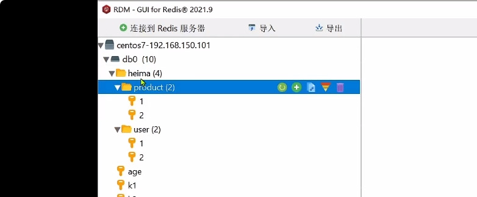

# string类型
+ string数据类型最大不能超过512M，string数据类型有如下三种表现形式：字符串、int、float。
+ set (key) (value)：添加或修改一个键值对。
+ get (key)：获取一个key的value。
+ mset (key value) (key value)...：添加或修改多个键值对。
+ mget (key) (key)...：获取多个key的value。
+ incr (key)：让一个整型的value（例如10，但其底层数据类型还是string）自增1。
+ incrby (key) (step)：让一个整型的value（例如10，但其底层数据类型还是string）自增步长step。
+ incrbyfloat (key) (step)：让一个浮点类型的value（例如10.1，但其底层数据类型还是string）自增步长step。
+ setnx (key) (value)：新增一个键值对，只有新增效果，与 $\color{#FF0000}{set (key) (value) nx 效果一样}$。
+ setex (key) (seconds) (value)：新增一个键值对，并且设置有效期seconds,与 $\color{#FF0000}{set (key) (value) ex (seconds) 效果一样}$。
+ 底层数据结构是SDS。
+ 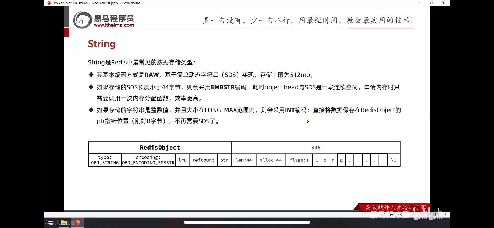

# Hash类型
+ HSET key field value [field value ...]：添加或修改hash类型key的field的值。可以添加或修改多个field。
+ HGET key field：获取一个key的单个field的值。如果不存在则返回nil。
+ HMSET key field value [field value ...]：redis 4.0.0版本之后，该命令已被弃用。
+ HMGET key field [field ...]：获取一个key的多个field的值，如果不存在则返回nil。
+ HGETALL key：返回对应key的所有field和value。
+ HKEYS key：返回对应key的所有field的名字。
+ HVALS key：返回对应key的所有value。
+ HINCRBY key field increment：对应的value自增increment，如果key不存在，则会添加对应的key。如果field不存在，也会添加对应的field，并且初始值为0。
+ HINCRBYFLOAT key field increment：如上。
+ HSETNX key field value：存在则不处理，返回值为0。不存在则塞入，返回值为1。
+ 底层数据结构如下所示：
+ 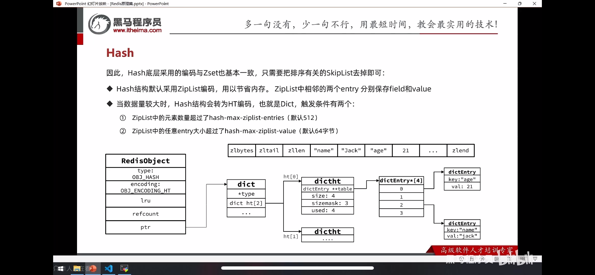

# List类型
+ 底层数据结构是QuickList。

# Set类型
+ SADD key member [member ...]：
+ SINTER key1 key2：求交集。
+ 只有int类型数据而且元素个数不多时，底层数据结构用IntSet，否则用Dict。

# SoretedSet类型
+ ZADD key [NX | XX] [GT | LT] [CH] [INCR] score member [score member ...]：$\color{#FF0000}{XX: 只更新存在的member，不新增。NX: 只新增，如果已经存在则不处理。LT: 只更新存在的，并且新的score比当前的score要小的member。GT: 只更新存在的，并且新的score比当期的score要大的member。CH：可选参数，用于指定是否返回添加成员的数量。INCR：可选参数，用于指定是否对成员的分数值进行累加操作。}$。
+ ZREM key member [member ...]：移除指定的member，不存在则忽略。
+ ZSCORE key member：返回对应的score，如果key或者member不存在，则返回nil。
+ ZRANK key member [WITHSCORE]：返回当前排名，如果带有可选参数[WITHSCORE]，则还会返回对应的score值。
+ ZCARD key：返回对应key的member数量。
+ ZCOUNT key min max：返回score在min和max之间的member的数量。如果有"("则表示不包含，比如(1 5,则表示min < score <= max。
+ ZINCRBY key increment member：累加member的score值。如果key或者member不存在，则新增，并且初始score为0。
+ ZDIFF numkeys key [key ...] [WITHSCORES]：返回多个key的差集，对比多个key的member不同，返回第一个key相比其他key多出来的member，如果带可选参数[WITHSCORES]，则还会返回对应的score。实例如下图所示：
+ 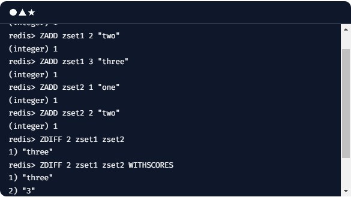
+ ZINTER numkeys key [key ...] [WEIGHTS weight [weight ...]] [AGGREGATE <SUM | MIN | MAX>] [WITHSCORES]：返回多个key的并集。如果带[WITHSCORES]参数，返回的score为多个key中的对应member的score相加值。
+ ZUNION numkeys key [key ...] [WEIGHTS weight [weight ...]] [AGGREGATE <SUM | MIN | MAX>] [WITHSCORES]：返回多个key的合集，如果带[WITHSCORES]参数，返回的score为多个key中的对应member的score相加值。
+ 底层数据结构使用SkipList和Dict同时来实现。如下所示：
+ 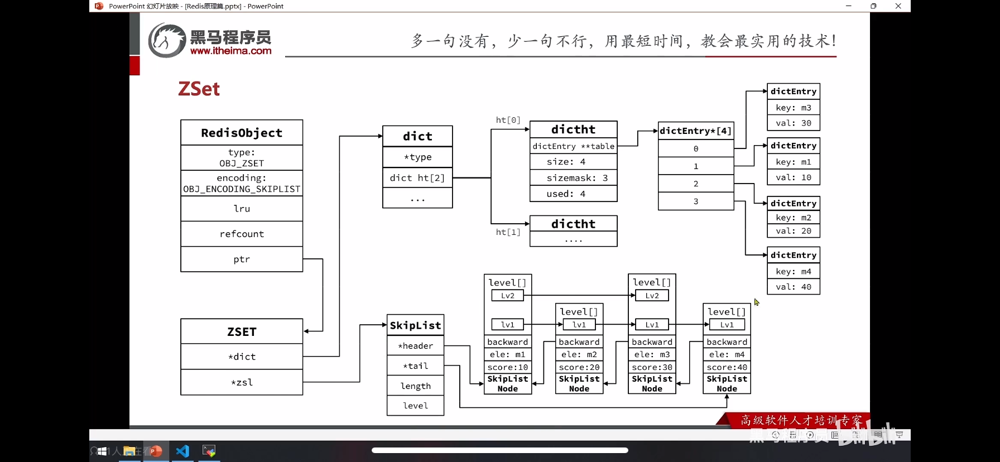

# 查看底层数据结构
+ OBJECT ENCODING key – 可查看redis key的底层实现的数据结构。

# SDS（simple dymanic string）
+ 扩容规则：新的大小小于1M时，则扩容为原本大小的2倍。如果大于1M则扩容1M。

# IntSet
+ IntSet结构体如下所示：
  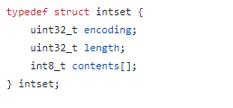
+ IntSet本身是个有序的集合，排序从小到大，不重复。只有Set底层才有可能使用IntSet，添加数据源码如下所示：
  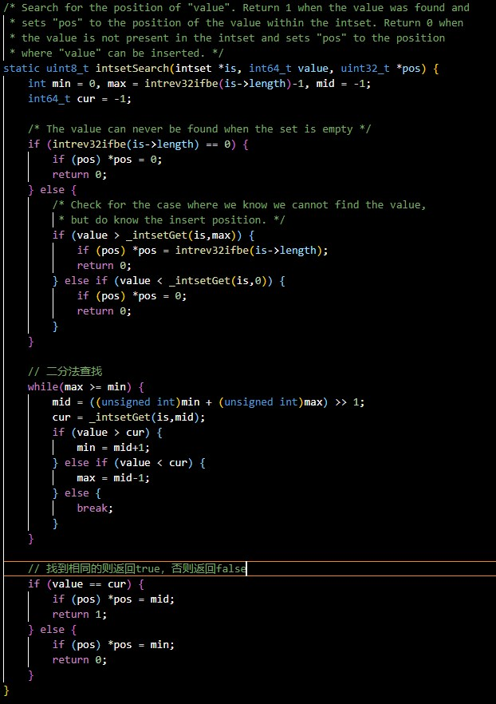
  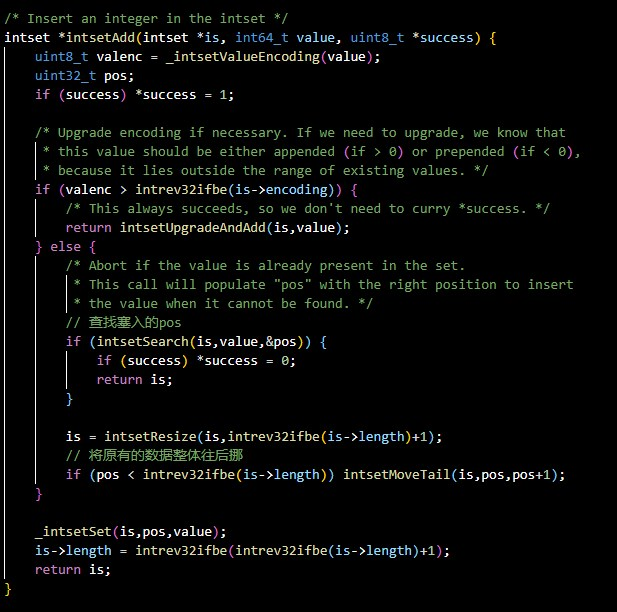
+ Redis automatically switches to intset encoding when a set only contains integer values and the number of elements is small enough. You can use various set commands like SADD, SREM, SISMEMBER, SINTER, and SCARD to work with intset and perform operations on sets of integers.(Redis当Set只有int类型数据而且元素个数不多时，底层会自动使用intset类型来保存数据。)

# Dict
+ dict结构体如下所示：
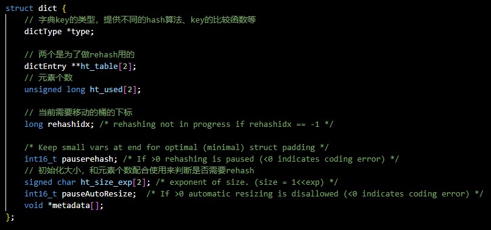
+ 为什么需要rehash？
  在key进行哈希计算得到hash值时，可能不同的key会得到相同的hash值，从而出现hash冲突，redis采用链地址法，把数组中同一下index下的所有数据，通过链表的形式进行关联。而redis中查找key的过程为： 首先对key进行hash计算并对数组长度取模得到数据所在的桶，在该桶下遍历链表来查找key。此时查找key的复杂度就取决于链表的长度，如果链表的长度为n，那么复杂度就为o(n)，n越大查询效率就会越低。当数据个数越多，哈希表的hash冲突的概率就会越高，导致链表长度越长，查询效率越低，所以要进行rehash。如果在进行rehash，每次增删改查都会判断当前是否在rehash，每次只挪动一个桶的链表。
+ 什么时候会触发rehash？扩容和缩小都会判断是否需要进行rehash。扩容：当负载因子（ht_used/ht_size_exp）>= 1并且当
  前没有后台进程（即执行bgsave或者bgrewriteaof），或者负载因子大于等于4。缩小：当负载因子<=0.8并且当前没有后台进程，或者负载因子<=1/32。扩容的大小是扩充为比ht_used+1大的最小的2的N次方，缩小的大小是小于ht_used-1的最大的2的N次方但不能小于4，判断源码如下图所示：
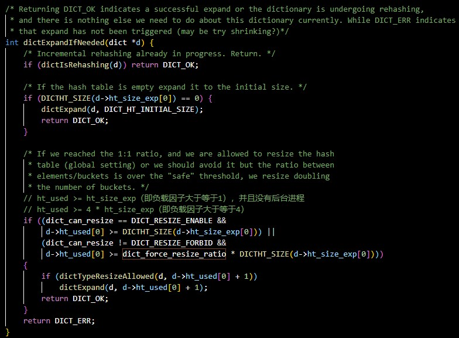

# ZipList
+ ZipList结构体如下所示：
  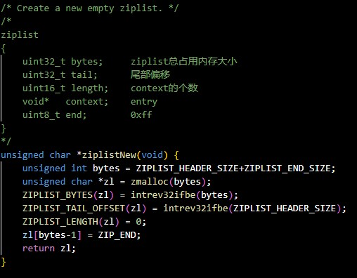
+ ZlEntry结构体如下所示：
  
+ ZipList是一段连续的内存。优点是省内存、数据局部性能好，顺序访问效率高。缺点是只能遍历查找查找时间复杂度高
；由于entry不定长的字段用来记录前一个entry的大小，所以修改操作可能引发连锁更新（当在Ziplist中插入、修改或删除数据项时，可能需要重新分配内存并移动其他数据项以维护其连续性。这可能导致连锁更新问题，即一个修改操作可能触发多个数据项的移动，从而影响性能。）；不预留内存空间，所以Ziplist在插入移除操作时可能需要频繁进行内存分配和释放，这可能导致性能下降。所以一个ziplist不会存储过多数据。

# QuickList
+ 多个ZipList的集合。

# SkipList
+ 
  
# Redis的数据库
+ Redis默认有16个数据库，每个数据库在Redis中实际上是相同实例中的不同键空间。每个数据库都可以被看作是一个独立的命名空间，有自己的键集合。这意味着每个数据库都有自己的数据集合，并且它们之间是相互隔离的。客户端可以指定将数据存储在哪个数据库中，从而实现了数据的分离和管理。

# Redis事务
+ Redis事务并不是真正的事务，本质是一组命令的集合。事务支持一次执行多个命令，一个事务中所有命令都会被序列化。$\color{#FF0000}{在事务执行过程，会按照顺序串行化执行队列中的命令，其他客户端提交的命令请求不会插入到事务执行命令序列中。}$
+ 命令：开启事务（multi），执行事务（exec），取消事务（discard）。
+ 加入事务的命令暂时进入到任务队列中，并没有立即执行，只有执行exec命令才开始执行。
+ 若在事务队列中存在命令性错误（比如命令错误），则执行EXEC命令时，所有命令都不会执行。若在事务队列中存在语法性错误（比如把string类型当成int类型使用），则执行EXEC命令时，其他正确命令会被执行，错误命令抛出异常（就算第一条命令报错了后面的也会执行）。$\color{#FF0000}{已经执行的不会回滚}$。

# Redis的淘汰策略
+ Redis的淘汰策略是指当Redis内存使用达到最大限制时，为了保证服务的稳定性，Redis会根据一定的策略来删除一些key以释放内存空间。以下是Redis支持的几种主要淘汰策略：
  1、noeviction：不淘汰任何数据，如果内存已经满了，不支持客户端写入新的数据，会直接发出拒绝，返回错误。
  2、volatile-lru：最常用的淘汰策略，该策略是淘汰掉设置了过期时间的键，并按照最少访问频次进行淘汰。
  3、volatile-lfu：针对设置了过期时间的key，按照一段时间内的访问频次，淘汰掉访问频次最低的进行淘汰。
  4、volatile-ttl：该策略是淘汰掉针对设置了过期时间的键，按照生存时间最短的进行淘汰。
  5、volatile-random：针对设置了过期时间的键，随机选择一个键淘汰。
  6、allkeys-lru：从所有的键中选取最近最少使用的数据淘汰。这种方式通常可以保留热点数据，但是可能会出现内存碎片，导致内存浪费。
  7、allkeys-lfu：从所有的键中选取访问频率最少的数据进行淘汰。这种方式适用于处理访问分布相对均匀的数据，通常适用于缓存等使用场景。
  需要注意的是，当使用volatile-lru、volatile-lfu、volatile-random、volatile-ttl这四种淘汰策略时，如果没有key可以淘汰，Redis的行为将和noeviction策略一样，即拒绝写入新数据并返回错误。

# Redis的Key过期策略
+ 当key的过期时间到达后，Redis会根据一定的策略来删除这些过期的key，以释放内存空间。以下是Redis中常见的Key过期策略：
  1、立即删除：在设置键的过期时间时，会创建一个回调事件。当过期时间达到时，会自动执行回调事件去删除键。然而，这种策略对CPU的消耗较大，因此并不是最优的选择。（notify-keyspace-events "E"）
  2、惰性删除：当某个键值过期后，此键值不会马上被删除，而是加入到删除字典（dict和expires）当中。等到下次被使用的时候，才会被检查到过期，此时才会得到删除。这种策略的优点是对CPU友好，因为只有在key被访问时才会进行检查和删除操作。然而，它可能会浪费内存，因为过期的key在被删除之前仍然会占用内存空间。
  3、定期删除：Redis会每隔一段时间对删除字典进行检查，删除里面的过期键。这种策略结合了主动删除和被动删除的特点。通过限制删除操作的执行时长和频率，可以减少对CPU的影响。同时，定期删除也能有效地减少因惰性删除带来的内存浪费。具体来说，Redis会将每个设置了过期时间的key放入到一个独立的字典中，并默认每100ms进行一次过期扫描。在扫描过程中，Redis会随机抽取一定数量的key，并删除其中过期的key。如果过期的key比例超过某个阈值（如1/4），Redis会重复这个扫描过程。

# 为什么用redis来做排行榜功能，而不自己实现？
使用Redis来实现排行榜功能相较于自行实现具有多重优势。以下是一些主要原因：
1、高性能与速度：Redis是一个基于内存的数据库，其数据存储在内存中，这使得它具有极快的读写速度。在处理排行榜这种实时更新频繁的应用场景时，Redis的高性能特点使其能够迅速响应并处理大量的读写请求。
丰富的数据结构：Redis提供了多种数据结构，其中有序集合（Sorted Sets）特别适用于排行榜功能。有序集合使用了一个分值（score）来对元素进行排序，可以根据分值进行升序或降序排列。这使得排行榜的排名和更新变得简单而高效。
2、原子操作：Redis的命令是原子性的，这意味着通过一条命令就可以完成复杂的操作，而不会导致数据不一致的问题。在排行榜的更新过程中，原子操作可以确保排行榜数据的一致性，避免了并发更新时可能出现的竞态条件。
3、内存管理：Redis具有高效的内存管理机制，能够自动进行内存回收和优化，降低了内存泄漏的风险。这对于需要长时间运行的排行榜功能来说至关重要。
4、持久化支持：Redis支持将数据持久化到磁盘，即使发生服务器重启或崩溃，数据也不会丢失。这对于排行榜这种重要的数据是非常关键的，确保了数据的可靠性和安全性。
5、扩展性与灵活性：Redis支持分布式部署和集群化，可以轻松应对大规模并发访问和数据存储需求。
相比之下，自行实现排行榜功能可能需要投入大量的时间和资源来设计和维护一个稳定、高效的系统。而且，自行实现的系统可能难以达到Redis那样的高性能和可靠性。因此，使用Redis来实现排行榜功能是一个更为明智和高效的选择。

# RDB持久化
+ 保存的是redis中的数据，启动会从RDB磁盘文件中恢复。默认就开启，停机前会执行save(阻塞)保存到磁盘，也可以在redis.conf配置文件中配置save 时间(秒) 次数，如save 900 1，表示900秒内有1次修改，就执行bgsave(不阻塞，开启一个子进程执行保存到磁盘)。

# AOF持久化
+ 保存的是每次执行的写命令，默认关闭，redis.conf配置文件中修改appendonly true。appendfsync参数设置刷盘频率，always表示每执行一次都会主动调用fsync刷盘，everysec表示每秒调用fsync刷盘，no表示只是写入page cache不主动执行fsync由操作系统自己控制何时刷盘。
+ 由于记录的是每次执行的写命令，那么对同一个key的操作只有最后一次才是有效的，可以执行bgrewriteaof命令来重写aof文件。会开启一个子进程来重写aof文件。自动重写的配置：auto-aof-rewrite-percentage xxx表示AOF文件比上次文件增长超过xxx百分比则触发重写，auto-aof-rewrite-min-size xxx表示AOF文件重写的最小文件体积。这两个参数是相互影响的，第一次超过最小体积则重写，之后只有增长超过xxx百分比才会触发自动重写。（You can disable the automatic AOF rewrite feature by setting auto-aof-rewrite-percentage to 0.）设置百分比为0则是关闭自动触发重写。

# 使用子进程而非线程的原因
这里使用子进程而不是线程，是因为如果使用线程，多线程之间会共享内存，那么在修改共享内存数据的时候，需要通过加锁来保证数据的安全，而这样就会降低性能。而使用子进程，创建子进程时，父子进程是共享内存数据的，不过这个共享的内存只能以只读的方式，而当父子进程任意一方修改了该共享内存，就会发生「写时复制」，于是父子进程就有了独立的数据副本，就不用加锁来保证数据安全。
  
# RDB、AOF差异
+ RDB保存的是数据，AOF保存的是执行的命令。RDB数据恢复较快。
+ 如果同时开启RDB和AOF，启动时数据会用AOF文件恢复数据。

# redis集群
+ INFO replication命令查看集群信息

## 全量同步与增量同步
+ 全量同步：
+ 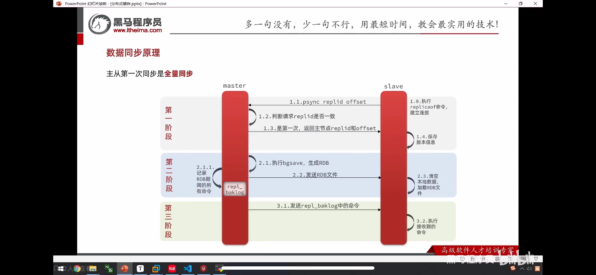

## 全量同步优化
+ repl_diskless-sync参数设置为yes，未开启时全量同步会先执行bgsave将内存中的数据保存到磁盘rdb文件中，再从从磁盘中读取数据发给slave。开启后不保存到磁盘。
+ 每个节点数据不宜过多。
+ 尽快恢复宕机节点。

## 主从架构
+ 不会读写自动路由，不会自动选主。

## 哨兵集群
+ 作用：1、服务发现功能，client在sentinel上获取所有的主从节点信息。2、自动选主功能。3、当主节点发生变更时会主动通知client。
+ 选主流程：一般sentinel也是一个集群，首先多个sentinel先选主，然后在多个从节点中按一定的规则选一个作为主节点，发送slaveof no one命令给选中的从节点，通知其他节点slaveof 新主节点。
+ 不支持读写自动路由，还是需要client用一些插件或者自己来实现路由功能。
+ 自动选主会触发全量同步。

## 分片集群
+ 在Redis分片集群中，尽管整个集群层面不会因自动选主而触发全量同步，但针对单个主从集合（也称为复制集或副本集）来说，当主节点故障并自动选主时，确实会触发该集合内部的全量同步。
+ Redis分片集群具有自动读写路由功能。